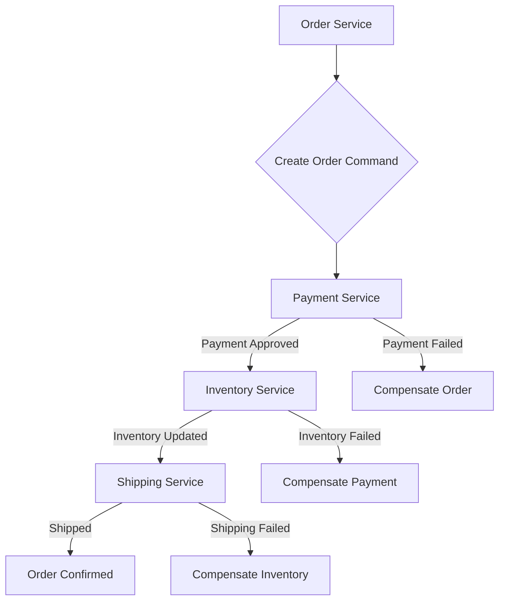

# Integrating New Patterns into Microservices

## Original Question
> **When integrating new patterns into microservices, what are the key considerations?**

## Core Concepts

### Key Definitions
- **Microservices Pattern**: A reusable solution to a common problem encountered when designing or implementing microservices (e.g., API Gateway, Saga, Circuit Breaker, Event Sourcing).
- **Integration Pattern**: A specific type of microservices pattern that focuses on how services communicate and interact (e.g., synchronous API calls, asynchronous messaging, event-driven communication).
- **Cloud-Native**: An approach to building and running applications that exploits the advantages of the cloud computing delivery model. Cloud-native applications are designed to be highly scalable, resilient, and manageable.
- **Distributed System**: A system whose components are located on different networked computers, which communicate and coordinate their actions by passing messages to one another.

### Fundamental Principles
- **No Free Lunch**: Every pattern comes with trade-offs. Implementing a new pattern introduces complexity, operational overhead, and potential new failure modes.
- **Context is King**: A pattern that works well in one microservices architecture might be a terrible fit for another. The choice must always be driven by the specific business requirements, team capabilities, and existing technical landscape.
- **Evolutionary Design**: Microservices architectures are rarely built perfectly from day one. Patterns are often introduced incrementally as the system evolves and new challenges arise.

## Best Practices & Industry Standards

Integrating new patterns into a microservices architecture requires careful consideration across technical, operational, and organizational dimensions. The goal is to solve a specific problem without introducing more complexity than the problem itself.

### Key Considerations

1.  **Problem-Driven Adoption**: 
    -   **Consideration**: Don't adopt a pattern just because it's popular or new. Identify a clear problem that the pattern solves (e.g., "We have cascading failures, so we need a Circuit Breaker").
    -   **Best Practice**: Start with the simplest solution. Only introduce complexity (a new pattern) when the existing approach proves insufficient for a specific, identified pain point.

2.  **Impact on Communication and Data Consistency**: 
    -   **Consideration**: How will the new pattern affect how services communicate (synchronous vs. asynchronous) and how data consistency is maintained across distributed services?
    -   **Best Practice**: Understand the implications for eventual consistency. If introducing an event-driven pattern, design for idempotent consumers and plan for conflict resolution strategies (e.g., Saga pattern for distributed transactions).

3.  **Operational Overhead and Observability**: 
    -   **Consideration**: Every new pattern adds to the operational burden. How will you monitor, log, and troubleshoot the new pattern?
    -   **Best Practice**: Ensure the pattern is observable. For example, if implementing a service mesh, ensure you can collect metrics, logs, and traces from the mesh proxies. If using a message queue, monitor queue depth and consumer lag.

4.  **Team Skillset and Learning Curve**: 
    -   **Consideration**: Does your team have the necessary skills to implement, operate, and troubleshoot the new pattern? What is the learning curve?
    -   **Best Practice**: Invest in training. Start with a small, pilot project to gain experience. Provide clear documentation and internal best practices for the new pattern.

5.  **Impact on Deployment and Testing**: 
    -   **Consideration**: How will the new pattern affect your CI/CD pipelines and testing strategy?
    -   **Best Practice**: Automate. Integrate testing for the new pattern into your CI/CD pipeline (e.g., contract testing for event-driven systems, chaos engineering for resilience patterns). Ensure the pattern supports independent deployability of services.

6.  **Security Implications**: 
    -   **Consideration**: Does the new pattern introduce new attack vectors or change existing security boundaries?
    -   **Best Practice**: Conduct a threat model for the new pattern. For example, if implementing a service mesh, understand how mTLS works and how to manage certificates. If using an API Gateway, ensure it handles authentication and authorization securely.

## Real-World Examples

### Example 1: Introducing the Circuit Breaker Pattern
**Context**: A microservices architecture where the `OrderService` frequently called the `PaymentService`.
**Problem**: The `PaymentService` was occasionally slow or unavailable, causing the `OrderService` to hang and eventually fail, leading to cascading failures across the system.
**Pattern Integrated**: **Circuit Breaker**.
**Key Considerations**:
-   **Problem-Driven**: The clear problem was cascading failures due to a flaky dependency.
-   **Operational Overhead**: We needed to monitor the circuit breaker's state (open, half-open, closed) and configure alerts for when it tripped. This required integrating a new library and exposing its metrics.
-   **Testing**: We introduced chaos engineering experiments in staging to simulate `PaymentService` failures and verify that the circuit breaker tripped correctly and the `OrderService` degraded gracefully.
**Outcome**: The `OrderService` became resilient to `PaymentService` outages. When the payment service failed, the order service would immediately return an error or a fallback response, preventing its own failure and protecting the overall system availability.

### Example 2: Adopting Event Sourcing and CQRS
**Context**: A core `AccountService` was becoming a bottleneck due to complex read and write patterns, and historical data was hard to query.
**Problem**: Scalability issues for reads and writes, and difficulty in querying historical state.
**Pattern Integrated**: **Event Sourcing** (for writes) and **CQRS (Command Query Responsibility Segregation)** (for reads).
**Key Considerations**:
-   **Impact on Communication/Consistency**: This was a massive shift from traditional CRUD. Writes became event-driven (commands produce events, events are stored). Reads were served from a separate, optimized read model. This introduced eventual consistency between the write and read models.
-   **Operational Overhead**: We needed an event store (e.g., Kafka or DynamoDB with streams) and a mechanism to build and update read models (projections). This significantly increased infrastructure and operational complexity.
-   **Team Skillset**: This pattern has a steep learning curve. We invested heavily in training and started with a small, non-critical part of the `AccountService` to gain experience.
**Outcome**: The `AccountService` achieved high scalability for both reads and writes. Historical data became easily queryable. However, the complexity of debugging and operating the system increased significantly, requiring a dedicated team to manage the event store and projections.

## Common Pitfalls & Solutions

### Pitfall 1: Over-Engineering with Patterns
**Problem**: Introducing complex patterns (e.g., Saga, Event Sourcing) when a simpler solution (e.g., a direct API call, a simple message queue) would suffice.
**Why it happens**: "Resume-driven development" or a fascination with new technologies.
**Solution**: Always start with the simplest solution that meets the requirements. Only introduce complexity when a clear, identified problem demands it. The cost of complexity is high.
**Prevention**: Rigorous architectural reviews that challenge the necessity of every new component or pattern.

### Pitfall 2: Ignoring Data Consistency Implications
**Problem**: Implementing asynchronous patterns (e.g., event-driven) without a clear strategy for managing eventual consistency and distributed transactions.
**Why it happens**: Focusing only on the decoupling benefits.
**Solution**: For any pattern that introduces eventual consistency, explicitly design how data will converge and how distributed transactions will be handled (e.g., using the Saga pattern for long-running business processes).
**Prevention**: Conduct a thorough data flow and consistency analysis during the design phase for any new pattern.

## Follow-up Questions Preparation

### Likely Deep-Dive Questions
1.  **"How do you decide if a pattern is a good fit for your organization's culture and skillset?"**
    - I assess the team's current capabilities and their willingness to learn. I look for patterns that align with our existing operational practices (e.g., if we already use Kubernetes, a service mesh might be a natural fit). I also consider the long-term support implications: can we hire people with these skills?
2.  **"What is the role of a service mesh when integrating new patterns?"**
    - A service mesh (like Istio or Linkerd) can simplify the implementation of many patterns, especially those related to communication and resilience. It can provide transparent mTLS, retries, circuit breakers, and traffic routing without requiring changes to application code. This offloads cross-cutting concerns from developers to the infrastructure layer.

### Related Topics to Be Ready For
- **Distributed Transactions**: Understanding the challenges and patterns (e.g., 2PC, Saga) for managing transactions across multiple services.
- **Observability**: How to ensure that new patterns don't create black boxes in your system.

### Connection Points to Other Sections
- **Section 3 (Service Communication Patterns)**: This question builds directly on the choice of communication patterns.
- **Section 8 (Microservices Architecture)**: This question is about the practical application of architectural patterns within a microservices context.

## Sample Answer Framework

### Opening Statement
"When integrating new patterns into microservices, the key consideration is always to ensure that the pattern solves a specific, identified problem without introducing undue complexity. It's crucial to evaluate the pattern's impact across technical, operational, and organizational dimensions, always prioritizing a problem-driven approach."

### Core Answer Structure
1.  **Problem-Driven Adoption**: Emphasize that patterns should solve a clear problem, not be adopted for their own sake.
2.  **Impact on Communication/Consistency**: Discuss how the pattern affects synchronous vs. asynchronous communication and how data consistency will be managed (e.g., eventual consistency, Saga pattern).
3.  **Operational Overhead & Observability**: Highlight the need to plan for monitoring, logging, and troubleshooting the new pattern.
4.  **Team Skillset & Learning Curve**: Address the human element – ensuring the team has the skills or can acquire them.
5.  **Provide an Example**: Use the Circuit Breaker example to illustrate how these considerations played out in a real project, focusing on the problem it solved and the operational aspects.

### Closing Statement
"By carefully considering these factors, we can strategically introduce patterns that enhance the microservices architecture's resilience, scalability, or maintainability, rather than creating a 'distributed monolith' or an overly complex system that is difficult to operate and understand."

## Technical Deep-Dive Points

### Implementation Details

**Example of a Saga Pattern (Orchestration-based):**

### Metrics and Measurement
- **Complexity Metrics**: Track the cyclomatic complexity and coupling of services before and after pattern integration to ensure the pattern is simplifying, not complicating, the architecture.
- **Mean Time to Recovery (MTTR)**: For resilience patterns like Circuit Breaker, measure if the MTTR for dependent services decreases.
- **Deployment Frequency**: Ensure that the new pattern does not hinder the ability to deploy services independently and frequently.

## Recommended Reading

### Industry Resources
- [Microservices.io: Patterns](https://microservices.io/patterns/index.html)
- **Book**: "Building Microservices" by Sam Newman (Chapter 5: Developing Services).
- **Book**: "Designing Data-Intensive Applications" by Martin Kleppmann (Chapter 9: Consistency and Consensus).