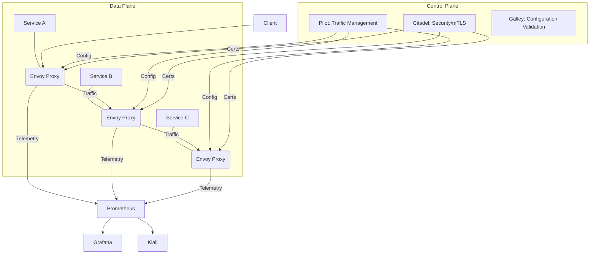

# Service Mesh Components: Data Plane and Control Plane

## Original Question
> **What are the main components (data plane, control plane) and their roles?**

## Core Concepts

### Key Definitions
- **Service Mesh**: A dedicated infrastructure layer for handling service-to-service communication in a microservices architecture. It provides a transparent way to manage traffic, enforce policies, and collect telemetry without requiring changes to application code.
- **Data Plane**: The part of the service mesh that intercepts and handles all network traffic between services. It consists of a network of intelligent proxies (sidecars) that run alongside each service instance.
- **Control Plane**: The management layer of the service mesh. It configures and manages the proxies in the data plane, enforces policies, and aggregates telemetry data.
- **Sidecar Proxy**: A lightweight network proxy that runs in a separate container alongside each microservice instance. All inbound and outbound network traffic for the service passes through its sidecar proxy.

### Fundamental Principles
- **Separation of Concerns**: The service mesh cleanly separates the application's business logic from the complexities of inter-service communication, traffic management, and security policies.
- **Centralized Control, Distributed Enforcement**: Policies are defined centrally in the control plane, but their enforcement happens in a distributed manner by the sidecar proxies in the data plane.
- **Transparency**: The service mesh operates transparently to application developers. Services communicate as if they are making direct network calls, while the sidecar proxies handle the underlying complexities.

## Best Practices & Industry Standards

A service mesh is typically composed of two main logical components: the Data Plane and the Control Plane. Understanding their roles is key to grasping how a service mesh operates.

### 1. **The Data Plane**

-   **Components**: The Data Plane is primarily made up of a network of **sidecar proxies**. These proxies are deployed alongside each instance of your microservices (e.g., in the same Kubernetes pod).
-   **Role**: The Data Plane is responsible for intercepting and handling all network traffic between services. It acts as an intelligent intermediary for every service-to-service call. Its key responsibilities include:
    -   **Traffic Interception**: All inbound and outbound traffic to/from a service is automatically redirected through its sidecar proxy.
    -   **Traffic Routing**: Based on rules from the control plane, it intelligently routes requests to the correct service instance, supporting advanced patterns like canary deployments, A/B testing, and traffic splitting.
    -   **Load Balancing**: Performs intelligent, service-aware load balancing across multiple instances of a service.
    -   **Resilience**: Implements automatic retries, timeouts, and circuit breakers to make communication more robust and prevent cascading failures.
    -   **Security**: Enforces mutual TLS (mTLS) encryption and authentication for all service-to-service communication.
    -   **Telemetry Collection**: Automatically collects metrics (e.g., latency, request volume, error rates), logs, and traces for every service interaction.
-   **Example Proxy**: **Envoy Proxy** is a popular choice for the data plane in many service mesh implementations (e.g., Istio, AWS App Mesh).

### 2. **The Control Plane**

-   **Components**: The Control Plane is a set of management services that configure and manage the proxies in the data plane. It typically includes components for configuration, policy, and telemetry.
-   **Role**: The Control Plane is the brain of the service mesh. It provides the APIs and intelligence to:
    -   **Configuration Management**: Takes high-level traffic management rules (e.g., "route 10% of traffic to v2") and translates them into low-level configurations that are pushed down to the sidecar proxies.
    -   **Policy Enforcement**: Manages and enforces network and security policies (e.g., "`Service A` can only talk to `Service B`"). It can also manage rate limiting and access control policies.
    -   **Service Discovery**: Maintains a registry of all services and their instances, allowing proxies to discover and route traffic to them.
    -   **Certificate Management**: Acts as a Certificate Authority (CA) to issue and rotate mTLS certificates for the sidecar proxies, enabling secure communication.
    -   **Telemetry Aggregation**: Collects and aggregates telemetry data (metrics, logs, traces) from the data plane, providing a unified view of the mesh's operational state.
-   **Examples**: In **Istio**, the control plane components include `Pilot` (for traffic management), `Citadel` (for security/mTLS), and `Galley` (for configuration validation). In **Linkerd**, the control plane is simpler, focusing on core features.

## Real-World Examples

### Example 1: Istio in a Kubernetes Cluster
**Context**: A microservices application deployed on Kubernetes.
**Challenge**: Manage traffic, secure communication, and gain observability across dozens of microservices.
**Solution**: **Istio** was deployed as the service mesh.
-   **Data Plane**: An Envoy proxy was automatically injected as a sidecar into every Kubernetes pod running a microservice. All network calls between services were intercepted by these Envoy proxies.
-   **Control Plane**: The Istio control plane components (Pilot, Citadel, Galley) were deployed as separate services within the Kubernetes cluster. 
    -   Developers defined traffic rules (e.g., `VirtualService` for routing, `DestinationRule` for load balancing) using Istio's custom resource definitions (CRDs).
    -   `Pilot` would then translate these CRDs into Envoy-specific configurations and push them to the sidecar proxies.
    -   `Citadel` managed the mTLS certificates for all proxies.
**Outcome**: The application gained advanced traffic management capabilities, automated mTLS, and comprehensive observability without any changes to the application code itself.

### Example 2: Linkerd for Observability and Reliability
**Context**: A team wanted to quickly gain better visibility into their microservices and improve their reliability without adding too much complexity.
**Challenge**: Get consistent metrics and implement retries/timeouts across services.
**Solution**: **Linkerd** was chosen for its simplicity and focus on core features.
-   **Data Plane**: Linkerd's lightweight Rust-based proxies were injected as sidecars.
-   **Control Plane**: Linkerd's control plane components were deployed. They automatically discovered services and provided a web dashboard.
-   **Role**: The control plane configured the proxies to automatically collect golden metrics (latency, success rates, request volume) and apply default retries and timeouts for all service calls.
**Outcome**: The team immediately gained deep insights into service-to-service communication through Linkerd's dashboard, and the application became more resilient to transient network issues, all with minimal configuration.

## Common Pitfalls & Solutions

### Pitfall 1: Overlooking Resource Consumption
**Problem**: The sidecar proxies consume CPU and memory resources, which can add up significantly in a large cluster.
**Why it happens**: Not accounting for the overhead of running a proxy alongside every service instance.
**Solution**: Carefully monitor the resource usage of the sidecar proxies. Optimize the mesh configuration to disable unused features. Choose a service mesh known for its low overhead (e.g., Linkerd).
**Prevention**: Include sidecar resource consumption in your capacity planning and cost estimations.

### Pitfall 2: Debugging Complexity
**Problem**: Adding a service mesh introduces another layer of abstraction, making it harder to debug network issues.
**Why it happens**: Network traffic is intercepted and routed by the sidecar, making traditional `tcpdump` or `curl` commands less effective.
**Solution**: Leverage the mesh's built-in observability tools (dashboards, distributed tracing) to understand traffic flow. Learn how to access proxy logs and configurations. Use `kubectl debug` or similar tools to inspect the sidecar container directly.
**Prevention**: Invest in training for your operations and development teams on how to use the service mesh's debugging tools.

## Follow-up Questions Preparation

### Likely Deep-Dive Questions
1.  **"How does a service mesh handle traffic for services not running in Kubernetes?"**
    - Most service meshes (like Istio) can extend their control plane to include VMs or other non-Kubernetes workloads. This typically involves manually installing the sidecar proxy on the VM and configuring it to connect to the mesh control plane. This allows for a unified mesh across heterogeneous environments.
2.  **"What is the role of a service mesh in a serverless architecture (e.g., AWS Lambda)?"**
    - Service meshes are primarily designed for long-running services (like containers or VMs) where a sidecar can be injected. They are generally not applicable to serverless functions like AWS Lambda, which are ephemeral and managed by the cloud provider. For Lambda, you rely on the cloud provider's built-in security and observability features.

### Related Topics to Be Ready For
- **Microservices Architecture**: A service mesh is a solution to the challenges inherent in microservices.
- **Kubernetes**: The most common environment for deploying service meshes.

### Connection Points to Other Sections
- **Section 3 (Interface Patterns)**: A service mesh can manage communication for both REST and gRPC APIs.
- **Section 6 (Cloud Security)**: A service mesh provides automated mTLS and fine-grained access control, which are critical security features.

## Sample Answer Framework

### Opening Statement
"A service mesh is fundamentally composed of two main parts: the Data Plane and the Control Plane. The Data Plane consists of intelligent proxies that handle all service-to-service communication, while the Control Plane manages and configures these proxies, acting as the brain of the mesh."

### Core Answer Structure
1.  **The Data Plane**: Explain that it's made of sidecar proxies (like Envoy) that run alongside each service. Detail its responsibilities: intercepting traffic, routing, load balancing, resilience (retries, timeouts, circuit breakers), security (mTLS), and telemetry collection.
2.  **The Control Plane**: Describe it as the management layer. Detail its responsibilities: configuration management (translating high-level rules to proxy configs), policy enforcement, service discovery, and certificate management.
3.  **Analogy**: Use a simple analogy to clarify their relationship, e.g., "The control plane is like the air traffic controller, and the data plane (proxies) are like the individual airplanes following the controller's instructions."
4.  **Provide an Example**: Briefly mention how Istio or Linkerd implements these components in a Kubernetes environment.

### Closing Statement
"This clear separation of concerns allows the service mesh to offload complex, cross-cutting communication concerns from application developers, enabling them to focus on business logic, while providing operators with centralized control and deep observability over their distributed systems."

## Technical Deep-Dive Points

### Implementation Details

**Istio Architecture Diagram (Simplified):**

### Metrics and Measurement
- **Proxy Resource Usage**: Monitor the CPU and memory consumption of the sidecar proxies to ensure they are not becoming a bottleneck.
- **Control Plane Latency**: Monitor the latency of the control plane pushing configurations to the data plane. High latency can lead to stale policies.

## Recommended Reading

### Industry Resources
- [What is a Service Mesh?](https://www.nginx.com/blog/what-is-a-service-mesh/)
- [Istio Architecture](https://istio.io/latest/docs/ops/architecture/)
- [Linkerd Architecture](https://linkerd.io/2.12/overview/architecture/)
