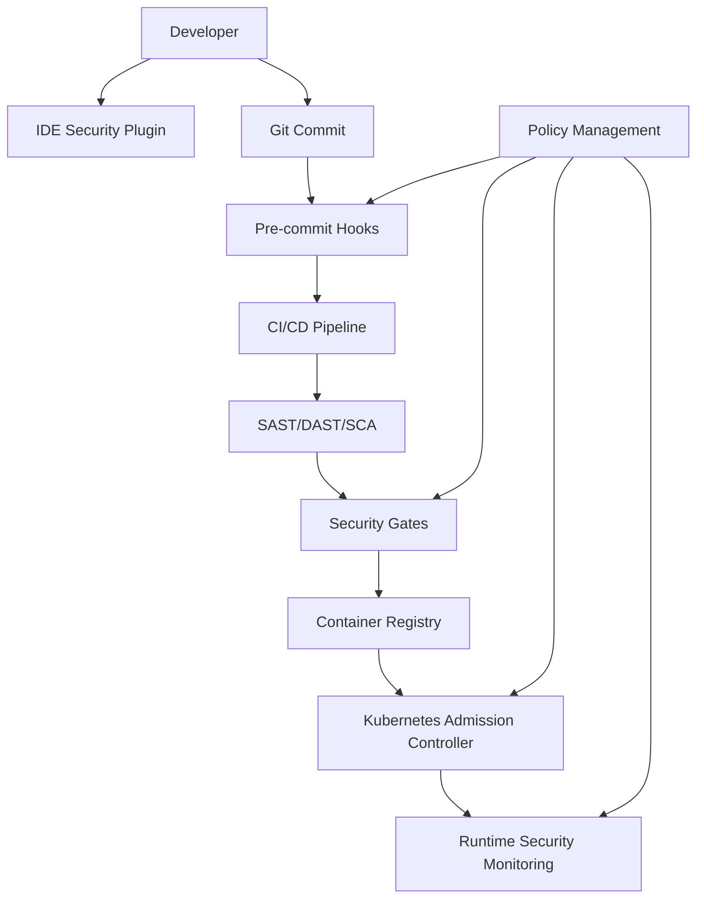

# Architectural Security Standards Enforcement

## Original Question
> **How do you enforce secure coding standards at the architectural level?**

## Core Concepts

### Key Definitions
- **Architectural Security**: Security controls and patterns implemented at the system architecture level
- **Security Standards Enforcement**: Systematic application of security policies across teams and systems
- **Security Governance**: Framework for making consistent security decisions across an organization
- **Security Architecture**: The design and structure of security controls within and around systems
- **Policy as Code**: Implementing security policies through automated, version-controlled code

### Fundamental Principles
- **Centralized Policy, Distributed Enforcement**: Define policies centrally but implement checks throughout the system
- **Shift-Left Security**: Integrate security controls early in the development lifecycle
- **Automated Compliance**: Use automation to enforce standards consistently
- **Security by Default**: Make secure choices the default and easiest option for developers
- **Continuous Security**: Security enforcement is ongoing, not a one-time activity

## Best Practices & Industry Standards

### Architectural Security Patterns

#### 1. **Security Gateway Pattern**
- **Purpose**: Centralized security enforcement point for all external requests
- **Implementation**: API Gateway with integrated security controls
- **Controls**: Authentication, authorization, rate limiting, input validation
- **Benefits**: Consistent security application, simplified maintenance

#### 2. **Zero Trust Architecture**
- **Principle**: Never trust, always verify, regardless of location
- **Components**: Identity verification, device verification, least privilege access
- **Implementation**: Micro-segmentation, continuous authentication, encrypted communication
- **Benefits**: Reduced blast radius, improved visibility

#### 3. **Security Mesh Pattern**
- **Purpose**: Distributed security enforcement across microservices
- **Implementation**: Service mesh with security policies (Istio, Linkerd)
- **Controls**: mTLS, service-to-service authorization, traffic policies
- **Benefits**: Granular security, policy consistency

#### 4. **Defense in Depth Architecture**
- **Layers**: Network, host, application, data
- **Implementation**: Multiple security controls at each layer
- **Redundancy**: If one layer fails, others provide protection
- **Benefits**: Comprehensive protection, resilience

### Enforcement Mechanisms

#### Technology-Based Enforcement

##### 1. **Static Application Security Testing (SAST)**
```yaml
# Example: SonarQube quality gate configuration
quality_gates:
  security:
    - security_hotspots_reviewed: 100%
    - vulnerabilities: 0
    - security_rating: A
  maintainability:
    - code_smells: <100
    - maintainability_rating: A
```

##### 2. **Infrastructure as Code (IaC) Security**
```terraform
# Example: Terraform security policies using Sentinel
policy "require-encryption" {
  enforcement_level = "hard-mandatory"
}

resource "aws_s3_bucket" "example" {
  bucket = "my-bucket"

  server_side_encryption_configuration {
    rule {
      apply_server_side_encryption_by_default {
        sse_algorithm = "AES256"
      }
    }
  }
}
```

##### 3. **Container Security Standards**
```dockerfile
# Security-hardened base image selection
FROM registry.access.redhat.com/ubi8/ubi-minimal:latest

# Non-root user enforcement
RUN useradd -m -s /bin/bash appuser
USER appuser

# Read-only filesystem where possible
VOLUME ["/tmp", "/var/log"]
```

##### 4. **API Security Standards**
```yaml
# OpenAPI specification with security requirements
openapi: 3.0.0
security:
  - OAuth2: [read, write]
  - ApiKeyAuth: []

paths:
  /api/users:
    get:
      security:
        - OAuth2: [read]
      parameters:
        - name: limit
          in: query
          schema:
            type: integer
            minimum: 1
            maximum: 100
```

#### Process-Based Enforcement

##### 1. **Security Champions Program**
- **Structure**: Security-trained developers in each team
- **Responsibilities**: Code review focus, security guidance, threat modeling facilitation
- **Training**: Regular security updates, hands-on workshops
- **Benefits**: Scalable security expertise, cultural change

##### 2. **Secure Development Lifecycle (SDL)**
- **Requirements Phase**: Security requirements definition, threat modeling
- **Design Phase**: Security architecture review, control specification
- **Implementation Phase**: Secure coding practices, automated security testing
- **Testing Phase**: Security testing, penetration testing
- **Deployment Phase**: Security configuration validation, monitoring setup

##### 3. **Architecture Review Board**
- **Composition**: Senior architects, security specialists, compliance officers
- **Process**: Mandatory review for significant changes, risk assessment
- **Criteria**: Security control adequacy, compliance requirements, threat coverage
- **Output**: Approval, conditional approval with remediation, or rejection

### Standards Framework Implementation

#### NIST Cybersecurity Framework Integration
1. **Identify**: Asset inventory, risk assessment, governance policies
2. **Protect**: Access control, data security, training programs
3. **Detect**: Security monitoring, threat detection, vulnerability assessment
4. **Respond**: Incident response, communication, analysis
5. **Recover**: Recovery planning, improvements, communications

#### ISO 27001 Architecture Controls
- **A.12.6.1**: Management of technical vulnerabilities
- **A.14.2**: Security in development and support processes
- **A.13.1**: Network security management
- **A.10.1**: Cryptographic controls

## Real-World Examples

### Example 1: Financial Services API Security Architecture
**Context**: Large investment bank modernizing legacy systems with microservices architecture
**Challenge**: Ensuring consistent security controls across 200+ APIs while meeting regulatory requirements
**Solution**:
- Implemented centralized API Gateway with OAuth 2.0 and JWT validation
- Created security policy templates enforced through CI/CD pipelines
- Established API security standards with automated compliance checking
- Set up real-time security monitoring with automated incident response
**Architecture Components**:
```
[Client] -> [WAF] -> [API Gateway] -> [Service Mesh] -> [Microservices]
              ↓           ↓              ↓               ↓
           [Rules]   [Auth/Authz]    [mTLS]      [Security Libs]
```
**Outcome**: 100% API compliance with security standards, 60% reduction in security incidents, automated security validation in <5 minutes per deployment
**Technologies**: Kong API Gateway, Istio service mesh, HashiCorp Vault, Splunk SIEM

### Example 2: Healthcare Data Platform Security Governance
**Context**: Multi-tenant healthcare analytics platform processing PHI data
**Challenge**: Ensuring HIPAA compliance across development teams while enabling rapid feature development
**Solution**:
- Designed data classification system with automated enforcement
- Implemented attribute-based access control (ABAC) for fine-grained permissions
- Created security-as-code framework with policy validation
- Established continuous compliance monitoring with automated remediation
**Policy Framework**:
```python
# Example: ABAC policy for PHI data access
def evaluate_access(user, resource, action, context):
    if resource.classification == "PHI":
        if not user.has_training("HIPAA"):
            return DENY
        if not context.network.is_secure():
            return DENY
        if action == "EXPORT" and not user.has_role("DATA_ANALYST"):
            return DENY
    return PERMIT
```
**Outcome**: Achieved HIPAA compliance certification, reduced compliance audit findings by 90%, maintained <200ms authorization decision time
**Technologies**: Open Policy Agent (OPA), AWS KMS, CloudTrail, DataDog

### Example 3: E-commerce Platform Container Security Standards
**Context**: Global e-commerce platform transitioning to Kubernetes-based architecture
**Challenge**: Standardizing container security across multiple development teams and geographic regions
**Solution**:
- Implemented security-first container base images with vulnerability scanning
- Created Kubernetes security policies using OPA Gatekeeper
- Established secure CI/CD pipeline with security gates at each stage
- Set up runtime security monitoring with behavioral analysis
**Security Pipeline**:
```yaml
# Example: Kubernetes security policy
apiVersion: kustomize.config.k8s.io/v1beta1
kind: Kustomization

patchesStrategicMerge:
- security-context.yaml

resources:
- deployment.yaml

# security-context.yaml
spec:
  template:
    spec:
      securityContext:
        runAsNonRoot: true
        runAsUser: 1000
        fsGroup: 2000
      containers:
      - name: app
        securityContext:
          allowPrivilegeEscalation: false
          readOnlyRootFilesystem: true
          capabilities:
            drop: ["ALL"]
```
**Outcome**: Zero privilege escalation incidents, 95% reduction in container vulnerabilities, 4x faster security review process
**Technologies**: Kubernetes, OPA Gatekeeper, Falco, Twistlock (now Prisma Cloud)

## Common Pitfalls & Solutions

### Pitfall 1: Security Standards Too Rigid for Development Velocity
**Problem**: Overly strict security controls that significantly slow development
**Why it happens**: Security team creates standards without considering developer workflow impact
**Solution**: Collaborate with development teams to create "secure by default" approaches that enable rather than block
**Prevention**: Include developers in security standard design, provide easy-to-use security libraries and templates

### Pitfall 2: Inconsistent Enforcement Across Teams
**Problem**: Some teams follow security standards rigorously while others bypass them
**Why it happens**: Lack of automated enforcement mechanisms and unclear accountability
**Solution**: Implement automated security gates that prevent non-compliant code from reaching production
**Prevention**: Make security standards part of CI/CD pipeline, not optional manual processes

### Pitfall 3: Security Architecture Not Aligned with Business Architecture
**Problem**: Security controls that don't map to actual business risks and data flows
**Why it happens**: Security designed in isolation from business requirements
**Solution**: Conduct business-driven threat modeling to align security controls with actual risks
**Prevention**: Include business stakeholders in security architecture decisions

### Pitfall 4: Over-reliance on Tooling Without Cultural Change
**Problem**: Implementing security tools without changing development culture and practices
**Why it happens**: Believing technology alone can solve security problems
**Solution**: Combine tooling with training, process changes, and incentive alignment
**Prevention**: Treat security as a cultural transformation, not just a technical implementation

## Follow-up Questions Preparation

### Likely Deep-Dive Questions

1. **"How do you handle security standard exceptions and risk acceptance processes?"**
   - Formal exception process with time-bound approvals
   - Compensating controls for accepted risks
   - Regular review and remediation planning
   - Executive visibility and approval for high-risk exceptions

2. **"What metrics do you use to measure the effectiveness of your security standards enforcement?"**
   - Vulnerability discovery rate and remediation time
   - Security standard compliance percentage
   - Security incident frequency and impact
   - Developer productivity impact measurements

3. **"How do you evolve security standards as new threats emerge?"**
   - Threat intelligence integration into standard updates
   - Regular security standard review cycles
   - Pilot programs for new security controls
   - Industry best practice adoption processes

4. **"How do you balance security standards with cloud provider native security services?"**
   - Hybrid approach using both custom and cloud-native controls
   - Cloud provider security assessment and validation
   - Multi-cloud security standard compatibility
   - Vendor lock-in risk mitigation strategies

### Related Topics to Be Ready For
- **DevSecOps Integration**: How security standards integrate with continuous delivery
- **Compliance Automation**: Automated compliance reporting and audit preparation
- **Security Debt Management**: Prioritizing and addressing accumulated security technical debt
- **Third-Party Integration**: Extending security standards to partner and vendor integrations

### Connection Points to Other Sections
- **Section 6 (AWS Security)**: Implementation of architectural standards using AWS services
- **Section 4 (Service Mesh)**: Service mesh as enforcement mechanism for security policies
- **Section 9 (Leadership)**: Leading cultural change for security standard adoption

## Sample Answer Framework

### Opening Statement
"In my experience leading security architecture for enterprise applications, effective enforcement requires both technological and cultural approaches that make security standards integral to the development process rather than external barriers..."

### Core Answer Structure
1. **Multi-Layer Approach**: Technology-based and process-based enforcement mechanisms
2. **Concrete Example**: Specific implementation showing measurable security improvements
3. **Developer Experience**: How standards enhance rather than hinder development productivity
4. **Continuous Improvement**: Metrics and feedback loops for evolving standards

### Closing Statement
"This comprehensive approach has proven effective because it creates security-conscious developers who understand and embrace standards rather than trying to circumvent them."

## Technical Deep-Dive Points

### Implementation Architecture


### Metrics and Measurement
- **Lead Time Impact**: Security standard compliance time < 5% of total development time
- **Vulnerability Metrics**: <1% high/critical vulnerabilities reaching production
- **Compliance Rate**: >95% adherence to security standards across all teams
- **Developer Satisfaction**: Security tools rated >4.0/5.0 in developer surveys

### Automation Examples
```bash
#!/bin/bash
# Example: Git pre-commit security hook
set -e

echo "Running security checks..."

# Secret detection
if truffleHog --regex --entropy=False .; then
    echo "❌ Potential secrets detected!"
    exit 1
fi

# Dependency vulnerability check
if safety check --json; then
    echo "✅ No known vulnerable dependencies"
else
    echo "❌ Vulnerable dependencies found!"
    exit 1
fi

echo "✅ All security checks passed"
```

## Recommended Reading

### Official Documentation
- [NIST Cybersecurity Framework](https://www.nist.gov/cyberframework): Comprehensive security governance framework
- [OWASP Application Security Architecture Cheat Sheet](https://cheatsheetseries.owasp.org/cheatsheets/Application_Security_Architecture_Cheat_Sheet.html): Practical architecture guidance

### Industry Resources
- **Book**: "Building Secure and Reliable Systems" by Google SRE team - real-world security architecture practices
- **Framework**: SABSA (Sherwood Applied Business Security Architecture) - business-driven security architecture methodology
- **Paper**: "Security as Code: DevSecOps Patterns and Practices" - automation-focused security implementation

### Recent Updates (2024-2025)
- **Cloud Security Posture Management (CSPM)**: Automated cloud configuration compliance
- **AI-Powered Security**: Machine learning for anomaly detection and automated response
- **Supply Chain Security**: Software Bill of Materials (SBOM) and provenance tracking