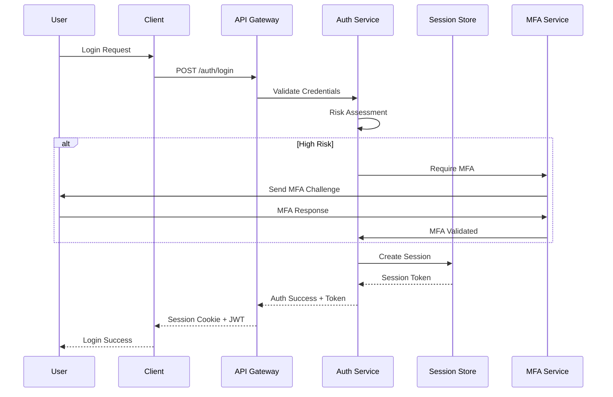

# Authentication and Session Management Design

## Original Question
> **How do you design authentication and session management to minimize vulnerabilities?**

## Core Concepts

### Key Definitions
- **Authentication**: Process of verifying user identity ("who you are")
- **Session Management**: Maintaining user state across multiple requests in stateless protocols
- **Authorization**: Determining what authenticated users are allowed to do ("what you can access")
- **Token-Based Authentication**: Using cryptographically signed tokens instead of server-side sessions
- **Multi-Factor Authentication (MFA)**: Requiring multiple forms of identity verification

### Fundamental Principles
- **Defense in Depth**: Multiple security layers for authentication
- **Principle of Least Privilege**: Grant minimum necessary permissions
- **Zero Trust**: Verify every request, regardless of source
- **Session Timeout**: Automatic invalidation of inactive sessions
- **Secure Defaults**: Default to secure configuration and require explicit permission for less secure options

## Best Practices & Industry Standards

### Authentication Architecture Patterns

#### 1. **Token-Based Authentication (JWT)**
- **Benefits**: Stateless, scalable, cross-domain support
- **Structure**: Header.Payload.Signature
- **Security Considerations**: Token expiration, secure storage, signature verification

```javascript
// Example: Secure JWT implementation
const jwt = require('jsonwebtoken');
const crypto = require('crypto');

class JWTAuthService {
    constructor(config) {
        this.accessTokenSecret = config.accessTokenSecret;
        this.refreshTokenSecret = config.refreshTokenSecret;
        this.accessTokenExpiry = config.accessTokenExpiry || '15m';
        this.refreshTokenExpiry = config.refreshTokenExpiry || '7d';
    }

    generateTokenPair(user) {
        const payload = {
            userId: user.id,
            email: user.email,
            roles: user.roles,
            permissions: user.permissions,
            iat: Math.floor(Date.now() / 1000),
            jti: crypto.randomUUID() // Unique token ID for revocation
        };

        const accessToken = jwt.sign(payload, this.accessTokenSecret, {
            expiresIn: this.accessTokenExpiry,
            issuer: 'api.company.com',
            audience: 'app.company.com'
        });

        const refreshToken = jwt.sign(
            { userId: user.id, jti: payload.jti },
            this.refreshTokenSecret,
            { expiresIn: this.refreshTokenExpiry }
        );

        return { accessToken, refreshToken };
    }

    verifyAccessToken(token) {
        try {
            const decoded = jwt.verify(token, this.accessTokenSecret, {
                issuer: 'api.company.com',
                audience: 'app.company.com'
            });

            // Check token revocation list
            if (this.isTokenRevoked(decoded.jti)) {
                throw new Error('Token has been revoked');
            }

            return decoded;
        } catch (error) {
            throw new AuthenticationError('Invalid or expired token');
        }
    }

    refreshTokens(refreshToken) {
        const decoded = jwt.verify(refreshToken, this.refreshTokenSecret);

        // Validate refresh token hasn't been used (token rotation)
        if (this.isRefreshTokenUsed(decoded.jti)) {
            // Possible token theft - revoke all tokens for this user
            this.revokeAllUserTokens(decoded.userId);
            throw new SecurityError('Refresh token reuse detected');
        }

        // Mark refresh token as used
        this.markRefreshTokenUsed(decoded.jti);

        // Generate new token pair
        const user = this.getUserById(decoded.userId);
        return this.generateTokenPair(user);
    }
}
```

#### 2. **OAuth 2.0 / OpenID Connect**
- **Use Cases**: Third-party authentication, API access delegation
- **Flow Types**: Authorization Code, Client Credentials, Device Code
- **Security Features**: PKCE, state parameter, nonce validation

```python
# Example: OAuth 2.0 implementation with PKCE
import secrets
import hashlib
import base64
from urllib.parse import urlencode

class OAuth2Service:
    def __init__(self, client_id, client_secret, redirect_uri):
        self.client_id = client_id
        self.client_secret = client_secret
        self.redirect_uri = redirect_uri
        self.authorization_endpoint = 'https://oauth.provider.com/authorize'
        self.token_endpoint = 'https://oauth.provider.com/token'

    def generate_pkce_pair(self):
        """Generate PKCE code verifier and challenge"""
        code_verifier = base64.urlsafe_b64encode(
            secrets.token_bytes(32)
        ).decode('utf-8').rstrip('=')

        code_challenge = base64.urlsafe_b64encode(
            hashlib.sha256(code_verifier.encode()).digest()
        ).decode('utf-8').rstrip('=')

        return code_verifier, code_challenge

    def build_authorization_url(self, scope='openid profile email'):
        """Build secure authorization URL with PKCE and state"""
        state = secrets.token_urlsafe(32)
        code_verifier, code_challenge = self.generate_pkce_pair()

        # Store code_verifier and state for later verification
        self.store_oauth_state(state, code_verifier)

        params = {
            'response_type': 'code',
            'client_id': self.client_id,
            'redirect_uri': self.redirect_uri,
            'scope': scope,
            'state': state,
            'code_challenge': code_challenge,
            'code_challenge_method': 'S256',
            'prompt': 'consent'  # Force consent to prevent silent attacks
        }

        return f"{self.authorization_endpoint}?{urlencode(params)}"

    def exchange_code_for_tokens(self, authorization_code, state):
        """Exchange authorization code for access and ID tokens"""
        # Verify state parameter
        stored_data = self.get_oauth_state(state)
        if not stored_data:
            raise SecurityError("Invalid or expired state parameter")

        code_verifier = stored_data['code_verifier']

        # Exchange code for tokens
        token_data = {
            'grant_type': 'authorization_code',
            'client_id': self.client_id,
            'client_secret': self.client_secret,
            'code': authorization_code,
            'redirect_uri': self.redirect_uri,
            'code_verifier': code_verifier
        }

        response = requests.post(self.token_endpoint, data=token_data)

        if response.status_code != 200:
            raise AuthenticationError("Token exchange failed")

        tokens = response.json()

        # Verify ID token if present
        if 'id_token' in tokens:
            self.verify_id_token(tokens['id_token'])

        # Clean up stored state
        self.delete_oauth_state(state)

        return tokens
```

#### 3. **Multi-Factor Authentication (MFA)**
- **Factors**: Something you know (password), have (phone), are (biometrics)
- **Methods**: SMS, TOTP, hardware keys, push notifications
- **Implementation**: Graceful fallback, backup codes, device trust

```java
// Example: TOTP-based MFA implementation
import org.apache.commons.codec.binary.Base32;
import javax.crypto.Mac;
import javax.crypto.spec.SecretKeySpec;
import java.security.SecureRandom;

@Service
public class MFAService {

    private static final String ALGORITHM = "HmacSHA1";
    private static final int CODE_DIGITS = 6;
    private static final int TIME_STEP = 30; // seconds

    public String generateSecretKey() {
        SecureRandom random = new SecureRandom();
        byte[] bytes = new byte[20];
        random.nextBytes(bytes);

        Base32 base32 = new Base32();
        return base32.encodeToString(bytes);
    }

    public boolean verifyTOTP(String secretKey, String userCode) {
        try {
            Base32 base32 = new Base32();
            byte[] decodedKey = base32.decode(secretKey);

            // Check current time window and adjacent windows (clock drift tolerance)
            long currentTime = System.currentTimeMillis() / 1000L;
            long timeWindow = currentTime / TIME_STEP;

            for (int i = -1; i <= 1; i++) {
                String generatedCode = generateTOTP(decodedKey, timeWindow + i);
                if (userCode.equals(generatedCode)) {
                    // Prevent replay attacks - store used codes
                    if (!isCodeAlreadyUsed(secretKey, generatedCode, timeWindow + i)) {
                        markCodeAsUsed(secretKey, generatedCode, timeWindow + i);
                        return true;
                    }
                }
            }

            return false;
        } catch (Exception e) {
            logger.error("TOTP verification failed", e);
            return false;
        }
    }

    private String generateTOTP(byte[] key, long timeCounter) throws Exception {
        byte[] data = new byte[8];
        long value = timeCounter;

        for (int i = 8; i-- > 0; value >>>= 8) {
            data[i] = (byte) value;
        }

        SecretKeySpec signKey = new SecretKeySpec(key, ALGORITHM);
        Mac mac = Mac.getInstance(ALGORITHM);
        mac.init(signKey);
        byte[] hash = mac.doFinal(data);

        int offset = hash[hash.length - 1] & 0xf;
        long truncatedHash = 0;

        for (int i = 0; i < 4; ++i) {
            truncatedHash <<= 8;
            truncatedHash |= (hash[offset + i] & 0xFF);
        }

        truncatedHash &= 0x7FFFFFFF;
        truncatedHash %= Math.pow(10, CODE_DIGITS);

        return String.format("%0" + CODE_DIGITS + "d", truncatedHash);
    }

    public MFASetupData setupMFA(User user) {
        String secretKey = generateSecretKey();
        String qrCodeUrl = generateQRCodeUrl(user.getEmail(), secretKey);

        // Generate backup codes
        List<String> backupCodes = generateBackupCodes();

        return MFASetupData.builder()
            .secretKey(secretKey)
            .qrCodeUrl(qrCodeUrl)
            .backupCodes(backupCodes)
            .build();
    }

    private List<String> generateBackupCodes() {
        SecureRandom random = new SecureRandom();
        List<String> codes = new ArrayList<>();

        for (int i = 0; i < 10; i++) {
            // Generate 8-digit backup codes
            int code = 10000000 + random.nextInt(90000000);
            codes.add(String.valueOf(code));
        }

        return codes;
    }
}
```

### Session Management Strategies

#### 1. **Stateless Session Management**
```go
// Example: Stateless session with encrypted cookies
package session

import (
    "crypto/aes"
    "crypto/cipher"
    "crypto/rand"
    "encoding/base64"
    "encoding/json"
    "fmt"
    "time"
)

type SessionManager struct {
    secretKey []byte
    gcm       cipher.AEAD
}

type SessionData struct {
    UserID    string    `json:"user_id"`
    Email     string    `json:"email"`
    Roles     []string  `json:"roles"`
    IssuedAt  time.Time `json:"issued_at"`
    ExpiresAt time.Time `json:"expires_at"`
}

func NewSessionManager(secretKey string) (*SessionManager, error) {
    key := []byte(secretKey)
    if len(key) != 32 {
        return nil, fmt.Errorf("secret key must be exactly 32 bytes")
    }

    block, err := aes.NewCipher(key)
    if err != nil {
        return nil, err
    }

    gcm, err := cipher.NewGCM(block)
    if err != nil {
        return nil, err
    }

    return &SessionManager{secretKey: key, gcm: gcm}, nil
}

func (sm *SessionManager) CreateSession(userID, email string, roles []string, duration time.Duration) (string, error) {
    session := SessionData{
        UserID:    userID,
        Email:     email,
        Roles:     roles,
        IssuedAt:  time.Now(),
        ExpiresAt: time.Now().Add(duration),
    }

    // Serialize session data
    data, err := json.Marshal(session)
    if err != nil {
        return "", err
    }

    // Generate random nonce
    nonce := make([]byte, sm.gcm.NonceSize())
    if _, err := rand.Read(nonce); err != nil {
        return "", err
    }

    // Encrypt session data
    ciphertext := sm.gcm.Seal(nonce, nonce, data, nil)

    // Base64 encode for cookie storage
    return base64.URLEncoding.EncodeToString(ciphertext), nil
}

func (sm *SessionManager) ValidateSession(sessionToken string) (*SessionData, error) {
    // Decode from base64
    ciphertext, err := base64.URLEncoding.DecodeString(sessionToken)
    if err != nil {
        return nil, fmt.Errorf("invalid session token format")
    }

    // Extract nonce
    nonceSize := sm.gcm.NonceSize()
    if len(ciphertext) < nonceSize {
        return nil, fmt.Errorf("invalid session token length")
    }

    nonce, ciphertext := ciphertext[:nonceSize], ciphertext[nonceSize:]

    // Decrypt session data
    plaintext, err := sm.gcm.Open(nil, nonce, ciphertext, nil)
    if err != nil {
        return nil, fmt.Errorf("failed to decrypt session")
    }

    // Deserialize session data
    var session SessionData
    if err := json.Unmarshal(plaintext, &session); err != nil {
        return nil, fmt.Errorf("failed to parse session data")
    }

    // Check expiration
    if time.Now().After(session.ExpiresAt) {
        return nil, fmt.Errorf("session expired")
    }

    return &session, nil
}
```

#### 2. **Redis-Based Session Storage**
```python
# Example: Distributed session management with Redis
import redis
import json
import uuid
import hashlib
from datetime import datetime, timedelta

class DistributedSessionManager:
    def __init__(self, redis_client, session_timeout=3600):
        self.redis = redis_client
        self.session_timeout = session_timeout
        self.session_prefix = "session:"

    def create_session(self, user_id, user_data, remember_me=False):
        """Create a new session with secure session ID"""
        session_id = self._generate_secure_session_id()

        session_data = {
            'user_id': user_id,
            'user_data': user_data,
            'created_at': datetime.utcnow().isoformat(),
            'last_activity': datetime.utcnow().isoformat(),
            'ip_address': self._get_client_ip(),
            'user_agent_hash': self._hash_user_agent(),
            'remember_me': remember_me
        }

        # Set session timeout based on remember_me
        timeout = 2592000 if remember_me else self.session_timeout  # 30 days vs 1 hour

        # Store session in Redis
        session_key = f"{self.session_prefix}{session_id}"
        self.redis.setex(
            session_key,
            timeout,
            json.dumps(session_data, default=str)
        )

        return session_id

    def validate_session(self, session_id, update_activity=True):
        """Validate session and optionally update last activity"""
        session_key = f"{self.session_prefix}{session_id}"
        session_data_json = self.redis.get(session_key)

        if not session_data_json:
            return None

        try:
            session_data = json.loads(session_data_json)
        except json.JSONDecodeError:
            return None

        # Security checks
        if not self._validate_session_security(session_data):
            self.invalidate_session(session_id)
            return None

        # Update last activity if requested
        if update_activity:
            session_data['last_activity'] = datetime.utcnow().isoformat()
            self.redis.setex(
                session_key,
                self.redis.ttl(session_key),  # Maintain existing TTL
                json.dumps(session_data, default=str)
            )

        return session_data

    def invalidate_session(self, session_id):
        """Invalidate a specific session"""
        session_key = f"{self.session_prefix}{session_id}"
        self.redis.delete(session_key)

    def invalidate_all_user_sessions(self, user_id):
        """Invalidate all sessions for a specific user"""
        pattern = f"{self.session_prefix}*"

        for key in self.redis.scan_iter(match=pattern):
            session_data_json = self.redis.get(key)
            if session_data_json:
                try:
                    session_data = json.loads(session_data_json)
                    if session_data.get('user_id') == user_id:
                        self.redis.delete(key)
                except json.JSONDecodeError:
                    # Clean up invalid session data
                    self.redis.delete(key)

    def _generate_secure_session_id(self):
        """Generate cryptographically secure session ID"""
        random_bytes = uuid.uuid4().bytes + uuid.uuid4().bytes
        return hashlib.sha256(random_bytes).hexdigest()

    def _validate_session_security(self, session_data):
        """Perform security validation on session"""
        # Check for session hijacking indicators
        current_ip = self._get_client_ip()
        session_ip = session_data.get('ip_address')

        # Allow IP changes but log for monitoring
        if current_ip != session_ip:
            self._log_security_event('ip_change', session_data)

        # Validate user agent consistency
        current_ua_hash = self._hash_user_agent()
        session_ua_hash = session_data.get('user_agent_hash')

        if current_ua_hash != session_ua_hash:
            self._log_security_event('user_agent_change', session_data)
            return False  # Stricter policy for user agent changes

        return True
```

## Real-World Examples

### Example 1: Banking Application Authentication System
**Context**: Online banking platform requiring highest security standards
**Challenge**: Balancing security with user experience while meeting regulatory requirements
**Solution**:
- Implemented adaptive authentication based on risk scoring
- Multi-factor authentication with fallback options
- Device fingerprinting and behavioral analytics
- Automated account lockout and fraud detection
**Architecture**:
```python
class AdaptiveAuthenticationService:
    def __init__(self):
        self.risk_calculator = RiskCalculator()
        self.mfa_service = MFAService()
        self.device_service = DeviceService()

    def authenticate_user(self, credentials, context):
        # Step 1: Basic credential validation
        user = self.validate_credentials(credentials)
        if not user:
            self.log_failed_attempt(context)
            raise AuthenticationError("Invalid credentials")

        # Step 2: Calculate risk score
        risk_score = self.risk_calculator.calculate_risk(user, context)

        # Step 3: Determine authentication requirements
        auth_requirements = self.determine_auth_requirements(risk_score, user)

        # Step 4: Progressive authentication
        if auth_requirements.requires_mfa:
            if not self.mfa_service.verify_mfa(user, context.mfa_token):
                raise MFARequiredError("MFA verification required")

        if auth_requirements.requires_device_verification:
            if not self.device_service.is_trusted_device(user, context.device_id):
                self.device_service.send_verification_code(user)
                raise DeviceVerificationError("Device verification required")

        # Step 5: Create session with appropriate security level
        session = self.create_secure_session(user, risk_score, context)

        return AuthenticationResult(
            user=user,
            session=session,
            risk_score=risk_score,
            authentication_level=auth_requirements.level
        )

    def determine_auth_requirements(self, risk_score, user):
        if risk_score > 80:  # High risk
            return AuthRequirements(
                level="HIGH",
                requires_mfa=True,
                requires_device_verification=True,
                session_timeout=900  # 15 minutes
            )
        elif risk_score > 50:  # Medium risk
            return AuthRequirements(
                level="MEDIUM",
                requires_mfa=True,
                requires_device_verification=False,
                session_timeout=1800  # 30 minutes
            )
        else:  # Low risk
            return AuthRequirements(
                level="LOW",
                requires_mfa=False,
                requires_device_verification=False,
                session_timeout=3600  # 1 hour
            )
```
**Outcome**: 99.9% uptime, zero successful account takeovers, 95% user satisfaction with login experience
**Technologies**: Spring Security, Redis, AWS Cognito, Machine Learning for risk scoring

### Example 2: SaaS Platform Single Sign-On (SSO)
**Context**: Multi-tenant SaaS platform with enterprise customers requiring SSO integration
**Challenge**: Supporting multiple identity providers while maintaining security and performance
**Solution**:
- SAML 2.0 and OIDC integration with automatic provider discovery
- Just-in-time (JIT) user provisioning with role mapping
- Cross-domain session management with secure cookies
- Centralized audit logging for all authentication events
**Implementation**:
```java
@Service
public class SSOAuthenticationService {

    @Autowired
    private SAMLProcessor samlProcessor;

    @Autowired
    private OIDCProcessor oidcProcessor;

    @Autowired
    private UserProvisioningService userProvisioningService;

    public AuthenticationResult processSSOLogin(String tenant, String samlResponse, String relayState) {
        try {
            // Validate tenant and get SSO configuration
            SSOConfiguration ssoConfig = getSSOConfiguration(tenant);

            // Process SAML response
            SAMLAssertion assertion = samlProcessor.validateSAMLResponse(
                samlResponse,
                ssoConfig.getIdpCertificate(),
                ssoConfig.getAudienceRestriction()
            );

            // Extract user attributes
            UserAttributes userAttributes = extractUserAttributes(assertion);

            // JIT user provisioning
            User user = userProvisioningService.provisionUser(
                tenant,
                userAttributes,
                ssoConfig.getAttributeMapping()
            );

            // Create tenant-scoped session
            String sessionToken = createTenantSession(user, tenant, ssoConfig);

            // Audit log
            auditLogger.logSSOLogin(user, tenant, assertion.getIssuer());

            return AuthenticationResult.builder()
                .user(user)
                .sessionToken(sessionToken)
                .tenant(tenant)
                .authenticationMethod("SAML_SSO")
                .build();

        } catch (SAMLException e) {
            auditLogger.logSSOFailure(tenant, e.getMessage());
            throw new AuthenticationException("SSO authentication failed", e);
        }
    }

    private UserAttributes extractUserAttributes(SAMLAssertion assertion) {
        return UserAttributes.builder()
            .email(assertion.getAttributeValue("email"))
            .firstName(assertion.getAttributeValue("firstName"))
            .lastName(assertion.getAttributeValue("lastName"))
            .roles(assertion.getAttributeValues("roles"))
            .department(assertion.getAttributeValue("department"))
            .build();
    }

    private String createTenantSession(User user, String tenant, SSOConfiguration ssoConfig) {
        SessionData sessionData = SessionData.builder()
            .userId(user.getId())
            .tenantId(tenant)
            .roles(user.getRoles())
            .permissions(user.getPermissions())
            .ssoProvider(ssoConfig.getProviderName())
            .sessionTimeout(ssoConfig.getSessionTimeout())
            .build();

        return sessionManager.createEncryptedSession(sessionData);
    }
}
```
**Outcome**: Supported 500+ enterprise customers, <100ms SSO login time, 99.99% SSO availability
**Technologies**: Spring SAML, Okta, Azure AD, AWS ALB for session stickiness

### Example 3: Mobile App Authentication with Biometrics
**Context**: Financial mobile application requiring strong authentication with excellent UX
**Challenge**: Implementing biometric authentication while supporting device diversity and fallback scenarios
**Solution**:
- Biometric authentication with secure enclave storage
- PIN/password fallback with progressive lockout
- Device attestation and jailbreak/root detection
- Refresh token rotation with automatic logout on compromise
**Mobile Implementation**:
```swift
// iOS implementation with Touch ID/Face ID
import LocalAuthentication
import Security

class BiometricAuthenticationService {

    private let keychainService = "com.company.app.biometric"
    private let biometricKeyAlias = "biometric_key"

    func setupBiometricAuthentication(userId: String, completion: @escaping (Result<Void, BiometricError>) -> Void) {
        let context = LAContext()
        var error: NSError?

        // Check if biometric authentication is available
        guard context.canEvaluatePolicy(.biometryAny, error: &error) else {
            completion(.failure(.notAvailable))
            return
        }

        // Generate key pair for biometric authentication
        let keyPairResult = generateBiometricKeyPair()

        switch keyPairResult {
        case .success(let keyPair):
            // Store private key in secure enclave
            let storeResult = storeBiometricKey(keyPair.privateKey, userId: userId)

            if storeResult {
                // Register public key with server
                registerBiometricKey(keyPair.publicKey, userId: userId) { result in
                    completion(result)
                }
            } else {
                completion(.failure(.keyStoreFailed))
            }

        case .failure(let error):
            completion(.failure(error))
        }
    }

    func authenticateWithBiometric(userId: String, challenge: String, completion: @escaping (Result<String, BiometricError>) -> Void) {
        let context = LAContext()

        // Set biometric policy
        context.localizedFallbackTitle = "Use Passcode"

        context.evaluatePolicy(.biometryAny, localizedReason: "Authenticate to access your account") { [weak self] success, error in

            DispatchQueue.main.async {
                if success {
                    // Biometric authentication successful, sign challenge
                    self?.signChallengeWithBiometricKey(userId: userId, challenge: challenge, completion: completion)
                } else {
                    if let laError = error as? LAError {
                        switch laError.code {
                        case .userFallback:
                            completion(.failure(.userFallback))
                        case .userCancel:
                            completion(.failure(.userCancel))
                        case .biometryNotAvailable:
                            completion(.failure(.notAvailable))
                        case .biometryLockout:
                            completion(.failure(.lockout))
                        default:
                            completion(.failure(.authenticationFailed))
                        }
                    } else {
                        completion(.failure(.authenticationFailed))
                    }
                }
            }
        }
    }

    private func signChallengeWithBiometricKey(userId: String, challenge: String, completion: @escaping (Result<String, BiometricError>) -> Void) {

        // Retrieve private key from secure enclave
        guard let privateKey = retrieveBiometricKey(userId: userId) else {
            completion(.failure(.keyNotFound))
            return
        }

        // Sign challenge with private key
        guard let challengeData = challenge.data(using: .utf8) else {
            completion(.failure(.invalidChallenge))
            return
        }

        var error: Unmanaged<CFError>?
        guard let signature = SecKeyCreateSignature(
            privateKey,
            .ecdsaSignatureMessageX962SHA256,
            challengeData as CFData,
            &error
        ) else {
            completion(.failure(.signatureFailed))
            return
        }

        let signatureString = (signature as Data).base64EncodedString()
        completion(.success(signatureString))
    }

    private func generateBiometricKeyPair() -> Result<(privateKey: SecKey, publicKey: SecKey), BiometricError> {
        let access = SecAccessControlCreateWithFlags(
            kCFAllocatorDefault,
            kSecAttrAccessibleWhenUnlockedThisDeviceOnly,
            [.biometryAny, .privateKeyUsage],
            nil
        )

        let privateKeyAttributes: [String: Any] = [
            kSecAttrIsPermanent as String: false,
            kSecAttrAccessControl as String: access!
        ]

        let attributes: [String: Any] = [
            kSecAttrKeyType as String: kSecAttrKeyTypeECSECPrimeRandom,
            kSecAttrKeySizeInBits as String: 256,
            kSecAttrTokenID as String: kSecAttrTokenIDSecureEnclave,
            kSecPrivateKeyAttrs as String: privateKeyAttributes
        ]

        var error: Unmanaged<CFError>?
        guard let privateKey = SecKeyCreateRandomKey(attributes as CFDictionary, &error) else {
            return .failure(.keyGenerationFailed)
        }

        guard let publicKey = SecKeyCopyPublicKey(privateKey) else {
            return .failure(.keyGenerationFailed)
        }

        return .success((privateKey: privateKey, publicKey: publicKey))
    }
}
```
**Outcome**: 85% biometric adoption rate, <2 second authentication time, zero biometric credential compromises
**Technologies**: iOS Keychain Services, Android Keystore, React Native Biometrics

## Common Pitfalls & Solutions

### Pitfall 1: Insecure Session Token Generation
**Problem**: Using predictable or weak session identifiers that can be guessed or brute-forced
**Why it happens**: Using simple incremental IDs, timestamps, or insufficient entropy
**Solution**: Use cryptographically secure random number generators with sufficient entropy
**Prevention**: Implement session ID validation and monitoring for unusual patterns

### Pitfall 2: Session Fixation Vulnerabilities
**Problem**: Accepting session IDs from user input, allowing attackers to force known session IDs
**Why it happens**: Not regenerating session IDs after authentication
**Solution**: Always generate new session IDs upon successful authentication
**Prevention**: Implement session ID rotation and invalidate old sessions

### Pitfall 3: Insufficient Session Timeout Controls
**Problem**: Sessions that remain active indefinitely or for too long
**Why it happens**: Not implementing proper timeout mechanisms or making timeouts too long
**Solution**: Implement both idle timeouts and absolute session limits
**Prevention**: Risk-based session timeout adjustment and user activity monitoring

### Pitfall 4: Cross-Site Request Forgery (CSRF) in Authentication
**Problem**: Authentication endpoints vulnerable to CSRF attacks
**Why it happens**: Not implementing CSRF protection for state-changing authentication operations
**Solution**: Implement CSRF tokens, SameSite cookies, and origin validation
**Prevention**: Use framework-provided CSRF protection and validate all state changes

## Follow-up Questions Preparation

### Likely Deep-Dive Questions

1. **"How do you handle password reset security without compromising user experience?"**
   - Time-limited reset tokens with single use
   - Multi-factor verification for password reset
   - Account lockout policies for reset abuse
   - Secure delivery channels and verification

2. **"What's your approach to session management in microservices architectures?"**
   - Stateless JWT tokens vs centralized session store
   - Service-to-service authentication patterns
   - Token refresh and validation strategies
   - Cross-service authorization propagation

3. **"How do you implement remember me functionality securely?"**
   - Separate long-lived tokens with limited scope
   - Token rotation and family tracking
   - Device binding and trust establishment
   - Automatic security degradation for sensitive operations

4. **"What measures do you take against credential stuffing attacks?"**
   - Rate limiting and progressive delays
   - CAPTCHA integration for suspicious activity
   - Device fingerprinting and risk scoring
   - Credential monitoring and breach detection

### Related Topics to Be Ready For
- **Zero Trust Architecture**: How authentication fits into never-trust-always-verify models
- **Compliance Requirements**: Authentication requirements for SOX, HIPAA, PCI-DSS
- **Mobile Security**: Platform-specific authentication challenges and solutions
- **API Authentication**: OAuth 2.0, API keys, and machine-to-machine authentication

### Connection Points to Other Sections
- **Section 6 (AWS Security)**: AWS Cognito, IAM, and cloud-native authentication services
- **Section 4 (Service Mesh)**: Authentication in service mesh architectures
- **Section 8 (Architecture Design)**: Authentication as part of overall system security design

## Sample Answer Framework

### Opening Statement
"Designing secure authentication and session management requires balancing multiple security principles while maintaining excellent user experience. In my experience, the key is implementing layered security controls that adapt to risk levels..."

### Core Answer Structure
1. **Multi-Factor Approach**: Explain authentication factor diversity and risk-based requirements
2. **Session Security**: Detail secure session generation, management, and termination
3. **Real-World Example**: Concrete implementation showing security and UX balance
4. **Threat Mitigation**: How the design prevents common authentication attacks

### Closing Statement
"This comprehensive approach has proven effective because it provides strong security while enabling seamless user experience, adapting security requirements based on actual risk rather than applying blanket restrictions."

## Technical Deep-Dive Points

### Authentication Flow Architecture


### Metrics and Measurement
- **Authentication Success Rate**: >99% for legitimate users
- **False Positive Rate**: <1% for MFA challenges
- **Session Hijacking Detection**: 100% detection of known attack patterns
- **Password Reset Security**: <0.1% unauthorized resets

### Security Configuration Example
```yaml
# Application security configuration
authentication:
  password_policy:
    min_length: 12
    require_uppercase: true
    require_lowercase: true
    require_numbers: true
    require_symbols: true
    prevent_reuse: 12
    max_age_days: 90

  session_management:
    idle_timeout_minutes: 30
    absolute_timeout_hours: 8
    secure_cookies: true
    same_site: "Strict"
    regenerate_on_auth: true

  mfa:
    grace_period_hours: 24
    backup_codes_count: 10
    totp_window_tolerance: 1
    remember_device_days: 30

  rate_limiting:
    login_attempts: 5
    lockout_duration_minutes: 15
    progressive_delays: true
    captcha_threshold: 3
```

## Recommended Reading

### Official Documentation
- [OWASP Authentication Cheat Sheet](https://cheatsheetseries.owasp.org/cheatsheets/Authentication_Cheat_Sheet.html): Comprehensive authentication guidance
- [OWASP Session Management Cheat Sheet](https://cheatsheetseries.owasp.org/cheatsheets/Session_Management_Cheat_Sheet.html): Session security best practices

### Industry Resources
- **Book**: "OAuth 2.0 and OpenID Connect" by Justin Richer - authoritative guide to modern authentication protocols
- **Standard**: NIST SP 800-63B - Digital Identity Guidelines for Authentication and Lifecycle Management
- **Framework**: Passport.js - popular authentication middleware with extensive strategy support

### Recent Updates (2024-2025)
- **Passkeys/WebAuthn**: Passwordless authentication using FIDO2 standards
- **Continuous Authentication**: Behavioral biometrics and risk-based re-authentication
- **Quantum-Resistant Cryptography**: Preparing authentication systems for quantum computing threats