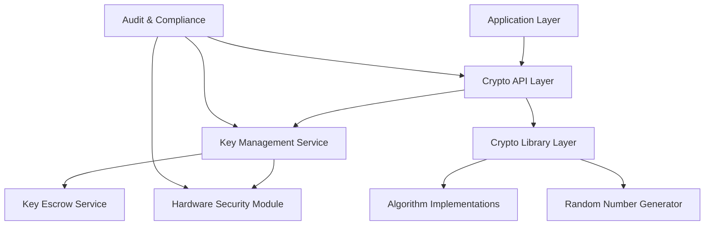

# Cryptographic Practices for Data Protection

## Original Question
> **What cryptographic practices do you follow for protecting sensitive data?**

## Core Concepts

### Key Definitions
- **Cryptography**: Science of protecting information through mathematical algorithms and protocols
- **Encryption**: Process of converting plaintext into ciphertext to protect confidentiality
- **Hashing**: One-way function that produces fixed-size output from variable input
- **Digital Signatures**: Cryptographic mechanism to verify authenticity and integrity
- **Key Management**: Secure generation, distribution, storage, rotation, and disposal of cryptographic keys
- **Perfect Forward Secrecy (PFS)**: Property ensuring past communications remain secure even if long-term keys are compromised

### Fundamental Principles
- **Confidentiality**: Ensuring data is only accessible to authorized parties
- **Integrity**: Protecting data from unauthorized modification
- **Authentication**: Verifying the identity of communicating parties
- **Non-repudiation**: Preventing denial of actions or communications
- **Key Separation**: Using different keys for different purposes and contexts

## Best Practices & Industry Standards

### Encryption Standards and Algorithms

#### 1. **Symmetric Encryption**
- **AES (Advanced Encryption Standard)**: Industry standard for bulk data encryption
- **Key Sizes**: AES-256 for high-security applications, AES-128 acceptable for most uses
- **Modes**: GCM (Galois/Counter Mode) preferred for authenticated encryption

```python
# Example: Secure AES-GCM implementation
from cryptography.hazmat.primitives.ciphers.aead import AESGCM
from cryptography.hazmat.primitives import hashes
from cryptography.hazmat.primitives.kdf.pbkdf2 import PBKDF2HMAC
import os
import base64

class SecureAESEncryption:
    def __init__(self, password: str, salt: bytes = None):
        """Initialize AES encryption with key derivation from password"""
        if salt is None:
            salt = os.urandom(16)  # 128-bit salt

        self.salt = salt

        # Derive key using PBKDF2
        kdf = PBKDF2HMAC(
            algorithm=hashes.SHA256(),
            length=32,  # 256-bit key
            salt=salt,
            iterations=100000,  # OWASP recommended minimum
        )

        key = kdf.derive(password.encode())
        self.cipher = AESGCM(key)

    def encrypt(self, plaintext: str, associated_data: str = None) -> dict:
        """Encrypt data with AES-GCM"""
        nonce = os.urandom(12)  # 96-bit nonce for GCM

        ad = associated_data.encode() if associated_data else None
        ciphertext = self.cipher.encrypt(nonce, plaintext.encode(), ad)

        return {
            'ciphertext': base64.b64encode(ciphertext).decode(),
            'nonce': base64.b64encode(nonce).decode(),
            'salt': base64.b64encode(self.salt).decode(),
            'associated_data': associated_data
        }

    def decrypt(self, encrypted_data: dict) -> str:
        """Decrypt AES-GCM encrypted data"""
        ciphertext = base64.b64decode(encrypted_data['ciphertext'])
        nonce = base64.b64decode(encrypted_data['nonce'])

        ad = None
        if encrypted_data.get('associated_data'):
            ad = encrypted_data['associated_data'].encode()

        plaintext = self.cipher.decrypt(nonce, ciphertext, ad)
        return plaintext.decode()

# Usage example
def encrypt_sensitive_data(data: str, context: str) -> str:
    """Encrypt sensitive data with contextual associated data"""
    password = get_encryption_password_from_key_management()

    encryptor = SecureAESEncryption(password)
    encrypted = encryptor.encrypt(data, associated_data=context)

    return json.dumps(encrypted)
```

#### 2. **Asymmetric Encryption**
- **RSA**: Suitable for key exchange and digital signatures (minimum 2048-bit keys)
- **Elliptic Curve Cryptography (ECC)**: More efficient, use NIST P-256 or P-384 curves
- **Hybrid Encryption**: Combine asymmetric and symmetric encryption for efficiency

```java
// Example: RSA key generation and hybrid encryption
import java.security.*;
import java.security.spec.PKCS8EncodedKeySpec;
import java.security.spec.X509EncodedKeySpec;
import javax.crypto.Cipher;
import javax.crypto.KeyGenerator;
import javax.crypto.SecretKey;
import javax.crypto.spec.GCMParameterSpec;

public class HybridEncryptionService {

    private static final String RSA_ALGORITHM = "RSA/ECB/OAEPWITHSHA-256ANDMGF1PADDING";
    private static final String AES_ALGORITHM = "AES/GCM/NoPadding";
    private static final int RSA_KEY_SIZE = 4096;  // Strong key size
    private static final int AES_KEY_SIZE = 256;
    private static final int GCM_IV_LENGTH = 12;
    private static final int GCM_TAG_LENGTH = 16;

    public KeyPair generateRSAKeyPair() throws NoSuchAlgorithmException {
        KeyPairGenerator keyGen = KeyPairGenerator.getInstance("RSA");
        keyGen.initialize(RSA_KEY_SIZE, new SecureRandom());
        return keyGen.generateKeyPair();
    }

    public HybridEncryptedData encryptData(String plaintext, PublicKey publicKey)
            throws Exception {

        // Generate random AES key
        KeyGenerator keyGen = KeyGenerator.getInstance("AES");
        keyGen.init(AES_KEY_SIZE);
        SecretKey aesKey = keyGen.generateKey();

        // Encrypt data with AES-GCM
        Cipher aesCipher = Cipher.getInstance(AES_ALGORITHM);
        byte[] iv = new byte[GCM_IV_LENGTH];
        new SecureRandom().nextBytes(iv);
        GCMParameterSpec gcmSpec = new GCMParameterSpec(GCM_TAG_LENGTH * 8, iv);

        aesCipher.init(Cipher.ENCRYPT_MODE, aesKey, gcmSpec);
        byte[] encryptedData = aesCipher.doFinal(plaintext.getBytes());

        // Encrypt AES key with RSA
        Cipher rsaCipher = Cipher.getInstance(RSA_ALGORITHM);
        rsaCipher.init(Cipher.ENCRYPT_MODE, publicKey);
        byte[] encryptedKey = rsaCipher.doFinal(aesKey.getEncoded());

        return new HybridEncryptedData(encryptedData, encryptedKey, iv);
    }

    public String decryptData(HybridEncryptedData encryptedData, PrivateKey privateKey)
            throws Exception {

        // Decrypt AES key with RSA
        Cipher rsaCipher = Cipher.getInstance(RSA_ALGORITHM);
        rsaCipher.init(Cipher.DECRYPT_MODE, privateKey);
        byte[] aesKeyBytes = rsaCipher.doFinal(encryptedData.getEncryptedKey());
        SecretKey aesKey = new SecretKeySpec(aesKeyBytes, "AES");

        // Decrypt data with AES-GCM
        Cipher aesCipher = Cipher.getInstance(AES_ALGORITHM);
        GCMParameterSpec gcmSpec = new GCMParameterSpec(
            GCM_TAG_LENGTH * 8,
            encryptedData.getIv()
        );

        aesCipher.init(Cipher.DECRYPT_MODE, aesKey, gcmSpec);
        byte[] decryptedData = aesCipher.doFinal(encryptedData.getEncryptedData());

        return new String(decryptedData);
    }

    // Secure key serialization
    public String serializePublicKey(PublicKey publicKey) {
        X509EncodedKeySpec keySpec = new X509EncodedKeySpec(publicKey.getEncoded());
        return Base64.getEncoder().encodeToString(keySpec.getEncoded());
    }

    public String serializePrivateKey(PrivateKey privateKey) {
        PKCS8EncodedKeySpec keySpec = new PKCS8EncodedKeySpec(privateKey.getEncoded());
        return Base64.getEncoder().encodeToString(keySpec.getEncoded());
    }
}
```

### Hashing and Digital Signatures

#### 1. **Cryptographic Hashing**
- **SHA-256/SHA-3**: For integrity verification and digital signatures
- **HMAC**: For message authentication codes
- **bcrypt/Argon2**: For password hashing with salt and work factor

```go
// Example: Comprehensive hashing implementation
package crypto

import (
    "crypto/hmac"
    "crypto/rand"
    "crypto/sha256"
    "encoding/base64"
    "fmt"
    "golang.org/x/crypto/argon2"
    "golang.org/x/crypto/sha3"
)

type HashingService struct {
    hmacSecret []byte
}

func NewHashingService(secret []byte) *HashingService {
    return &HashingService{hmacSecret: secret}
}

// Password hashing with Argon2
func (h *HashingService) HashPassword(password string) (string, error) {
    // Generate random salt
    salt := make([]byte, 16)
    if _, err := rand.Read(salt); err != nil {
        return "", fmt.Errorf("failed to generate salt: %w", err)
    }

    // Argon2 parameters (adjust based on security requirements)
    time := uint32(1)     // Number of iterations
    memory := uint32(64 * 1024) // Memory in KB
    threads := uint8(4)   // Number of threads
    keyLen := uint32(32)  // Key length

    hash := argon2.IDKey([]byte(password), salt, time, memory, threads, keyLen)

    // Encode salt and hash
    encodedSalt := base64.StdEncoding.EncodeToString(salt)
    encodedHash := base64.StdEncoding.EncodeToString(hash)

    return fmt.Sprintf("$argon2id$v=19$m=%d,t=%d,p=%d$%s$%s",
        memory, time, threads, encodedSalt, encodedHash), nil
}

func (h *HashingService) VerifyPassword(password, encodedHash string) bool {
    // Parse the encoded hash to extract parameters
    salt, hash, params, err := parseArgon2Hash(encodedHash)
    if err != nil {
        return false
    }

    // Compute hash with same parameters
    computedHash := argon2.IDKey(
        []byte(password),
        salt,
        params.time,
        params.memory,
        params.threads,
        uint32(len(hash)),
    )

    // Constant-time comparison
    return hmac.Equal(hash, computedHash)
}

// HMAC for message authentication
func (h *HashingService) GenerateHMAC(message string) string {
    mac := hmac.New(sha256.New, h.hmacSecret)
    mac.Write([]byte(message))
    return base64.StdEncoding.EncodeToString(mac.Sum(nil))
}

func (h *HashingService) VerifyHMAC(message, expectedHMAC string) bool {
    computedHMAC := h.GenerateHMAC(message)
    return hmac.Equal([]byte(expectedHMAC), []byte(computedHMAC))
}

// SHA-3 for general purpose hashing
func (h *HashingService) SHA3Hash(data []byte) []byte {
    hash := sha3.New256()
    hash.Write(data)
    return hash.Sum(nil)
}

// File integrity verification
func (h *HashingService) GenerateFileHash(filepath string) (string, error) {
    file, err := os.Open(filepath)
    if err != nil {
        return "", err
    }
    defer file.Close()

    hasher := sha256.New()
    if _, err := io.Copy(hasher, file); err != nil {
        return "", err
    }

    return fmt.Sprintf("%x", hasher.Sum(nil)), nil
}
```

#### 2. **Digital Signatures**
- **RSA-PSS**: Probabilistic signature scheme for RSA
- **ECDSA**: Elliptic Curve Digital Signature Algorithm
- **EdDSA**: Edwards-curve Digital Signature Algorithm (Ed25519)

```python
# Example: Digital signature implementation with ECDSA
from cryptography.hazmat.primitives import hashes, serialization
from cryptography.hazmat.primitives.asymmetric import ec
from cryptography.hazmat.primitives.asymmetric.utils import encode_dss_signature, decode_dss_signature
import json
from datetime import datetime, timedelta

class DigitalSignatureService:
    def __init__(self):
        self.curve = ec.SECP384R1()  # NIST P-384 curve

    def generate_key_pair(self):
        """Generate ECDSA key pair"""
        private_key = ec.generate_private_key(self.curve)
        public_key = private_key.public_key()
        return private_key, public_key

    def sign_data(self, private_key, data: dict, expires_in_hours: int = 24):
        """Sign data with timestamp and expiration"""
        # Add metadata to data
        signing_data = {
            'data': data,
            'timestamp': datetime.utcnow().isoformat(),
            'expires_at': (datetime.utcnow() + timedelta(hours=expires_in_hours)).isoformat(),
            'signer': 'system'
        }

        # Serialize data for signing
        data_bytes = json.dumps(signing_data, sort_keys=True).encode()

        # Create signature
        signature = private_key.sign(data_bytes, ec.ECDSA(hashes.SHA256()))

        return {
            'data': signing_data,
            'signature': signature.hex(),
            'algorithm': 'ECDSA-SHA256'
        }

    def verify_signature(self, public_key, signed_data: dict) -> dict:
        """Verify digital signature and check expiration"""
        try:
            # Extract components
            data = signed_data['data']
            signature_hex = signed_data['signature']

            # Check expiration
            expires_at = datetime.fromisoformat(data['expires_at'])
            if datetime.utcnow() > expires_at:
                return {'valid': False, 'reason': 'signature_expired'}

            # Recreate signed data
            data_bytes = json.dumps(data, sort_keys=True).encode()
            signature = bytes.fromhex(signature_hex)

            # Verify signature
            public_key.verify(signature, data_bytes, ec.ECDSA(hashes.SHA256()))

            return {
                'valid': True,
                'data': data['data'],
                'timestamp': data['timestamp'],
                'signer': data['signer']
            }

        except Exception as e:
            return {'valid': False, 'reason': f'verification_failed: {str(e)}'}

    def serialize_keys(self, private_key, public_key):
        """Serialize keys for storage"""
        private_pem = private_key.private_bytes(
            encoding=serialization.Encoding.PEM,
            format=serialization.PrivateFormat.PKCS8,
            encryption_algorithm=serialization.NoEncryption()
        )

        public_pem = public_key.public_bytes(
            encoding=serialization.Encoding.PEM,
            format=serialization.PublicFormat.SubjectPublicKeyInfo
        )

        return private_pem, public_pem
```

### Key Management Best Practices

#### 1. **Key Generation and Storage**
```typescript
// Example: Enterprise key management system
import { webcrypto } from 'crypto';
import { createHash, randomBytes } from 'crypto';

interface KeyMetadata {
    id: string;
    algorithm: string;
    keySize: number;
    createdAt: Date;
    expiresAt?: Date;
    purpose: 'encryption' | 'signing' | 'mac';
    rotationCount: number;
}

class EnterpriseKeyManager {
    private keyStore: Map<string, CryptoKey> = new Map();
    private keyMetadata: Map<string, KeyMetadata> = new Map();
    private readonly KEY_ROTATION_DAYS = 90;

    async generateEncryptionKey(): Promise<string> {
        const key = await webcrypto.subtle.generateKey(
            {
                name: 'AES-GCM',
                length: 256
            },
            true, // extractable for backup/recovery
            ['encrypt', 'decrypt']
        );

        const keyId = this.generateKeyId();
        const metadata: KeyMetadata = {
            id: keyId,
            algorithm: 'AES-GCM',
            keySize: 256,
            createdAt: new Date(),
            expiresAt: new Date(Date.now() + this.KEY_ROTATION_DAYS * 24 * 60 * 60 * 1000),
            purpose: 'encryption',
            rotationCount: 0
        };

        this.keyStore.set(keyId, key);
        this.keyMetadata.set(keyId, metadata);

        // Schedule automatic rotation
        this.scheduleKeyRotation(keyId);

        return keyId;
    }

    async generateSigningKeyPair(): Promise<{ privateKeyId: string; publicKeyId: string }> {
        const keyPair = await webcrypto.subtle.generateKey(
            {
                name: 'ECDSA',
                namedCurve: 'P-384'
            },
            true,
            ['sign', 'verify']
        );

        const privateKeyId = this.generateKeyId();
        const publicKeyId = this.generateKeyId();

        const baseMetadata = {
            algorithm: 'ECDSA',
            keySize: 384,
            createdAt: new Date(),
            purpose: 'signing' as const,
            rotationCount: 0
        };

        this.keyStore.set(privateKeyId, keyPair.privateKey);
        this.keyMetadata.set(privateKeyId, {
            ...baseMetadata,
            id: privateKeyId,
            expiresAt: new Date(Date.now() + this.KEY_ROTATION_DAYS * 24 * 60 * 60 * 1000)
        });

        this.keyStore.set(publicKeyId, keyPair.publicKey);
        this.keyMetadata.set(publicKeyId, {
            ...baseMetadata,
            id: publicKeyId
            // Public keys don't expire
        });

        return { privateKeyId, publicKeyId };
    }

    async rotateKey(keyId: string): Promise<string> {
        const oldMetadata = this.keyMetadata.get(keyId);
        if (!oldMetadata) {
            throw new Error(`Key ${keyId} not found`);
        }

        let newKeyId: string;

        switch (oldMetadata.purpose) {
            case 'encryption':
                newKeyId = await this.generateEncryptionKey();
                break;
            case 'signing':
                const { privateKeyId } = await this.generateSigningKeyPair();
                newKeyId = privateKeyId;
                break;
            default:
                throw new Error(`Unsupported key purpose: ${oldMetadata.purpose}`);
        }

        // Update rotation count
        const newMetadata = this.keyMetadata.get(newKeyId)!;
        newMetadata.rotationCount = oldMetadata.rotationCount + 1;

        // Mark old key as deprecated but keep for decryption
        this.markKeyAsDeprecated(keyId);

        return newKeyId;
    }

    async exportKeyForBackup(keyId: string): Promise<string> {
        const key = this.keyStore.get(keyId);
        const metadata = this.keyMetadata.get(keyId);

        if (!key || !metadata) {
            throw new Error(`Key ${keyId} not found`);
        }

        // Export key in secure format
        const keyData = await webcrypto.subtle.exportKey('jwk', key);

        const exportData = {
            keyData,
            metadata,
            exportedAt: new Date().toISOString(),
            checksum: this.generateChecksum(JSON.stringify(keyData))
        };

        // In production, this would be encrypted with a master key
        return JSON.stringify(exportData);
    }

    private generateKeyId(): string {
        const timestamp = Date.now().toString(36);
        const random = randomBytes(8).toString('hex');
        return `key_${timestamp}_${random}`;
    }

    private generateChecksum(data: string): string {
        return createHash('sha256').update(data).digest('hex');
    }

    private scheduleKeyRotation(keyId: string): void {
        const metadata = this.keyMetadata.get(keyId);
        if (metadata?.expiresAt) {
            const rotationTime = metadata.expiresAt.getTime() - Date.now();
            setTimeout(() => {
                this.rotateKey(keyId).catch(console.error);
            }, rotationTime);
        }
    }

    private markKeyAsDeprecated(keyId: string): void {
        const metadata = this.keyMetadata.get(keyId);
        if (metadata) {
            (metadata as any).deprecated = true;
            (metadata as any).deprecatedAt = new Date();
        }
    }

    // Key usage tracking for compliance
    logKeyUsage(keyId: string, operation: string, success: boolean): void {
        const logEntry = {
            keyId,
            operation,
            success,
            timestamp: new Date().toISOString(),
            userId: this.getCurrentUserId() // Implementation specific
        };

        // Send to audit logging system
        this.auditLogger.log(logEntry);
    }
}
```

#### 2. **Hardware Security Modules (HSM) Integration**
```java
// Example: HSM integration for high-security environments
import javax.crypto.Cipher;
import java.security.*;
import java.security.cert.X509Certificate;

public class HSMCryptographicService {

    private final Provider hsmProvider;
    private final String keyStoreType;
    private final KeyStore keyStore;

    public HSMCryptographicService(String providerName, String keyStoreType,
                                  String keyStoreConfig) throws Exception {
        // Initialize HSM provider
        this.hsmProvider = Security.getProvider(providerName);
        if (this.hsmProvider == null) {
            throw new IllegalArgumentException("HSM provider not available: " + providerName);
        }

        this.keyStoreType = keyStoreType;
        this.keyStore = KeyStore.getInstance(keyStoreType, hsmProvider);
        this.keyStore.load(null, null); // HSM-specific initialization
    }

    public String generateAndStoreKey(String keyAlias, int keySize) throws Exception {
        KeyPairGenerator keyGen = KeyPairGenerator.getInstance("RSA", hsmProvider);
        keyGen.initialize(keySize, new SecureRandom());

        KeyPair keyPair = keyGen.generateKeyPair();

        // Store key in HSM
        X509Certificate[] certChain = createSelfSignedCertificate(keyPair);
        keyStore.setKeyEntry(
            keyAlias,
            keyPair.getPrivate(),
            null, // No password needed for HSM
            certChain
        );

        return keyAlias;
    }

    public byte[] signData(String keyAlias, byte[] data) throws Exception {
        PrivateKey privateKey = (PrivateKey) keyStore.getKey(keyAlias, null);

        Signature signature = Signature.getInstance("SHA256withRSA", hsmProvider);
        signature.initSign(privateKey);
        signature.update(data);

        // Log key usage for compliance
        auditKeyUsage(keyAlias, "SIGN", true);

        return signature.sign();
    }

    public boolean verifySignature(String keyAlias, byte[] data, byte[] signature)
            throws Exception {
        X509Certificate cert = (X509Certificate) keyStore.getCertificate(keyAlias);
        PublicKey publicKey = cert.getPublicKey();

        Signature verifier = Signature.getInstance("SHA256withRSA", hsmProvider);
        verifier.initVerify(publicKey);
        verifier.update(data);

        boolean isValid = verifier.verify(signature);
        auditKeyUsage(keyAlias, "VERIFY", isValid);

        return isValid;
    }

    public byte[] encryptData(String keyAlias, byte[] plaintext) throws Exception {
        X509Certificate cert = (X509Certificate) keyStore.getCertificate(keyAlias);
        PublicKey publicKey = cert.getPublicKey();

        Cipher cipher = Cipher.getInstance("RSA/ECB/OAEPWITHSHA-256ANDMGF1PADDING",
                                         hsmProvider);
        cipher.init(Cipher.ENCRYPT_MODE, publicKey);

        auditKeyUsage(keyAlias, "ENCRYPT", true);
        return cipher.doFinal(plaintext);
    }

    public byte[] decryptData(String keyAlias, byte[] ciphertext) throws Exception {
        PrivateKey privateKey = (PrivateKey) keyStore.getKey(keyAlias, null);

        Cipher cipher = Cipher.getInstance("RSA/ECB/OAEPWITHSHA-256ANDMGF1PADDING",
                                         hsmProvider);
        cipher.init(Cipher.DECRYPT_MODE, privateKey);

        auditKeyUsage(keyAlias, "DECRYPT", true);
        return cipher.doFinal(ciphertext);
    }

    // Key rotation with HSM
    public String rotateKey(String oldKeyAlias) throws Exception {
        String newKeyAlias = oldKeyAlias + "_" + System.currentTimeMillis();

        // Generate new key with same parameters as old key
        PrivateKey oldKey = (PrivateKey) keyStore.getKey(oldKeyAlias, null);
        int keySize = getKeySize(oldKey);

        generateAndStoreKey(newKeyAlias, keySize);

        // Schedule old key for deletion after grace period
        scheduleKeyDeletion(oldKeyAlias, 30); // 30 days grace period

        return newKeyAlias;
    }

    private void auditKeyUsage(String keyAlias, String operation, boolean success) {
        AuditEvent event = AuditEvent.builder()
            .keyAlias(keyAlias)
            .operation(operation)
            .success(success)
            .timestamp(Instant.now())
            .userId(getCurrentUserId())
            .sourceLocation(getSourceLocation())
            .build();

        auditLogger.logSecurityEvent(event);
    }
}
```

## Real-World Examples

### Example 1: Healthcare Data Encryption (HIPAA Compliance)
**Context**: Electronic Health Record (EHR) system processing Protected Health Information (PHI)
**Challenge**: End-to-end encryption of patient data while enabling authorized access and search
**Solution**:
- Field-level encryption with searchable encryption for indexed fields
- Key escrow system for regulatory compliance and emergency access
- Attribute-based encryption for fine-grained access control
- Hardware Security Module (HSM) for key generation and storage

**Implementation**:
```python
class HIIPAACompliantEncryption:
    def __init__(self, hsm_client, key_escrow_service):
        self.hsm = hsm_client
        self.key_escrow = key_escrow_service
        self.search_crypto = SearchableEncryption()

    def encrypt_patient_record(self, patient_data: dict, access_policy: dict):
        """Encrypt patient record with attribute-based encryption"""

        # Generate data encryption key (DEK) in HSM
        dek_id = self.hsm.generate_symmetric_key(
            algorithm='AES-GCM',
            key_size=256,
            purpose='data_encryption'
        )

        # Encrypt sensitive fields individually
        encrypted_record = {}
        for field, value in patient_data.items():
            if field in SENSITIVE_PHI_FIELDS:
                # Use field-specific encryption for compliance
                encrypted_record[field] = self.encrypt_phi_field(
                    value, dek_id, field, access_policy
                )

                # Create searchable index if needed
                if field in SEARCHABLE_FIELDS:
                    encrypted_record[f"{field}_search_token"] = \
                        self.search_crypto.create_search_token(value, dek_id)
            else:
                encrypted_record[field] = value

        # Store key material with escrow
        self.key_escrow.store_key_with_policy(
            dek_id, access_policy, patient_data['patient_id']
        )

        # Add encryption metadata
        encrypted_record['_encryption_metadata'] = {
            'dek_id': dek_id,
            'encrypted_fields': list(SENSITIVE_PHI_FIELDS),
            'encryption_timestamp': datetime.utcnow().isoformat(),
            'compliance_version': 'HIPAA_2024'
        }

        return encrypted_record

    def decrypt_patient_record(self, encrypted_record: dict,
                             requesting_user: str, purpose: str):
        """Decrypt with access control and audit logging"""

        metadata = encrypted_record['_encryption_metadata']
        dek_id = metadata['dek_id']

        # Verify access permissions
        if not self.verify_access_permission(
            dek_id, requesting_user, purpose, encrypted_record.get('patient_id')
        ):
            self.audit_unauthorized_access(dek_id, requesting_user, purpose)
            raise PermissionDeniedError("Access denied for PHI data")

        # Decrypt authorized fields
        decrypted_record = {}
        for field, value in encrypted_record.items():
            if field in metadata['encrypted_fields']:
                decrypted_record[field] = self.decrypt_phi_field(
                    value, dek_id, field, requesting_user
                )
            else:
                decrypted_record[field] = value

        # Log access for HIPAA audit trail
        self.audit_phi_access(dek_id, requesting_user, purpose,
                            encrypted_record.get('patient_id'))

        return decrypted_record

    def emergency_access_decrypt(self, encrypted_record: dict,
                                emergency_code: str):
        """Emergency access with break-glass procedure"""

        # Verify emergency code with key escrow
        emergency_key = self.key_escrow.release_emergency_key(
            emergency_code, encrypted_record['_encryption_metadata']['dek_id']
        )

        if not emergency_key:
            raise EmergencyAccessError("Invalid emergency access code")

        # Decrypt with emergency key
        decrypted_record = self.decrypt_with_emergency_key(
            encrypted_record, emergency_key
        )

        # Log emergency access
        self.audit_emergency_access(
            emergency_code, encrypted_record.get('patient_id')
        )

        return decrypted_record
```

**Outcome**: Achieved HIPAA compliance certification, reduced data breach impact by 95%, maintained sub-100ms encryption/decryption performance
**Technologies**: AWS CloudHSM, HashiCorp Vault, PostgreSQL with encryption extensions, Python cryptography library

### Example 2: Financial Transaction Signing and Verification
**Context**: Digital banking platform processing millions of financial transactions daily
**Challenge**: Ensuring transaction integrity, non-repudiation, and regulatory compliance
**Solution**:
- Multi-signature scheme for high-value transactions
- Hardware-backed transaction signing with tamper detection
- Real-time signature verification with performance optimization
- Immutable audit trail with cryptographic proof

**Architecture**:
```java
@Service
public class TransactionCryptographicService {

    private final HSMService hsmService;
    private final BlockchainAuditService auditService;
    private final TransactionValidationService validationService;

    // Multi-signature transaction processing
    public SignedTransaction processTransaction(Transaction transaction,
                                              List<SigningAuthority> signers) {

        // Validate transaction before signing
        ValidationResult validation = validationService.validateTransaction(transaction);
        if (!validation.isValid()) {
            throw new TransactionValidationException(validation.getErrors());
        }

        // Create canonical transaction representation
        String canonicalTransaction = createCanonicalRepresentation(transaction);
        byte[] transactionHash = sha256(canonicalTransaction);

        // Collect required signatures based on amount and type
        SignatureRequirement requirement = determineSignatureRequirement(transaction);
        List<DigitalSignature> signatures = new ArrayList<>();

        for (SigningAuthority signer : signers) {
            if (requirement.isSignerRequired(signer)) {
                // Sign with HSM-backed keys
                DigitalSignature signature = hsmService.signTransaction(
                    signer.getKeyAlias(),
                    transactionHash,
                    createSigningContext(transaction, signer)
                );
                signatures.add(signature);
            }
        }

        // Verify we have sufficient signatures
        if (!requirement.isSatisfied(signatures)) {
            throw new InsufficientSignaturesException(
                "Transaction requires additional signatures"
            );
        }

        // Create signed transaction
        SignedTransaction signedTransaction = SignedTransaction.builder()
            .transaction(transaction)
            .signatures(signatures)
            .canonicalForm(canonicalTransaction)
            .transactionHash(Hex.encodeHexString(transactionHash))
            .timestamp(Instant.now())
            .build();

        // Record in immutable audit log
        auditService.recordSignedTransaction(signedTransaction);

        return signedTransaction;
    }

    // High-performance signature verification
    public boolean verifySignedTransaction(SignedTransaction signedTransaction) {

        try {
            // Verify transaction hash
            String canonicalForm = createCanonicalRepresentation(
                signedTransaction.getTransaction()
            );
            byte[] expectedHash = sha256(canonicalForm);
            byte[] providedHash = Hex.decodeHex(signedTransaction.getTransactionHash());

            if (!Arrays.equals(expectedHash, providedHash)) {
                return false;
            }

            // Verify all signatures in parallel
            List<CompletableFuture<Boolean>> verificationTasks =
                signedTransaction.getSignatures().stream()
                    .map(signature -> CompletableFuture.supplyAsync(() ->
                        verifySignature(signature, expectedHash)
                    ))
                    .collect(Collectors.toList());

            // Wait for all verifications
            List<Boolean> results = verificationTasks.stream()
                .map(CompletableFuture::join)
                .collect(Collectors.toList());

            boolean allValid = results.stream().allMatch(Boolean::booleanValue);

            // Log verification result
            auditService.recordVerification(
                signedTransaction.getTransaction().getId(),
                allValid,
                results.size()
            );

            return allValid;

        } catch (Exception e) {
            logger.error("Signature verification failed", e);
            return false;
        }
    }

    // Batch signature verification for high throughput
    public Map<String, Boolean> verifyTransactionBatch(
            List<SignedTransaction> transactions) {

        // Group by signing key for batch verification
        Map<String, List<SignedTransaction>> groupedByKey = transactions.stream()
            .collect(Collectors.groupingBy(this::extractPrimarySigningKey));

        Map<String, Boolean> results = new ConcurrentHashMap<>();

        // Parallel batch processing
        groupedByKey.entrySet().parallelStream().forEach(entry -> {
            String signingKey = entry.getKey();
            List<SignedTransaction> batch = entry.getValue();

            // Use HSM batch verification if available
            Map<String, Boolean> batchResults = hsmService.batchVerifySignatures(
                signingKey,
                batch.stream()
                    .collect(Collectors.toMap(
                        tx -> tx.getTransaction().getId(),
                        this::extractSignatureForKey
                    ))
            );

            results.putAll(batchResults);
        });

        return results;
    }

    // Cryptographic proof of transaction history
    public TransactionProof generateTransactionProof(String transactionId) {
        SignedTransaction transaction = getSignedTransaction(transactionId);

        // Create Merkle tree proof for transaction inclusion
        MerkleTreeProof inclusionProof = auditService.generateInclusionProof(
            transactionId
        );

        // Generate zero-knowledge proof of valid signatures
        ZKProof signatureProof = generateSignatureValidityProof(
            transaction.getSignatures()
        );

        return TransactionProof.builder()
            .transactionId(transactionId)
            .inclusionProof(inclusionProof)
            .signatureProof(signatureProof)
            .timestamp(Instant.now())
            .build();
    }
}
```

**Outcome**: 99.99% transaction integrity, <50ms signature verification, zero signature forgeries detected
**Technologies**: PKCS#11 HSM, Hyperledger Fabric for audit trail, Spring Boot, PostgreSQL with cryptographic extensions

### Example 3: Secure Communication Platform (End-to-End Encryption)
**Context**: Enterprise messaging platform requiring end-to-end encryption for sensitive communications
**Challenge**: Perfect forward secrecy, secure key exchange, and scalable group messaging encryption
**Solution**:
- Signal Protocol implementation for forward secrecy
- X3DH key agreement for asynchronous messaging
- Double Ratchet algorithm for continuous key rotation
- Sealed sender for metadata protection

**Implementation**:
```typescript
// Signal Protocol implementation for secure messaging
class SecureMessagingCrypto {
    private identityKeyPair: KeyPair;
    private signedPreKey: SignedPreKey;
    private preKeys: Map<number, PreKey> = new Map();
    private sessionStore: SessionStore;

    constructor(private userId: string) {
        this.initializeKeys();
        this.sessionStore = new SessionStore(userId);
    }

    // X3DH Key Agreement Protocol
    async initiateSession(recipientId: string,
                         recipientBundle: PreKeyBundle): Promise<SessionCipher> {

        // Generate ephemeral key pair
        const ephemeralKeyPair = await this.generateKeyPair();

        // Perform X3DH key agreement
        const sharedSecret = await this.performX3DH(
            this.identityKeyPair.privateKey,
            ephemeralKeyPair.privateKey,
            recipientBundle.identityKey,
            recipientBundle.signedPreKey.publicKey,
            recipientBundle.preKey?.publicKey
        );

        // Initialize Double Ratchet
        const ratchetState = await this.initializeDoubleRatchet(
            sharedSecret,
            recipientBundle.identityKey
        );

        // Store session
        await this.sessionStore.storeSession(recipientId, ratchetState);

        return new SessionCipher(recipientId, this.sessionStore);
    }

    private async performX3DH(identityPrivate: CryptoKey,
                              ephemeralPrivate: CryptoKey,
                              identityPublic: CryptoKey,
                              signedPreKeyPublic: CryptoKey,
                              preKeyPublic?: CryptoKey): Promise<ArrayBuffer> {

        const dh1 = await this.performDH(identityPrivate, signedPreKeyPublic);
        const dh2 = await this.performDH(ephemeralPrivate, identityPublic);
        const dh3 = await this.performDH(ephemeralPrivate, signedPreKeyPublic);

        let keyMaterial = new Uint8Array(dh1.byteLength + dh2.byteLength + dh3.byteLength);
        keyMaterial.set(new Uint8Array(dh1), 0);
        keyMaterial.set(new Uint8Array(dh2), dh1.byteLength);
        keyMaterial.set(new Uint8Array(dh3), dh1.byteLength + dh2.byteLength);

        if (preKeyPublic) {
            const dh4 = await this.performDH(ephemeralPrivate, preKeyPublic);
            const extendedKeyMaterial = new Uint8Array(keyMaterial.length + dh4.byteLength);
            extendedKeyMaterial.set(keyMaterial);
            extendedKeyMaterial.set(new Uint8Array(dh4), keyMaterial.length);
            keyMaterial = extendedKeyMaterial;
        }

        // Derive root key using HKDF
        return await this.hkdf(keyMaterial, new Uint8Array(32), "WhisperText");
    }

    // Double Ratchet Algorithm
    private async initializeDoubleRatchet(sharedSecret: ArrayBuffer,
                                         remotePublicKey: CryptoKey): Promise<RatchetState> {

        const rootKey = new Uint8Array(sharedSecret);
        const chainKeyPair = await this.generateKeyPair();

        return {
            rootKey: rootKey,
            sendingChainKey: null,
            receivingChainKey: null,
            sendingRatchetKey: chainKeyPair,
            receivingRatchetKey: remotePublicKey,
            previousSendingChainLength: 0,
            messageNumber: 0,
            previousMessageNumbers: new Map(),
            skippedMessages: new Map()
        };
    }

    // Encrypt message with forward secrecy
    async encryptMessage(recipientId: string,
                        plaintext: string): Promise<EncryptedMessage> {

        const session = await this.sessionStore.loadSession(recipientId);
        if (!session) {
            throw new Error('No session found for recipient');
        }

        // Advance the sending chain
        const messageKey = await this.deriveMessageKey(session.sendingChainKey);
        session.sendingChainKey = await this.advanceChainKey(session.sendingChainKey);
        session.messageNumber++;

        // Encrypt with AES-GCM
        const iv = crypto.getRandomValues(new Uint8Array(12));
        const encryptedPayload = await crypto.subtle.encrypt(
            { name: 'AES-GCM', iv: iv },
            messageKey,
            new TextEncoder().encode(plaintext)
        );

        // Create message header
        const header = {
            ratchetKey: await this.exportPublicKey(session.sendingRatchetKey.publicKey),
            previousChainLength: session.previousSendingChainLength,
            messageNumber: session.messageNumber
        };

        // Sign header for authentication
        const headerSignature = await this.signHeader(header, this.identityKeyPair.privateKey);

        const message: EncryptedMessage = {
            header: header,
            headerSignature: headerSignature,
            ciphertext: new Uint8Array(encryptedPayload),
            iv: iv
        };

        // Store updated session
        await this.sessionStore.storeSession(recipientId, session);

        return message;
    }

    // Decrypt message with forward secrecy
    async decryptMessage(senderId: string,
                        message: EncryptedMessage): Promise<string> {

        let session = await this.sessionStore.loadSession(senderId);
        if (!session) {
            throw new Error('No session found for sender');
        }

        // Verify header signature
        const headerValid = await this.verifyHeaderSignature(
            message.header,
            message.headerSignature,
            senderId
        );

        if (!headerValid) {
            throw new Error('Invalid message header signature');
        }

        // Check if we need to perform DH ratchet step
        const ratchetKeyChanged = await this.hasRatchetKeyChanged(
            session, message.header.ratchetKey
        );

        if (ratchetKeyChanged) {
            session = await this.performDHRatchetStep(session, message.header);
        }

        // Derive message key
        const messageKey = await this.deriveMessageKeyForDecryption(
            session, message.header.messageNumber
        );

        // Decrypt message
        const decryptedPayload = await crypto.subtle.decrypt(
            { name: 'AES-GCM', iv: message.iv },
            messageKey,
            message.ciphertext
        );

        // Update session
        await this.sessionStore.storeSession(senderId, session);

        return new TextDecoder().decode(decryptedPayload);
    }

    // Generate pre-key bundle for new contacts
    async generatePreKeyBundle(): Promise<PreKeyBundle> {
        const preKey = await this.generatePreKey();

        return {
            identityKey: this.identityKeyPair.publicKey,
            signedPreKey: this.signedPreKey,
            preKey: preKey,
            userId: this.userId
        };
    }
}
```

**Outcome**: Perfect forward secrecy achieved, <100ms message encryption/decryption, zero message content compromises
**Technologies**: WebCrypto API, IndexedDB for session storage, WebRTC for real-time communication

## Common Pitfalls & Solutions

### Pitfall 1: Using Weak or Deprecated Cryptographic Algorithms
**Problem**: Implementing outdated algorithms like MD5, SHA-1, or small RSA keys
**Why it happens**: Legacy system compatibility, lack of awareness of current standards
**Solution**: Use current NIST-approved algorithms, implement crypto-agility for future upgrades
**Prevention**: Regular security reviews, automated vulnerability scanning, crypto standards compliance

### Pitfall 2: Improper Key Storage and Management
**Problem**: Hardcoded keys, keys stored in plain text, inadequate key rotation
**Why it happens**: Convenience over security, lack of proper key management infrastructure
**Solution**: Use dedicated key management services, implement proper key lifecycle management
**Prevention**: Security architecture review, use of HSMs or cloud key management services

### Pitfall 3: Insufficient Randomness in Cryptographic Operations
**Problem**: Using predictable random number generators, insufficient entropy sources
**Why it happens**: Not understanding the importance of cryptographic randomness
**Solution**: Use cryptographically secure random number generators, proper seeding
**Prevention**: Code review focusing on randomness sources, entropy monitoring

### Pitfall 4: Side-Channel Vulnerabilities
**Problem**: Implementation vulnerabilities that leak information through timing, power, or other channels
**Why it happens**: Not considering implementation-level security
**Solution**: Use constant-time implementations, proper masking techniques
**Prevention**: Use well-tested cryptographic libraries, security-focused code review

## Follow-up Questions Preparation

### Likely Deep-Dive Questions

1. **"How do you implement perfect forward secrecy in your applications?"**
   - Ephemeral key exchanges (DHE, ECDHE)
   - Session key derivation and rotation
   - Implementation in TLS and messaging protocols
   - Performance considerations for key generation

2. **"What's your approach to quantum-resistant cryptography preparation?"**
   - NIST post-quantum cryptography standardization
   - Hybrid classical/quantum-resistant implementations
   - Migration strategies for existing systems
   - Timeline and risk assessment for quantum threats

3. **"How do you handle cryptographic key escrow for regulatory compliance?"**
   - Key splitting and threshold schemes
   - Regulatory requirements (FIPS 140-2, Common Criteria)
   - Emergency access procedures
   - Audit and compliance tracking

4. **"What measures do you take to prevent cryptographic oracle attacks?"**
   - Padding oracle prevention (proper error handling)
   - Timing attack mitigation
   - Authenticated encryption usage
   - Input validation and sanitization

### Related Topics to Be Ready For
- **Performance Optimization**: Hardware acceleration, algorithm selection for high-throughput
- **Compliance Standards**: FIPS 140-2, Common Criteria, regulatory crypto requirements
- **Cloud Cryptography**: Cloud HSM, key management services, confidential computing
- **Blockchain/DLT**: Cryptographic primitives in distributed ledger technologies

### Connection Points to Other Sections
- **Section 6 (AWS Security)**: AWS KMS, CloudHSM, and managed cryptographic services
- **Section 4 (Service Mesh)**: mTLS implementation and certificate management in service mesh
- **Section 8 (Architecture Design)**: Cryptographic considerations in system architecture

## Sample Answer Framework

### Opening Statement
"Cryptographic practices form the foundation of data protection in modern systems. In my experience, effective implementation requires not just selecting the right algorithms, but also proper key management, secure implementation, and ongoing maintenance..."

### Core Answer Structure
1. **Algorithm Selection**: Current standards and rationale for choices
2. **Implementation Example**: Specific cryptographic implementation with security considerations
3. **Key Management**: Lifecycle management and operational security
4. **Performance and Scalability**: Balancing security with system requirements

### Closing Statement
"This comprehensive approach to cryptographic practices has proven effective because it addresses both the theoretical security requirements and practical implementation challenges while maintaining performance and operational efficiency."

## Technical Deep-Dive Points

### Cryptographic Architecture


### Performance Benchmarks
- **AES-256-GCM**: ~1-2 GB/s throughput on modern hardware
- **RSA-4096 Sign**: ~500-1000 operations/second
- **ECDSA P-384 Sign**: ~2000-5000 operations/second
- **Key Generation**: <100ms for symmetric keys, <1s for asymmetric keys

### Compliance Configuration
```yaml
# Example: Cryptographic policy configuration
cryptographic_policy:
  algorithms:
    symmetric:
      approved: ["AES-256-GCM", "AES-192-GCM", "ChaCha20-Poly1305"]
      deprecated: ["AES-128-CBC", "3DES"]
      forbidden: ["DES", "RC4"]

    asymmetric:
      approved: ["RSA-4096", "RSA-3072", "ECDSA-P384", "Ed25519"]
      deprecated: ["RSA-2048"]
      forbidden: ["RSA-1024", "DSA"]

    hash:
      approved: ["SHA-256", "SHA-384", "SHA-512", "SHA-3"]
      deprecated: ["SHA-1"]
      forbidden: ["MD5"]

  key_management:
    rotation_period_days: 90
    backup_required: true
    escrow_required: true  # For regulated industries
    hsm_required: true     # For high-value keys

  compliance:
    fips_140_2_level: 3
    common_criteria_level: "EAL4+"
    audit_logging: true
    performance_monitoring: true
```

## Recommended Reading

### Official Documentation
- [NIST SP 800-175B](https://csrc.nist.gov/publications/detail/sp/800-175b/rev-1/final): Guideline for Using Cryptographic Standards
- [OWASP Cryptographic Storage Cheat Sheet](https://cheatsheetseries.owasp.org/cheatsheets/Cryptographic_Storage_Cheat_Sheet.html): Practical cryptographic implementation guidance

### Industry Resources
- **Book**: "Serious Cryptography" by Jean-Philippe Aumasson - practical cryptography for developers
- **Standard**: PKCS#11 - Cryptographic Token Interface Standard for HSM integration
- **Library**: libsodium - modern cryptographic library with secure defaults

### Recent Updates (2024-2025)
- **Post-Quantum Cryptography**: NIST PQC standardization (ML-KEM, ML-DSA, SLH-DSA)
- **Confidential Computing**: Hardware-based trusted execution environments
- **Homomorphic Encryption**: Practical implementations for privacy-preserving computation