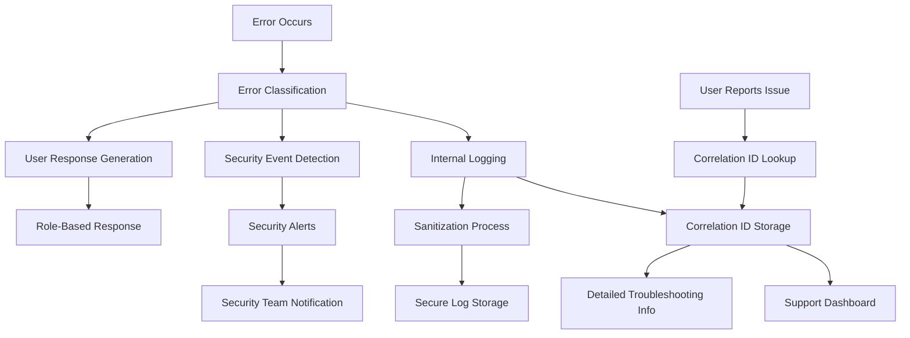

# Security vs Troubleshooting Balance in Error Handling

## Original Question
> **How do you balance error handling and logging between security and troubleshooting?**

## Core Concepts

### Key Definitions
- **Information Disclosure**: Unintentional revelation of sensitive system information through error messages
- **Security-First Error Handling**: Error responses that prioritize security over debugging convenience
- **Structured Logging**: Organized logging format that enables both security monitoring and troubleshooting
- **Error Correlation**: Linking user-facing errors with detailed internal logs for troubleshooting
- **Log Sanitization**: Removing or masking sensitive data from log entries

### Fundamental Principles
- **Fail Securely**: Systems should fail in a secure state without exposing sensitive information
- **Separation of Concerns**: Different error information for different audiences (users vs developers vs security teams)
- **Least Information Disclosure**: Provide minimum necessary information to resolve issues
- **Audit Trail Completeness**: Maintain comprehensive logs for security and compliance while protecting sensitive data
- **Contextual Error Handling**: Error responses appropriate to the context and user privilege level

## Best Practices & Industry Standards

### Error Handling Strategies

#### 1. **Layered Error Response Architecture**
```python
# Example: Multi-tier error handling system
from enum import Enum
from typing import Dict, Any, Optional
import logging
import uuid
from datetime import datetime

class ErrorSeverity(Enum):
    LOW = "low"
    MEDIUM = "medium"
    HIGH = "high"
    CRITICAL = "critical"

class ErrorCategory(Enum):
    AUTHENTICATION = "authentication"
    AUTHORIZATION = "authorization"
    VALIDATION = "validation"
    SYSTEM = "system"
    EXTERNAL = "external"

class SecureErrorHandler:
    def __init__(self, logger, audit_logger, security_logger):
        self.logger = logger
        self.audit_logger = audit_logger
        self.security_logger = security_logger

    def handle_error(self, error: Exception, context: Dict[str, Any],
                    user_context: Optional[Dict[str, Any]] = None) -> Dict[str, Any]:
        """
        Handle errors with appropriate level of detail for different audiences
        """
        # Generate unique error correlation ID
        correlation_id = str(uuid.uuid4())

        # Classify the error
        error_classification = self.classify_error(error, context)

        # Log detailed information for internal use
        self._log_detailed_error(error, context, correlation_id, error_classification)

        # Generate appropriate user-facing response
        user_response = self._generate_user_response(
            error_classification, correlation_id, user_context
        )

        # Log security events if needed
        if error_classification['severity'] in [ErrorSeverity.HIGH, ErrorSeverity.CRITICAL]:
            self._log_security_event(error, context, correlation_id, user_context)

        return user_response

    def classify_error(self, error: Exception, context: Dict[str, Any]) -> Dict[str, Any]:
        """Classify error for appropriate handling"""

        if isinstance(error, AuthenticationError):
            return {
                'category': ErrorCategory.AUTHENTICATION,
                'severity': ErrorSeverity.HIGH,
                'user_message': 'Authentication failed. Please verify your credentials.',
                'expose_details': False,
                'require_audit': True
            }
        elif isinstance(error, AuthorizationError):
            return {
                'category': ErrorCategory.AUTHORIZATION,
                'severity': ErrorSeverity.HIGH,
                'user_message': 'Access denied. You do not have permission to access this resource.',
                'expose_details': False,
                'require_audit': True
            }
        elif isinstance(error, ValidationError):
            return {
                'category': ErrorCategory.VALIDATION,
                'severity': ErrorSeverity.LOW,
                'user_message': 'Invalid input provided.',
                'expose_details': True,  # Safe to show validation details
                'require_audit': False
            }
        elif isinstance(error, DatabaseError):
            return {
                'category': ErrorCategory.SYSTEM,
                'severity': ErrorSeverity.CRITICAL,
                'user_message': 'A system error occurred. Please try again later.',
                'expose_details': False,
                'require_audit': True
            }
        else:
            return {
                'category': ErrorCategory.SYSTEM,
                'severity': ErrorSeverity.MEDIUM,
                'user_message': 'An unexpected error occurred. Please contact support.',
                'expose_details': False,
                'require_audit': True
            }

    def _generate_user_response(self, classification: Dict[str, Any],
                              correlation_id: str,
                              user_context: Optional[Dict[str, Any]]) -> Dict[str, Any]:
        """Generate appropriate user-facing error response"""

        base_response = {
            'success': False,
            'message': classification['user_message'],
            'correlation_id': correlation_id,
            'timestamp': datetime.utcnow().isoformat()
        }

        # Add details only if safe to expose
        if classification['expose_details'] and hasattr(error, 'user_safe_details'):
            base_response['details'] = error.user_safe_details

        # Add support information for high-severity errors
        if classification['severity'] in [ErrorSeverity.HIGH, ErrorSeverity.CRITICAL]:
            base_response['support_reference'] = correlation_id
            base_response['support_contact'] = 'support@company.com'

        # Add retry information for transient errors
        if classification['category'] == ErrorCategory.EXTERNAL:
            base_response['retry_after'] = 30  # seconds
            base_response['max_retries'] = 3

        return base_response

    def _log_detailed_error(self, error: Exception, context: Dict[str, Any],
                           correlation_id: str, classification: Dict[str, Any]):
        """Log detailed error information for troubleshooting"""

        # Sanitize context to remove sensitive data
        sanitized_context = self._sanitize_context(context)

        error_details = {
            'correlation_id': correlation_id,
            'error_type': error.__class__.__name__,
            'error_message': str(error),
            'error_category': classification['category'].value,
            'severity': classification['severity'].value,
            'context': sanitized_context,
            'stack_trace': self._get_sanitized_stack_trace(error),
            'timestamp': datetime.utcnow().isoformat()
        }

        # Log with appropriate level based on severity
        if classification['severity'] == ErrorSeverity.CRITICAL:
            self.logger.critical("Critical error occurred", extra=error_details)
        elif classification['severity'] == ErrorSeverity.HIGH:
            self.logger.error("High severity error", extra=error_details)
        elif classification['severity'] == ErrorSeverity.MEDIUM:
            self.logger.warning("Medium severity error", extra=error_details)
        else:
            self.logger.info("Low severity error", extra=error_details)

    def _log_security_event(self, error: Exception, context: Dict[str, Any],
                           correlation_id: str, user_context: Optional[Dict[str, Any]]):
        """Log security-relevant events"""

        security_event = {
            'event_type': 'security_error',
            'correlation_id': correlation_id,
            'error_category': self.classify_error(error, context)['category'].value,
            'user_id': user_context.get('user_id') if user_context else None,
            'ip_address': context.get('remote_ip'),
            'user_agent': context.get('user_agent'),
            'request_path': context.get('request_path'),
            'timestamp': datetime.utcnow().isoformat(),
            'severity': 'security_incident'
        }

        self.security_logger.warning("Security-related error", extra=security_event)

    def _sanitize_context(self, context: Dict[str, Any]) -> Dict[str, Any]:
        """Remove sensitive data from context before logging"""

        sensitive_keys = {
            'password', 'token', 'api_key', 'secret', 'private_key',
            'authorization', 'cookie', 'session_id', 'credit_card',
            'ssn', 'social_security_number'
        }

        sanitized = {}
        for key, value in context.items():
            if any(sensitive_key in key.lower() for sensitive_key in sensitive_keys):
                sanitized[key] = '[REDACTED]'
            elif isinstance(value, str) and len(value) > 100:
                # Truncate very long strings but show partial content
                sanitized[key] = f"{value[:50]}...[TRUNCATED]"
            else:
                sanitized[key] = value

        return sanitized
```

#### 2. **Context-Aware Error Responses**
```java
// Example: Role-based error detail exposure
@RestController
public class SecureErrorController {

    @Autowired
    private ErrorClassificationService errorClassificationService;

    @Autowired
    private AuditLoggingService auditLoggingService;

    @ExceptionHandler(Exception.class)
    public ResponseEntity<ErrorResponse> handleException(
            Exception ex, HttpServletRequest request) {

        // Extract request context
        RequestContext context = RequestContext.builder()
            .ipAddress(getClientIpAddress(request))
            .userAgent(request.getHeader("User-Agent"))
            .requestPath(request.getRequestURI())
            .requestMethod(request.getMethod())
            .timestamp(Instant.now())
            .build();

        // Get current user context
        UserContext userContext = SecurityContextHolder.getContext()
            .getAuthentication() != null ?
                extractUserContext(SecurityContextHolder.getContext().getAuthentication()) :
                null;

        // Generate correlation ID
        String correlationId = UUID.randomUUID().toString();

        // Classify and handle error
        ErrorClassification classification = errorClassificationService
            .classifyError(ex, context);

        // Log detailed information
        logDetailedError(ex, context, userContext, correlationId, classification);

        // Generate appropriate response based on user role
        ErrorResponse response = generateContextualResponse(
            classification, correlationId, userContext, context
        );

        // Audit security events
        if (classification.requiresSecurityAudit()) {
            auditLoggingService.logSecurityEvent(
                ex, context, userContext, correlationId
            );
        }

        return ResponseEntity
            .status(classification.getHttpStatus())
            .body(response);
    }

    private ErrorResponse generateContextualResponse(
            ErrorClassification classification,
            String correlationId,
            UserContext userContext,
            RequestContext requestContext) {

        ErrorResponse.Builder responseBuilder = ErrorResponse.builder()
            .success(false)
            .message(classification.getUserMessage())
            .correlationId(correlationId)
            .timestamp(Instant.now());

        // Add details based on user role and error type
        if (userContext != null && userContext.hasRole("ADMIN")) {
            // Admins get more detailed information
            responseBuilder
                .errorCode(classification.getErrorCode())
                .category(classification.getCategory().name());

            if (classification.isSafeToExposeDetails()) {
                responseBuilder.details(classification.getSafeDetails());
            }
        } else if (userContext != null && userContext.hasRole("DEVELOPER")) {
            // Developers get technical details for non-security errors
            if (!classification.isSecuritySensitive()) {
                responseBuilder
                    .errorCode(classification.getErrorCode())
                    .debugInfo(classification.getDebugInfo());
            }
        }

        // Add support information for end users
        if (classification.requiresSupportContact()) {
            responseBuilder
                .supportReference(correlationId)
                .supportContact("support@company.com")
                .documentation(classification.getDocumentationLink());
        }

        // Add retry information for transient errors
        if (classification.isRetryable()) {
            responseBuilder
                .retryable(true)
                .retryAfterSeconds(classification.getRetryDelay())
                .maxRetries(classification.getMaxRetries());
        }

        return responseBuilder.build();
    }

    private void logDetailedError(Exception ex, RequestContext requestContext,
                                UserContext userContext, String correlationId,
                                ErrorClassification classification) {

        // Create comprehensive log entry
        Map<String, Object> logData = new HashMap<>();
        logData.put("correlation_id", correlationId);
        logData.put("error_type", ex.getClass().getSimpleName());
        logData.put("error_message", ex.getMessage());
        logData.put("classification", classification.getCategory().name());
        logData.put("severity", classification.getSeverity().name());
        logData.put("http_status", classification.getHttpStatus().value());

        // Add request context (sanitized)
        logData.put("request_context", sanitizeRequestContext(requestContext));

        // Add user context (without sensitive information)
        if (userContext != null) {
            logData.put("user_context", sanitizeUserContext(userContext));
        }

        // Add stack trace for internal errors
        if (classification.includeStackTrace()) {
            logData.put("stack_trace", sanitizeStackTrace(ex));
        }

        // Log with appropriate level
        switch (classification.getSeverity()) {
            case CRITICAL:
                logger.error("Critical application error: {}", logData);
                break;
            case HIGH:
                logger.warn("High severity error: {}", logData);
                break;
            case MEDIUM:
                logger.info("Medium severity error: {}", logData);
                break;
            default:
                logger.debug("Low severity error: {}", logData);
                break;
        }
    }
}
```

### Structured Logging Implementation

#### 1. **Security-Aware Log Formatting**
```typescript
// Example: Comprehensive structured logging
interface LogEntry {
    timestamp: string;
    level: 'DEBUG' | 'INFO' | 'WARN' | 'ERROR' | 'CRITICAL';
    correlation_id: string;
    component: string;
    event_type: string;
    message: string;
    context: Record<string, any>;
    security_classification: 'PUBLIC' | 'INTERNAL' | 'CONFIDENTIAL' | 'SECRET';
    retention_period: number; // days
}

class SecureStructuredLogger {
    private sensitiveFieldPatterns: RegExp[] = [
        /password/i,
        /token/i,
        /key/i,
        /secret/i,
        /credential/i,
        /auth/i,
        /ssn/i,
        /social.security/i,
        /credit.card/i,
        /card.number/i
    ];

    private piiPatterns: RegExp[] = [
        /\b\d{3}-\d{2}-\d{4}\b/, // SSN
        /\b\d{4}[\s-]?\d{4}[\s-]?\d{4}[\s-]?\d{4}\b/, // Credit card
        /\b[A-Za-z0-9._%+-]+@[A-Za-z0-9.-]+\.[A-Z|a-z]{2,}\b/ // Email
    ];

    log(level: LogEntry['level'], message: string, context: Record<string, any> = {}): void {
        const logEntry: LogEntry = {
            timestamp: new Date().toISOString(),
            level,
            correlation_id: this.getCorrelationId(),
            component: this.getComponentName(),
            event_type: this.determineEventType(context),
            message: this.sanitizeMessage(message),
            context: this.sanitizeContext(context),
            security_classification: this.classifySecurityLevel(context),
            retention_period: this.determineRetentionPeriod(level, context)
        };

        // Send to appropriate log destination based on classification
        this.routeLogEntry(logEntry);

        // Alert on security events
        if (this.isSecurityEvent(logEntry)) {
            this.alertSecurityTeam(logEntry);
        }
    }

    private sanitizeContext(context: Record<string, any>): Record<string, any> {
        const sanitized: Record<string, any> = {};

        for (const [key, value] of Object.entries(context)) {
            if (this.isSensitiveField(key)) {
                sanitized[key] = '[REDACTED]';
            } else if (typeof value === 'string') {
                sanitized[key] = this.sanitizePII(value);
            } else if (typeof value === 'object' && value !== null) {
                sanitized[key] = this.sanitizeContext(value);
            } else {
                sanitized[key] = value;
            }
        }

        return sanitized;
    }

    private sanitizeMessage(message: string): string {
        let sanitized = message;

        // Remove PII patterns
        for (const pattern of this.piiPatterns) {
            sanitized = sanitized.replace(pattern, '[PII_REDACTED]');
        }

        // Remove potential sensitive paths or identifiers
        sanitized = sanitized.replace(/\/[a-f0-9]{8}-[a-f0-9]{4}-[a-f0-9]{4}-[a-f0-9]{4}-[a-f0-9]{12}/g, '/[UUID]');
        sanitized = sanitized.replace(/\b[A-Za-z0-9]{20,}\b/g, '[TOKEN]');

        return sanitized;
    }

    private isSensitiveField(fieldName: string): boolean {
        return this.sensitiveFieldPatterns.some(pattern => pattern.test(fieldName));
    }

    private sanitizePII(value: string): string {
        let sanitized = value;

        for (const pattern of this.piiPatterns) {
            if (pattern.test(value)) {
                sanitized = '[PII_REDACTED]';
                break;
            }
        }

        return sanitized;
    }

    private classifySecurityLevel(context: Record<string, any>): LogEntry['security_classification'] {
        // Classify based on context content
        if (context.user_id || context.authentication || context.authorization) {
            return 'CONFIDENTIAL';
        }
        if (context.error_type === 'SecurityException' || context.security_event) {
            return 'SECRET';
        }
        if (context.internal_system || context.database_query) {
            return 'INTERNAL';
        }
        return 'PUBLIC';
    }

    private determineRetentionPeriod(level: LogEntry['level'], context: Record<string, any>): number {
        // Security events: 7 years
        if (this.isSecurityEvent({ level, context } as any)) {
            return 2555; // 7 years
        }

        // Error logs: 1 year
        if (level === 'ERROR' || level === 'CRITICAL') {
            return 365;
        }

        // Warning logs: 6 months
        if (level === 'WARN') {
            return 180;
        }

        // Info/Debug logs: 30 days
        return 30;
    }

    private routeLogEntry(logEntry: LogEntry): void {
        // Route to different destinations based on classification
        switch (logEntry.security_classification) {
            case 'SECRET':
                this.sendToSecureLogStore(logEntry);
                break;
            case 'CONFIDENTIAL':
                this.sendToRestrictedLogStore(logEntry);
                break;
            default:
                this.sendToGeneralLogStore(logEntry);
                break;
        }

        // Always send errors to alerting system
        if (logEntry.level === 'ERROR' || logEntry.level === 'CRITICAL') {
            this.sendToAlertingSystem(logEntry);
        }
    }

    // Application-specific error logging
    logAuthenticationFailure(username: string, reason: string, context: Record<string, any>): void {
        this.log('WARN', `Authentication failed for user`, {
            ...context,
            event_type: 'authentication_failure',
            username: this.hashPII(username), // Hash instead of redact for correlation
            failure_reason: reason,
            security_event: true
        });
    }

    logAuthorizationFailure(userId: string, resource: string, action: string, context: Record<string, any>): void {
        this.log('WARN', `Authorization denied`, {
            ...context,
            event_type: 'authorization_failure',
            user_id: userId,
            resource: resource,
            attempted_action: action,
            security_event: true
        });
    }

    logDataAccess(userId: string, resource: string, context: Record<string, any>): void {
        this.log('INFO', `Data access logged`, {
            ...context,
            event_type: 'data_access',
            user_id: userId,
            resource: resource,
            security_classification: 'CONFIDENTIAL'
        });
    }

    private hashPII(value: string): string {
        // Use consistent hashing for correlation while protecting PII
        const crypto = require('crypto');
        return crypto.createHash('sha256').update(value + process.env.LOG_SALT).digest('hex').substring(0, 8);
    }
}
```

### Monitoring and Alerting Integration

#### 1. **Real-Time Security Event Detection**
```go
// Example: Real-time log analysis and alerting
package security

import (
    "context"
    "encoding/json"
    "fmt"
    "log"
    "time"
)

type SecurityEventDetector struct {
    alertManager    AlertManager
    ruleEngine     RuleEngine
    eventStream    chan LogEntry
    patterns       []SecurityPattern
}

type SecurityPattern struct {
    ID          string        `json:"id"`
    Name        string        `json:"name"`
    Description string        `json:"description"`
    Pattern     string        `json:"pattern"`
    Severity    Severity      `json:"severity"`
    WindowSize  time.Duration `json:"window_size"`
    Threshold   int          `json:"threshold"`
    Actions     []string     `json:"actions"`
}

type LogEntry struct {
    Timestamp    time.Time              `json:"timestamp"`
    Level        string                `json:"level"`
    Message      string                `json:"message"`
    Context      map[string]interface{} `json:"context"`
    Component    string                `json:"component"`
    CorrelationID string               `json:"correlation_id"`
}

func NewSecurityEventDetector() *SecurityEventDetector {
    detector := &SecurityEventDetector{
        eventStream: make(chan LogEntry, 1000),
        patterns: []SecurityPattern{
            {
                ID:          "auth_brute_force",
                Name:        "Authentication Brute Force",
                Description: "Multiple authentication failures from same IP",
                Pattern:     "authentication_failure",
                Severity:    SeverityHigh,
                WindowSize:  5 * time.Minute,
                Threshold:   5,
                Actions:     []string{"block_ip", "alert_security_team"},
            },
            {
                ID:          "privilege_escalation",
                Name:        "Privilege Escalation Attempt",
                Description: "Multiple authorization failures for elevated resources",
                Pattern:     "authorization_failure",
                Severity:    SeverityCritical,
                WindowSize:  10 * time.Minute,
                Threshold:   3,
                Actions:     []string{"alert_security_team", "require_mfa"},
            },
            {
                ID:          "data_exfiltration",
                Name:        "Potential Data Exfiltration",
                Description: "Large volume data access from single user",
                Pattern:     "data_access",
                Severity:    SeverityHigh,
                WindowSize:  1 * time.Hour,
                Threshold:   100,
                Actions:     []string{"alert_security_team", "limit_rate"},
            },
        },
    }

    go detector.processEventStream()
    return detector
}

func (d *SecurityEventDetector) ProcessLogEntry(entry LogEntry) {
    // Non-blocking send to event stream
    select {
    case d.eventStream <- entry:
    default:
        log.Printf("Event stream buffer full, dropping log entry: %s", entry.CorrelationID)
    }
}

func (d *SecurityEventDetector) processEventStream() {
    eventBuffer := make(map[string][]LogEntry)
    ticker := time.NewTicker(30 * time.Second)

    for {
        select {
        case entry := <-d.eventStream:
            d.analyzeLogEntry(entry, eventBuffer)

        case <-ticker.C:
            d.cleanupOldEvents(eventBuffer)
            d.evaluatePatterns(eventBuffer)
        }
    }
}

func (d *SecurityEventDetector) analyzeLogEntry(entry LogEntry, buffer map[string][]LogEntry) {
    // Group events by relevant keys for pattern matching
    for _, pattern := range d.patterns {
        if d.matchesPattern(entry, pattern) {
            key := d.generatePatternKey(entry, pattern)
            buffer[key] = append(buffer[key], entry)

            // Immediate evaluation for critical events
            if pattern.Severity == SeverityCritical {
                d.evaluatePattern(key, buffer[key], pattern)
            }
        }
    }
}

func (d *SecurityEventDetector) matchesPattern(entry LogEntry, pattern SecurityPattern) bool {
    eventType, exists := entry.Context["event_type"].(string)
    if !exists {
        return false
    }

    return eventType == pattern.Pattern
}

func (d *SecurityEventDetector) generatePatternKey(entry LogEntry, pattern SecurityPattern) string {
    switch pattern.Pattern {
    case "authentication_failure":
        if ip, exists := entry.Context["ip_address"].(string); exists {
            return fmt.Sprintf("%s:ip:%s", pattern.ID, ip)
        }
    case "authorization_failure":
        if userID, exists := entry.Context["user_id"].(string); exists {
            return fmt.Sprintf("%s:user:%s", pattern.ID, userID)
        }
    case "data_access":
        if userID, exists := entry.Context["user_id"].(string); exists {
            return fmt.Sprintf("%s:user:%s", pattern.ID, userID)
        }
    }

    return fmt.Sprintf("%s:general", pattern.ID)
}

func (d *SecurityEventDetector) evaluatePattern(key string, events []LogEntry, pattern SecurityPattern) {
    // Filter events within time window
    now := time.Now()
    recentEvents := []LogEntry{}

    for _, event := range events {
        if now.Sub(event.Timestamp) <= pattern.WindowSize {
            recentEvents = append(recentEvents, event)
        }
    }

    // Check if threshold is exceeded
    if len(recentEvents) >= pattern.Threshold {
        d.triggerSecurityAlert(key, recentEvents, pattern)
    }
}

func (d *SecurityEventDetector) triggerSecurityAlert(key string, events []LogEntry, pattern SecurityPattern) {
    alert := SecurityAlert{
        ID:          generateAlertID(),
        PatternID:   pattern.ID,
        PatternName: pattern.Name,
        Severity:    pattern.Severity,
        EventCount:  len(events),
        TimeWindow:  pattern.WindowSize,
        FirstEvent:  events[0].Timestamp,
        LastEvent:   events[len(events)-1].Timestamp,
        Events:      d.summarizeEvents(events),
        Actions:     pattern.Actions,
    }

    // Execute automated response actions
    for _, action := range pattern.Actions {
        go d.executeAction(action, alert, events)
    }

    // Send alert to security team
    d.alertManager.SendAlert(alert)

    log.Printf("Security alert triggered: %s (Pattern: %s, Count: %d)",
        alert.ID, pattern.Name, len(events))
}

func (d *SecurityEventDetector) executeAction(action string, alert SecurityAlert, events []LogEntry) {
    switch action {
    case "block_ip":
        if ip := d.extractIPFromEvents(events); ip != "" {
            d.blockIPAddress(ip, 1*time.Hour)
        }

    case "alert_security_team":
        d.alertManager.SendUrgentAlert(alert)

    case "require_mfa":
        if userID := d.extractUserIDFromEvents(events); userID != "" {
            d.requireMFAForUser(userID, 24*time.Hour)
        }

    case "limit_rate":
        if userID := d.extractUserIDFromEvents(events); userID != "" {
            d.applyRateLimit(userID, 10, 1*time.Minute)
        }
    }
}

// Error correlation for troubleshooting
func (d *SecurityEventDetector) correlateErrors(correlationID string, timeWindow time.Duration) []LogEntry {
    // Query log storage for all entries with the same correlation ID
    query := LogQuery{
        CorrelationID: correlationID,
        TimeRange: TimeRange{
            Start: time.Now().Add(-timeWindow),
            End:   time.Now(),
        },
        IncludeSanitized: false, // Full details for troubleshooting
    }

    entries, err := d.logStorage.Query(query)
    if err != nil {
        log.Printf("Error querying logs for correlation: %v", err)
        return nil
    }

    return entries
}
```

## Real-World Examples

### Example 1: E-commerce Platform Error Handling
**Context**: High-traffic e-commerce platform with strict PCI DSS compliance requirements
**Challenge**: Balancing detailed error information for developers with security requirements for payment processing
**Solution**:
- Implemented tiered error responses based on user authentication level
- Created correlation system linking sanitized user errors with detailed internal logs
- Set up real-time alerting for payment-related security events
- Established automated log retention based on data sensitivity classification

**Implementation**:
```python
class EcommerceErrorHandler:
    def __init__(self):
        self.pci_classifier = PCIDataClassifier()
        self.correlation_store = CorrelationStore()
        self.audit_logger = AuditLogger()

    def handle_payment_error(self, error: PaymentException, context: PaymentContext) -> ErrorResponse:
        """Handle payment-related errors with PCI DSS compliance"""

        correlation_id = str(uuid.uuid4())

        # Classify error sensitivity
        is_pci_sensitive = self.pci_classifier.contains_card_data(error, context)

        if is_pci_sensitive:
            # Sanitize all payment-related information
            sanitized_context = self.sanitize_payment_context(context)
            user_message = "Payment processing encountered an error. Please try again or contact support."

            # Log detailed information securely
            self.log_pci_error(error, context, correlation_id)

        else:
            sanitized_context = context.to_dict()
            user_message = f"Payment failed: {error.get_user_safe_message()}"

            # Log with standard sanitization
            self.log_payment_error(error, sanitized_context, correlation_id)

        # Store correlation for support team access
        self.correlation_store.store(
            correlation_id,
            {
                'error_type': error.__class__.__name__,
                'timestamp': datetime.utcnow(),
                'context_hash': hashlib.sha256(str(context).encode()).hexdigest(),
                'pci_sensitive': is_pci_sensitive
            }
        )

        # Alert for potential fraud
        if isinstance(error, FraudSuspiciousError):
            self.alert_fraud_team(error, correlation_id, context.user_id)

        return ErrorResponse(
            success=False,
            message=user_message,
            correlation_id=correlation_id,
            retry_allowed=error.is_retryable(),
            support_contact="payment-support@company.com"
        )

    def sanitize_payment_context(self, context: PaymentContext) -> dict:
        """Remove all PCI DSS sensitive data"""
        sanitized = {
            'order_id': context.order_id,
            'amount': context.amount,
            'currency': context.currency,
            'payment_method_type': context.payment_method_type,
            'merchant_id': context.merchant_id
        }

        # Hash card data for correlation without exposure
        if context.card_last_four:
            sanitized['card_reference'] = f"****{context.card_last_four}"

        return sanitized

    def log_pci_error(self, error: PaymentException, context: PaymentContext, correlation_id: str):
        """Log PCI-sensitive errors with encryption"""

        # Encrypt sensitive data before logging
        encrypted_context = self.encrypt_sensitive_data(
            {
                'full_context': context.to_secure_dict(),
                'error_details': error.get_full_details()
            }
        )

        log_entry = {
            'correlation_id': correlation_id,
            'event_type': 'pci_payment_error',
            'encrypted_data': encrypted_context,
            'data_classification': 'PCI_RESTRICTED',
            'retention_years': 7,  # PCI DSS requirement
            'access_level': 'PCI_AUTHORIZED_ONLY'
        }

        self.audit_logger.log_encrypted(log_entry)

    def retrieve_error_details(self, correlation_id: str, requester_role: str) -> dict:
        """Retrieve error details based on requester permissions"""

        correlation_data = self.correlation_store.get(correlation_id)
        if not correlation_data:
            return {'error': 'Correlation ID not found'}

        # Check access permissions
        if correlation_data['pci_sensitive'] and requester_role != 'PCI_AUTHORIZED':
            return {
                'message': 'Access denied. PCI DSS restricted information.',
                'contact': 'pci-compliance@company.com'
            }

        # Return appropriate level of detail
        if requester_role == 'SUPPORT_AGENT':
            return self.get_support_friendly_details(correlation_id)
        elif requester_role == 'DEVELOPER':
            return self.get_technical_details(correlation_id)
        elif requester_role == 'PCI_AUTHORIZED':
            return self.get_full_details(correlation_id)
        else:
            return {'message': 'Basic error occurred', 'correlation_id': correlation_id}
```

**Outcome**: Achieved PCI DSS Level 1 compliance, reduced payment error resolution time by 60%, zero PCI data exposure incidents
**Technologies**: Django, Redis for correlation storage, AWS KMS for encryption, Splunk for log analysis

### Example 2: Healthcare Platform HIPAA-Compliant Logging
**Context**: Electronic Health Records system processing Protected Health Information
**Challenge**: Maintaining comprehensive audit logs for compliance while protecting patient privacy
**Solution**:
- Implemented differential logging based on data sensitivity classification
- Created pseudonymization system for patient identifiers in logs
- Set up automated log analysis for security anomaly detection
- Established role-based log access with comprehensive audit trail

**Architecture**:
```java
@Component
public class HIPAACompliantErrorHandler {

    @Autowired
    private PHIClassificationService phiClassifier;

    @Autowired
    private PseudonymizationService pseudonymizationService;

    @Autowired
    private AuditTrailService auditTrailService;

    @Autowired
    private SecurityAlertService securityAlertService;

    public ErrorResponse handleMedicalRecordError(Exception error,
                                                MedicalContext context,
                                                UserContext userContext) {

        String correlationId = UUID.randomUUID().toString();

        // Classify PHI sensitivity
        PHIClassification classification = phiClassifier.classifyContext(context);

        // Generate appropriate error response
        ErrorResponse response = generateHIPAACompliantResponse(
            error, classification, correlationId, userContext
        );

        // Log based on PHI classification
        switch (classification.getSensitivityLevel()) {
            case HIGH_PHI:
                logHighSensitivityError(error, context, correlationId, userContext);
                break;
            case MODERATE_PHI:
                logModerateSensitivityError(error, context, correlationId, userContext);
                break;
            case LOW_PHI:
                logLowSensitivityError(error, context, correlationId, userContext);
                break;
            default:
                logGeneralError(error, context, correlationId, userContext);
        }

        // Create audit trail entry
        auditTrailService.recordErrorEvent(
            AuditEvent.builder()
                .correlationId(correlationId)
                .userId(userContext.getUserId())
                .patientId(pseudonymizationService.pseudonymize(context.getPatientId()))
                .action("ERROR_HANDLED")
                .errorType(error.getClass().getSimpleName())
                .phiAccessed(classification.isPhiInvolved())
                .timestamp(Instant.now())
                .build()
        );

        // Alert on potential security incidents
        if (isSecurityRelevantError(error, classification)) {
            securityAlertService.alertPotentialBreach(
                error, context, userContext, correlationId
            );
        }

        return response;
    }

    private void logHighSensitivityError(Exception error, MedicalContext context,
                                      String correlationId, UserContext userContext) {

        // Pseudonymize all patient identifiers
        PseudonymizedContext pseudonymizedContext =
            pseudonymizationService.pseudonymizeContext(context);

        // Create minimal log entry with maximum protection
        Map<String, Object> logEntry = Map.of(
            "correlation_id", correlationId,
            "error_type", error.getClass().getSimpleName(),
            "user_role", userContext.getPrimaryRole(),
            "access_type", context.getAccessType(),
            "phi_classification", "HIGH_SENSITIVITY",
            "patient_pseudonym", pseudonymizedContext.getPatientPseudonym(),
            "facility_id", context.getFacilityId(),
            "timestamp", Instant.now().toString()
        );

        // Log to secure, encrypted storage
        secureLogger.logEncrypted("HIGH_PHI_ERROR", logEntry);

        // Store detailed information separately with stronger encryption
        storeDetailedErrorInfo(correlationId, error, context, userContext);
    }

    private void logModerateSensitivityError(Exception error, MedicalContext context,
                                          String correlationId, UserContext userContext) {

        // Selectively pseudonymize sensitive fields
        Map<String, Object> logEntry = new HashMap<>();
        logEntry.put("correlation_id", correlationId);
        logEntry.put("error_type", error.getClass().getSimpleName());
        logEntry.put("error_message", sanitizeErrorMessage(error.getMessage()));
        logEntry.put("user_id", userContext.getUserId());
        logEntry.put("patient_pseudonym",
                    pseudonymizationService.pseudonymize(context.getPatientId()));
        logEntry.put("record_type", context.getRecordType());
        logEntry.put("phi_classification", "MODERATE_SENSITIVITY");

        // Add stack trace only for internal system errors
        if (error instanceof SystemException) {
            logEntry.put("stack_trace", sanitizeStackTrace(error));
        }

        auditLogger.info("Moderate PHI error occurred", logEntry);
    }

    private ErrorResponse generateHIPAACompliantResponse(Exception error,
                                                       PHIClassification classification,
                                                       String correlationId,
                                                       UserContext userContext) {

        ErrorResponse.Builder responseBuilder = ErrorResponse.builder()
            .success(false)
            .correlationId(correlationId)
            .timestamp(Instant.now());

        // Determine appropriate message based on error type and user role
        if (error instanceof PHIAccessDeniedException) {
            responseBuilder.message(
                "Access to this medical record is not authorized. " +
                "Please contact your supervisor if access is required."
            );
            responseBuilder.supportAction("REQUEST_ACCESS_REVIEW");

        } else if (error instanceof PatientConsentException) {
            responseBuilder.message(
                "Patient consent is required for this action. " +
                "Please obtain appropriate consent before proceeding."
            );
            responseBuilder.supportAction("OBTAIN_CONSENT");

        } else if (classification.getSensitivityLevel() == SensitivityLevel.HIGH_PHI) {
            responseBuilder.message(
                "A system error occurred while processing medical records. " +
                "Please contact technical support with reference number."
            );

        } else {
            // Provide more specific information for less sensitive errors
            responseBuilder.message(
                String.format("Error processing request: %s",
                             error.getUserFriendlyMessage())
            );
        }

        // Add role-specific information
        if (userContext.hasRole("PHYSICIAN") || userContext.hasRole("NURSE")) {
            responseBuilder.clinicalGuidance(
                "Please review patient chart manually or contact attending physician."
            );
        }

        responseBuilder.supportReference(correlationId);
        responseBuilder.supportContact("hipaa-support@hospital.com");

        return responseBuilder.build();
    }

    // Emergency access logging with enhanced audit trail
    public void logEmergencyAccess(String patientId, String providerId,
                                 String justification, EmergencyContext context) {

        String emergencyAccessId = UUID.randomUUID().toString();

        // Create detailed emergency access log
        EmergencyAccessLog accessLog = EmergencyAccessLog.builder()
            .accessId(emergencyAccessId)
            .patientPseudonym(pseudonymizationService.pseudonymize(patientId))
            .providerId(providerId)
            .justification(justification)
            .emergencyType(context.getEmergencyType())
            .witnessIds(context.getWitnessIds())
            .timestamp(Instant.now())
            .facilityId(context.getFacilityId())
            .requiresReview(true)
            .build();

        auditTrailService.recordEmergencyAccess(accessLog);

        // Immediate notification to compliance team
        complianceAlertService.notifyEmergencyAccess(accessLog);

        logger.warn("Emergency PHI access recorded: {}",
                   Map.of("access_id", emergencyAccessId,
                         "provider_id", providerId,
                         "emergency_type", context.getEmergencyType()));
    }
}
```

**Outcome**: Passed HIPAA compliance audit with zero findings, reduced incident response time by 40%, maintained 100% audit trail completeness
**Technologies**: Spring Boot, PostgreSQL with encryption, AWS CloudHSM, ELK Stack with field-level encryption

### Example 3: Financial Services Multi-Tier Error System
**Context**: Investment banking platform with multiple user types and regulatory requirements
**Challenge**: Providing appropriate error detail to traders, compliance officers, and external clients
**Solution**:
- Implemented role-based error detail exposure with real-time context switching
- Created financial regulation-aware logging with automatic compliance tagging
- Set up cross-system error correlation for complex transaction troubleshooting
- Established automated regulatory reporting for significant system errors

**Implementation**:
```typescript
class FinancialServicesErrorHandler {
    private regulatoryClassifier: RegulatoryClassifier;
    private errorCorrelationService: ErrorCorrelationService;
    private complianceReportingService: ComplianceReportingService;

    constructor() {
        this.regulatoryClassifier = new RegulatoryClassifier();
        this.errorCorrelationService = new ErrorCorrelationService();
        this.complianceReportingService = new ComplianceReportingService();
    }

    async handleTradingSystemError(
        error: TradingSystemError,
        context: TradingContext,
        userContext: UserContext
    ): Promise<ErrorResponse> {

        const correlationId = this.generateTradeCorrelationId(context);

        // Classify regulatory impact
        const regulatoryClassification = await this.regulatoryClassifier
            .classifyTradingError(error, context);

        // Generate user-appropriate response
        const response = this.generateRoleBasedResponse(
            error, context, userContext, regulatoryClassification, correlationId
        );

        // Log based on regulatory requirements
        await this.logRegulatoryCompliantError(
            error, context, userContext, regulatoryClassification, correlationId
        );

        // Correlate with related system events
        await this.correlateSystemEvents(correlationId, context);

        // Trigger regulatory reporting if required
        if (regulatoryClassification.requiresReporting) {
            await this.triggerRegulatoryReporting(
                error, context, regulatoryClassification, correlationId
            );
        }

        // Alert risk management for high-impact errors
        if (regulatoryClassification.riskLevel === 'HIGH') {
            await this.alertRiskManagement(error, context, correlationId);
        }

        return response;
    }

    private generateRoleBasedResponse(
        error: TradingSystemError,
        context: TradingContext,
        userContext: UserContext,
        classification: RegulatoryClassification,
        correlationId: string
    ): ErrorResponse {

        const baseResponse = {
            success: false,
            correlationId,
            timestamp: new Date().toISOString()
        };

        switch (userContext.role) {
            case 'TRADER':
                return {
                    ...baseResponse,
                    message: this.getTraderFriendlyMessage(error, context),
                    tradingImpact: this.assessTradingImpact(error, context),
                    suggestedAction: this.getSuggestedTradingAction(error),
                    riskNotification: classification.riskLevel !== 'LOW',
                    supportContact: 'trading-desk@bank.com'
                };

            case 'COMPLIANCE_OFFICER':
                return {
                    ...baseResponse,
                    message: error.message,
                    errorCode: error.code,
                    regulatoryImpact: classification.regulatoryImpact,
                    reportingRequired: classification.requiresReporting,
                    affectedRegulations: classification.affectedRegulations,
                    detailedContext: this.sanitizeContextForCompliance(context),
                    supportContact: 'compliance@bank.com'
                };

            case 'RISK_MANAGER':
                return {
                    ...baseResponse,
                    message: error.message,
                    riskMetrics: this.calculateRiskMetrics(error, context),
                    exposureImpact: this.calculateExposureImpact(context),
                    systemHealthStatus: await this.getSystemHealthStatus(),
                    recommendedActions: this.getRiskMitigationActions(error),
                    escalationRequired: classification.riskLevel === 'CRITICAL',
                    supportContact: 'risk-management@bank.com'
                };

            case 'CLIENT':
                return {
                    ...baseResponse,
                    message: 'A temporary system issue occurred. Your order status has been preserved.',
                    orderStatus: await this.getClientSafeOrderStatus(context.orderId),
                    estimatedResolution: this.estimateResolutionTime(error),
                    supportReference: correlationId,
                    supportContact: 'client-support@bank.com',
                    alternativeChannels: ['phone', 'branch']
                };

            default:
                return {
                    ...baseResponse,
                    message: 'System error occurred',
                    supportReference: correlationId
                };
        }
    }

    private async logRegulatoryCompliantError(
        error: TradingSystemError,
        context: TradingContext,
        userContext: UserContext,
        classification: RegulatoryClassification,
        correlationId: string
    ): Promise<void> {

        // Base log entry with regulatory tags
        const logEntry = {
            correlationId,
            timestamp: new Date().toISOString(),
            errorType: error.constructor.name,
            errorCode: error.code,
            userId: userContext.userId,
            tradingBook: context.tradingBook,
            instrument: context.instrument,
            notionalAmount: context.notionalAmount,
            currency: context.currency,
            regulatoryClassification: classification,
            retentionPeriod: classification.retentionYears
        };

        // Different logging strategies based on regulation
        if (classification.affectedRegulations.includes('MiFID II')) {
            await this.logMiFIDIICompliantEntry({
                ...logEntry,
                transactionId: context.transactionId,
                executionVenue: context.executionVenue,
                orderType: context.orderType,
                clientClassification: context.clientClassification
            });
        }

        if (classification.affectedRegulations.includes('Dodd-Frank')) {
            await this.logDoddFrankCompliantEntry({
                ...logEntry,
                swapDataRepository: context.swapDataRepository,
                clearingMember: context.clearingMember,
                riskCategory: classification.riskCategory
            });
        }

        if (classification.affectedRegulations.includes('GDPR') && context.personalData) {
            await this.logGDPRCompliantEntry({
                correlationId,
                timestamp: new Date().toISOString(),
                dataSubject: this.pseudonymizeDataSubject(context.clientId),
                processingPurpose: context.processingPurpose,
                legalBasis: context.legalBasis,
                errorImpact: this.assessGDPRImpact(error)
            });
        }

        // System-level technical logging
        await this.logTechnicalDetails({
            ...logEntry,
            stackTrace: this.sanitizeStackTrace(error.stack),
            systemState: await this.captureSystemState(),
            performanceMetrics: await this.capturePerformanceMetrics(context)
        });
    }

    private async correlateSystemEvents(correlationId: string, context: TradingContext): Promise<void> {
        // Gather related events across multiple systems
        const correlatedEvents = await Promise.all([
            this.errorCorrelationService.getOrderManagementEvents(context.orderId),
            this.errorCorrelationService.getRiskManagementEvents(context.tradingBook),
            this.errorCorrelationService.getMarketDataEvents(context.instrument),
            this.errorCorrelationService.getSettlementEvents(context.tradeId)
        ]);

        // Create comprehensive correlation map
        const correlationMap = {
            correlationId,
            primaryError: context,
            relatedEvents: correlatedEvents.flat(),
            systemImpact: this.assessSystemImpact(correlatedEvents),
            businessImpact: this.assessBusinessImpact(context, correlatedEvents)
        };

        await this.errorCorrelationService.storeCorrelation(correlationMap);

        // Alert if correlation reveals systemic issue
        if (correlationMap.systemImpact.severity === 'SYSTEMIC') {
            await this.alertSystemicIssue(correlationMap);
        }
    }

    // Real-time error pattern detection
    async detectErrorPatterns(timeWindow: number = 300000): Promise<ErrorPattern[]> {
        const recentErrors = await this.errorCorrelationService
            .getRecentErrors(Date.now() - timeWindow);

        const patterns = this.analyzeErrorPatterns(recentErrors);

        // Alert on concerning patterns
        for (const pattern of patterns) {
            if (pattern.severity === 'HIGH' || pattern.frequency > pattern.threshold) {
                await this.alertErrorPattern(pattern);
            }
        }

        return patterns;
    }

    private analyzeErrorPatterns(errors: TradingSystemError[]): ErrorPattern[] {
        // Group errors by various dimensions
        const patternAnalysis = {
            byInstrument: this.groupBy(errors, 'instrument'),
            byTradingBook: this.groupBy(errors, 'tradingBook'),
            byErrorType: this.groupBy(errors, 'errorType'),
            byTimeSegment: this.groupByTimeSegments(errors, 60000) // 1-minute segments
        };

        const patterns: ErrorPattern[] = [];

        // Detect instrument-specific issues
        for (const [instrument, instrumentErrors] of Object.entries(patternAnalysis.byInstrument)) {
            if (instrumentErrors.length >= 5) { // Threshold
                patterns.push({
                    type: 'INSTRUMENT_SPECIFIC',
                    identifier: instrument,
                    frequency: instrumentErrors.length,
                    threshold: 5,
                    severity: instrumentErrors.length >= 10 ? 'HIGH' : 'MEDIUM',
                    timespan: this.calculateTimespan(instrumentErrors),
                    affectedSystems: this.extractAffectedSystems(instrumentErrors)
                });
            }
        }

        // Detect time-based patterns
        for (const [timeSegment, segmentErrors] of Object.entries(patternAnalysis.byTimeSegment)) {
            if (segmentErrors.length >= 10) {
                patterns.push({
                    type: 'TIME_CLUSTER',
                    identifier: timeSegment,
                    frequency: segmentErrors.length,
                    threshold: 10,
                    severity: 'HIGH',
                    timespan: 60000,
                    possibleCause: 'MARKET_EVENT_OR_SYSTEM_OVERLOAD'
                });
            }
        }

        return patterns;
    }
}
```

**Outcome**: Achieved 100% regulatory compliance across MiFID II, Dodd-Frank, and GDPR; reduced error resolution time by 50%; zero regulatory fines
**Technologies**: Node.js, TypeScript, Apache Kafka for event streaming, Elasticsearch for correlation analysis, PostgreSQL with audit extensions

## Common Pitfalls & Solutions

### Pitfall 1: Information Disclosure Through Error Messages
**Problem**: Revealing sensitive system information, database schemas, or internal paths in error messages
**Why it happens**: Using framework default error messages, lack of error message review
**Solution**: Implement generic error messages for users with detailed logging for internal use
**Prevention**: Error message security review, automated scanning for information disclosure patterns

### Pitfall 2: Inconsistent Logging Levels Across Systems
**Problem**: Different components using different logging standards, making correlation difficult
**Why it happens**: Lack of centralized logging standards, different teams using different frameworks
**Solution**: Establish organization-wide logging standards with standardized correlation IDs
**Prevention**: Automated logging compliance checking, shared logging libraries

### Pitfall 3: Insufficient Log Retention and Storage Security
**Problem**: Logs containing sensitive information stored insecurely or for inappropriate durations
**Why it happens**: Not considering logs as sensitive data, lack of retention policies
**Solution**: Classify logs by sensitivity, implement appropriate retention and security controls
**Prevention**: Data classification integration, automated log lifecycle management

### Pitfall 4: Poor Error Correlation and Troubleshooting Experience
**Problem**: Difficulty connecting user-reported issues with internal error logs
**Why it happens**: Lack of correlation IDs, poor error tracking systems
**Solution**: Implement comprehensive correlation ID system with user-friendly error reporting
**Prevention**: End-to-end error tracking testing, user experience validation

## Follow-up Questions Preparation

### Likely Deep-Dive Questions

1. **"How do you handle error logging in microservices architectures where errors span multiple services?"**
   - Distributed tracing with correlation IDs
   - Centralized logging aggregation
   - Cross-service error context propagation
   - Service mesh observability integration

2. **"What's your approach to sanitizing logs that might contain PII or financial data?"**
   - Automated PII detection and redaction
   - Data classification-based sanitization
   - Pseudonymization techniques for correlation
   - Regular expression and ML-based sensitive data detection

3. **"How do you balance real-time error alerting with alert fatigue?"**
   - Intelligent alert grouping and deduplication
   - Severity-based escalation policies
   - Machine learning for anomaly detection
   - Context-aware alerting based on system health

4. **"What measures do you take to ensure log integrity and prevent tampering?"**
   - Cryptographic log signing and verification
   - Immutable log storage solutions
   - Blockchain-based audit trails for critical systems
   - Log forwarding and backup strategies

### Related Topics to Be Ready For
- **Compliance Requirements**: GDPR, HIPAA, SOX, PCI-DSS logging requirements
- **Observability**: Integration with APM tools, metrics, tracing
- **Performance Impact**: Log processing overhead, async logging strategies
- **Incident Response**: Log analysis during security incidents and system outages

### Connection Points to Other Sections
- **Section 6 (AWS Security)**: AWS CloudWatch, CloudTrail, and centralized logging
- **Section 4 (Service Mesh)**: Distributed tracing and observability in service mesh
- **Section 9 (Leadership)**: Communication strategies during incidents and error resolution

## Sample Answer Framework

### Opening Statement
"Balancing security and troubleshooting in error handling requires a layered approach that provides different levels of information to different audiences while maintaining comprehensive audit trails. In my experience, the key is implementing correlation systems that link sanitized user-facing errors with detailed internal logs..."

### Core Answer Structure
1. **Layered Response Strategy**: Different error details for users, developers, and security teams
2. **Practical Implementation**: Specific example showing correlation ID system and role-based responses
3. **Security Considerations**: How sensitive data is protected while maintaining troubleshooting capability
4. **Operational Benefits**: How the approach improves both security posture and incident resolution

### Closing Statement
"This balanced approach has proven effective because it maintains security while enabling rapid troubleshooting, with clear audit trails that satisfy both operational and compliance requirements."

## Technical Deep-Dive Points

### Error Handling Architecture


### Performance Metrics
- **Error Response Time**: <100ms for user-facing responses
- **Log Processing Latency**: <500ms from error to searchable log
- **Correlation Success Rate**: >99% successful error-to-log correlation
- **Security Alert Accuracy**: <5% false positive rate for security events

### Configuration Example
```yaml
# Error handling configuration
error_handling:
  correlation:
    id_format: "uuid_v4"
    ttl_hours: 72
    storage: "redis_cluster"

  user_responses:
    generic_message: "An error occurred. Please contact support with reference ID."
    include_error_codes: false
    include_stack_traces: false
    support_contact: "support@company.com"

  internal_logging:
    level: "INFO"
    include_stack_traces: true
    sanitize_pii: true
    retention_days: 90
    encryption: "AES256"

  security_events:
    alert_threshold: "HIGH"
    notification_channels: ["slack", "email", "pager"]
    correlation_window_minutes: 5

  compliance:
    gdpr_compliant: true
    hipaa_compliant: true
    pci_dss_compliant: true
    retention_policies:
      security_events: 2555  # 7 years
      error_logs: 365       # 1 year
      debug_logs: 30        # 30 days
```

## Recommended Reading

### Official Documentation
- [OWASP Logging Cheat Sheet](https://cheatsheetseries.owasp.org/cheatsheets/Logging_Cheat_Sheet.html): Comprehensive logging security guidance
- [NIST SP 800-92](https://csrc.nist.gov/publications/detail/sp/800-92/final): Guide to Computer Security Log Management

### Industry Resources
- **Book**: "Effective Monitoring and Alerting" by Slawek Ligus - comprehensive guide to monitoring and error handling
- **Framework**: Structured Logging with ELK Stack - practical implementation guide
- **Standard**: ISO/IEC 27035 - Information security incident management

### Recent Updates (2024-2025)
- **AI-Powered Log Analysis**: Machine learning for anomaly detection and automated incident response
- **Zero-Trust Logging**: Assuming logs may be compromised and implementing verification mechanisms
- **Privacy-Preserving Analytics**: Homomorphic encryption and differential privacy for log analysis