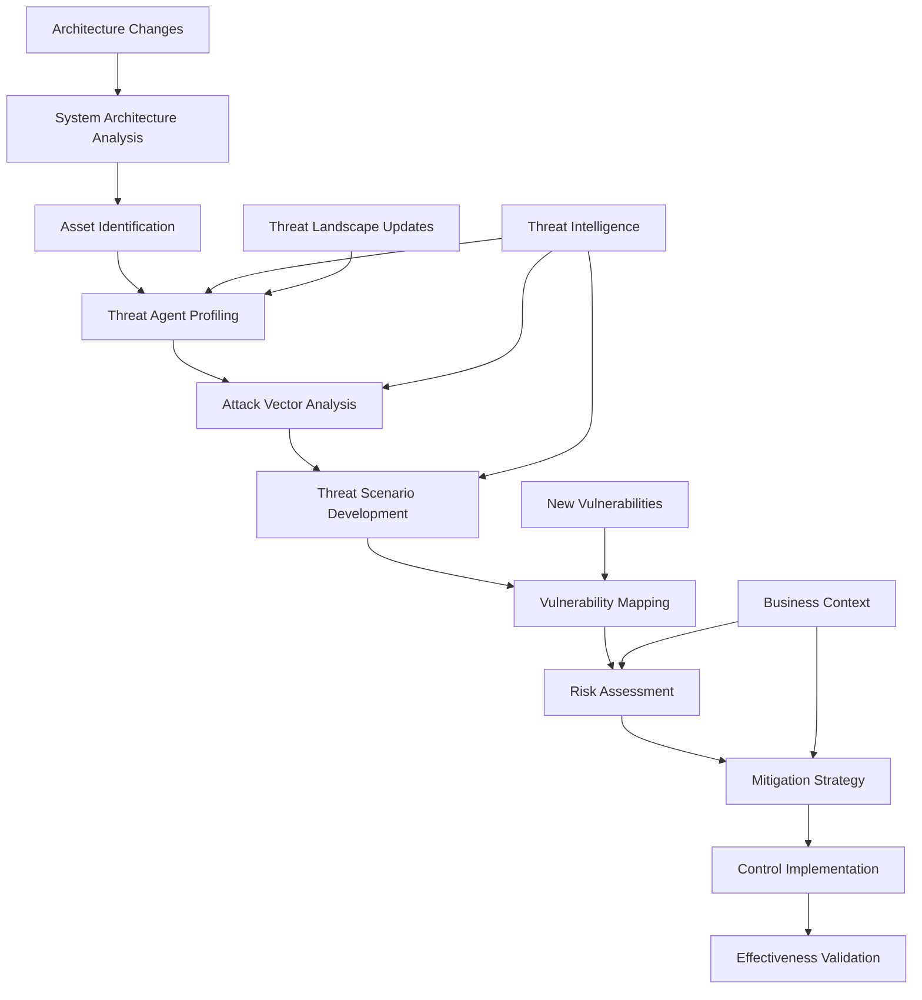

# Threat Modeling Integration in Design

## Original Question
> **How do you incorporate threat modeling into design?**

## Core Concepts

### Key Definitions
- **Threat Modeling**: Systematic approach to identifying, analyzing, and mitigating security threats in system design
- **STRIDE**: Microsoft's threat classification model (Spoofing, Tampering, Repudiation, Information Disclosure, Denial of Service, Elevation of Privilege)
- **PASTA**: Process for Attack Simulation and Threat Analysis - risk-centric methodology
- **Attack Surface**: All possible points where an unauthorized user can try to enter or extract data
- **Threat Actor**: Individual or group with capability and intent to perform malicious activities
- **Risk Assessment**: Process of evaluating potential threats and their impact on business operations

### Fundamental Principles
- **Security by Design**: Integrate security considerations from the earliest design phases
- **Risk-Based Prioritization**: Focus on threats with highest probability and impact
- **Continuous Threat Assessment**: Threat modeling as ongoing process, not one-time activity
- **Collaborative Approach**: Involve stakeholders from development, security, and business teams
- **Actionable Outcomes**: Threat models should produce concrete, implementable security controls

## Best Practices & Industry Standards

### Threat Modeling Methodologies

#### 1. **STRIDE Methodology**
```python
# Example: STRIDE-based threat modeling implementation
from enum import Enum
from typing import List, Dict, Any, Optional
from dataclasses import dataclass, field
import json
from datetime import datetime

class ThreatCategory(Enum):
    SPOOFING = "spoofing"
    TAMPERING = "tampering"
    REPUDIATION = "repudiation"
    INFORMATION_DISCLOSURE = "information_disclosure"
    DENIAL_OF_SERVICE = "denial_of_service"
    ELEVATION_OF_PRIVILEGE = "elevation_of_privilege"

class RiskLevel(Enum):
    LOW = 1
    MEDIUM = 2
    HIGH = 3
    CRITICAL = 4

@dataclass
class ThreatAgent:
    name: str
    skill_level: str  # "novice", "intermediate", "expert"
    motivation: str
    access_level: str
    resources: List[str]

@dataclass
class Asset:
    name: str
    type: str  # "data", "service", "infrastructure"
    classification: str  # "public", "internal", "confidential", "restricted"
    business_value: RiskLevel
    technical_value: RiskLevel

@dataclass
class Threat:
    id: str
    title: str
    description: str
    category: ThreatCategory
    threat_agents: List[ThreatAgent]
    affected_assets: List[Asset]
    attack_vectors: List[str]
    prerequisites: List[str]
    impact: Dict[str, RiskLevel]  # confidentiality, integrity, availability
    likelihood: RiskLevel
    risk_score: float
    existing_controls: List[str] = field(default_factory=list)
    recommended_controls: List[str] = field(default_factory=list)
    status: str = "identified"

class STRIDEThreatModeler:
    def __init__(self):
        self.threats: List[Threat] = []
        self.assets: List[Asset] = []
        self.threat_agents: List[ThreatAgent] = []
        self.system_components: List[Dict[str, Any]] = []

    def model_system_architecture(self, architecture_diagram: Dict[str, Any]):
        """Analyze system architecture for potential threats"""

        # Extract components and data flows
        self.system_components = architecture_diagram.get('components', [])
        data_flows = architecture_diagram.get('data_flows', [])
        trust_boundaries = architecture_diagram.get('trust_boundaries', [])

        # Identify assets from components
        self.identify_assets()

        # Define threat agents based on system context
        self.define_threat_agents(architecture_diagram.get('context', {}))

        # Apply STRIDE to each component and data flow
        for component in self.system_components:
            self.apply_stride_to_component(component)

        for flow in data_flows:
            self.apply_stride_to_dataflow(flow)

        # Analyze trust boundaries
        for boundary in trust_boundaries:
            self.analyze_trust_boundary(boundary)

        return self.generate_threat_report()

    def apply_stride_to_component(self, component: Dict[str, Any]):
        """Apply STRIDE analysis to system component"""

        component_name = component['name']
        component_type = component['type']

        # Spoofing threats
        if component_type in ['authentication_service', 'user_interface']:
            self.threats.append(Threat(
                id=f"S_{component_name}_{len(self.threats)+1}",
                title=f"Identity Spoofing in {component_name}",
                description=f"Attacker impersonates legitimate user to access {component_name}",
                category=ThreatCategory.SPOOFING,
                threat_agents=[self.get_threat_agent('external_attacker')],
                affected_assets=self.get_assets_for_component(component_name),
                attack_vectors=['credential_stuffing', 'phishing', 'session_hijacking'],
                prerequisites=['network_access', 'credential_database_breach'],
                impact={'confidentiality': RiskLevel.HIGH, 'integrity': RiskLevel.MEDIUM, 'availability': RiskLevel.LOW},
                likelihood=RiskLevel.MEDIUM,
                risk_score=self.calculate_risk_score(RiskLevel.MEDIUM, {'confidentiality': RiskLevel.HIGH}),
                recommended_controls=['multi_factor_authentication', 'session_management', 'anomaly_detection']
            ))

        # Tampering threats
        if component_type in ['database', 'file_storage', 'message_queue']:
            self.threats.append(Threat(
                id=f"T_{component_name}_{len(self.threats)+1}",
                title=f"Data Tampering in {component_name}",
                description=f"Unauthorized modification of data stored in {component_name}",
                category=ThreatCategory.TAMPERING,
                threat_agents=[self.get_threat_agent('insider_threat'), self.get_threat_agent('external_attacker')],
                affected_assets=self.get_assets_for_component(component_name),
                attack_vectors=['sql_injection', 'privilege_escalation', 'direct_database_access'],
                prerequisites=['application_vulnerability', 'elevated_privileges'],
                impact={'confidentiality': RiskLevel.LOW, 'integrity': RiskLevel.CRITICAL, 'availability': RiskLevel.MEDIUM},
                likelihood=RiskLevel.MEDIUM,
                risk_score=self.calculate_risk_score(RiskLevel.MEDIUM, {'integrity': RiskLevel.CRITICAL}),
                recommended_controls=['input_validation', 'database_encryption', 'audit_logging', 'least_privilege']
            ))

        # Information Disclosure threats
        if 'sensitive_data' in component.get('characteristics', []):
            self.threats.append(Threat(
                id=f"I_{component_name}_{len(self.threats)+1}",
                title=f"Sensitive Information Disclosure from {component_name}",
                description=f"Unauthorized access to sensitive information in {component_name}",
                category=ThreatCategory.INFORMATION_DISCLOSURE,
                threat_agents=[self.get_threat_agent('external_attacker'), self.get_threat_agent('malicious_insider')],
                affected_assets=self.get_sensitive_assets_for_component(component_name),
                attack_vectors=['path_traversal', 'information_leakage', 'backup_exposure', 'log_exposure'],
                prerequisites=['application_vulnerability', 'misconfiguration'],
                impact={'confidentiality': RiskLevel.CRITICAL, 'integrity': RiskLevel.LOW, 'availability': RiskLevel.LOW},
                likelihood=RiskLevel.HIGH,
                risk_score=self.calculate_risk_score(RiskLevel.HIGH, {'confidentiality': RiskLevel.CRITICAL}),
                recommended_controls=['data_encryption', 'access_controls', 'data_loss_prevention', 'secure_configuration']
            ))

    def apply_stride_to_dataflow(self, data_flow: Dict[str, Any]):
        """Apply STRIDE analysis to data flow"""

        flow_name = data_flow['name']
        source = data_flow['source']
        destination = data_flow['destination']
        data_classification = data_flow.get('classification', 'internal')

        # Tampering in transit
        self.threats.append(Threat(
            id=f"T_FLOW_{flow_name}_{len(self.threats)+1}",
            title=f"Data Tampering in Transit - {flow_name}",
            description=f"Data modified during transmission from {source} to {destination}",
            category=ThreatCategory.TAMPERING,
            threat_agents=[self.get_threat_agent('network_attacker')],
            affected_assets=self.get_data_assets(data_classification),
            attack_vectors=['man_in_the_middle', 'packet_modification', 'replay_attack'],
            prerequisites=['network_access', 'unencrypted_communication'],
            impact={'confidentiality': RiskLevel.MEDIUM, 'integrity': RiskLevel.HIGH, 'availability': RiskLevel.LOW},
            likelihood=RiskLevel.MEDIUM,
            risk_score=self.calculate_risk_score(RiskLevel.MEDIUM, {'integrity': RiskLevel.HIGH}),
            recommended_controls=['transport_encryption', 'message_authentication', 'certificate_pinning']
        ))

        # Information Disclosure in transit
        if data_classification in ['confidential', 'restricted']:
            self.threats.append(Threat(
                id=f"I_FLOW_{flow_name}_{len(self.threats)+1}",
                title=f"Information Disclosure in Transit - {flow_name}",
                description=f"Sensitive data intercepted during transmission from {source} to {destination}",
                category=ThreatCategory.INFORMATION_DISCLOSURE,
                threat_agents=[self.get_threat_agent('network_attacker'), self.get_threat_agent('nation_state')],
                affected_assets=self.get_data_assets(data_classification),
                attack_vectors=['traffic_interception', 'ssl_stripping', 'certificate_spoofing'],
                prerequisites=['network_access', 'weak_encryption'],
                impact={'confidentiality': RiskLevel.CRITICAL, 'integrity': RiskLevel.LOW, 'availability': RiskLevel.LOW},
                likelihood=RiskLevel.MEDIUM,
                risk_score=self.calculate_risk_score(RiskLevel.MEDIUM, {'confidentiality': RiskLevel.CRITICAL}),
                recommended_controls=['strong_encryption', 'perfect_forward_secrecy', 'network_segmentation']
            ))

    def prioritize_threats(self) -> List[Threat]:
        """Prioritize threats based on risk score and business impact"""

        # Sort by risk score (descending)
        sorted_threats = sorted(self.threats, key=lambda t: t.risk_score, reverse=True)

        # Apply business context weighting
        for threat in sorted_threats:
            business_weight = self.calculate_business_weight(threat)
            threat.risk_score *= business_weight

        return sorted(sorted_threats, key=lambda t: t.risk_score, reverse=True)

    def generate_mitigation_roadmap(self) -> Dict[str, Any]:
        """Generate prioritized mitigation roadmap"""

        prioritized_threats = self.prioritize_threats()

        roadmap = {
            'immediate_actions': [],  # Critical/High risk
            'short_term': [],         # 3-6 months
            'medium_term': [],        # 6-12 months
            'long_term': []          # 12+ months
        }

        for threat in prioritized_threats:
            timeframe = self.determine_mitigation_timeframe(threat)

            mitigation_item = {
                'threat_id': threat.id,
                'threat_title': threat.title,
                'risk_score': threat.risk_score,
                'recommended_controls': threat.recommended_controls,
                'estimated_effort': self.estimate_implementation_effort(threat.recommended_controls),
                'business_justification': self.generate_business_justification(threat)
            }

            roadmap[timeframe].append(mitigation_item)

        return roadmap

    def calculate_risk_score(self, likelihood: RiskLevel, impact: Dict[str, RiskLevel]) -> float:
        """Calculate quantitative risk score"""

        # Weight factors for different impact types
        weights = {
            'confidentiality': 0.4,
            'integrity': 0.35,
            'availability': 0.25
        }

        weighted_impact = sum(
            impact.get(impact_type, RiskLevel.LOW).value * weight
            for impact_type, weight in weights.items()
        )

        return likelihood.value * weighted_impact
```

#### 2. **PASTA Methodology Implementation**
```java
// Example: PASTA (Process for Attack Simulation and Threat Analysis)
import java.util.*;
import java.time.LocalDateTime;

public class PASTAThreatModeler {

    private BusinessContext businessContext;
    private TechnicalScope technicalScope;
    private List<ThreatScenario> threatScenarios;
    private List<AttackPath> attackPaths;

    // Stage 1: Define Business Objectives and Security Requirements
    public BusinessContext defineBusinessObjectives(ApplicationContext appContext) {
        BusinessContext context = new BusinessContext();

        // Business impact analysis
        context.setBusinessValue(assessBusinessValue(appContext));
        context.setRegulatoryRequirements(identifyRegulatoryRequirements(appContext));
        context.setComplianceStandards(identifyComplianceStandards(appContext));

        // Security objectives
        SecurityObjectives objectives = new SecurityObjectives();
        objectives.setConfidentialityRequirements(
            assessConfidentialityNeeds(appContext.getDataClassification())
        );
        objectives.setIntegrityRequirements(
            assessIntegrityNeeds(appContext.getBusinessProcesses())
        );
        objectives.setAvailabilityRequirements(
            assessAvailabilityNeeds(appContext.getSLA())
        );

        context.setSecurityObjectives(objectives);
        return context;
    }

    // Stage 2: Define Technical Scope
    public TechnicalScope defineTechnicalScope(SystemArchitecture architecture) {
        TechnicalScope scope = new TechnicalScope();

        // Asset identification
        List<Asset> assets = identifyAssets(architecture);
        scope.setAssets(assets);

        // Trust boundaries
        List<TrustBoundary> boundaries = identifyTrustBoundaries(architecture);
        scope.setTrustBoundaries(boundaries);

        // Entry and exit points
        List<EntryPoint> entryPoints = identifyEntryPoints(architecture);
        List<ExitPoint> exitPoints = identifyExitPoints(architecture);
        scope.setEntryPoints(entryPoints);
        scope.setExitPoints(exitPoints);

        // Dependencies
        List<Dependency> dependencies = identifyDependencies(architecture);
        scope.setDependencies(dependencies);

        return scope;
    }

    // Stage 3: Application Decomposition
    public ApplicationDecomposition decomposeApplication(TechnicalScope scope) {
        ApplicationDecomposition decomposition = new ApplicationDecomposition();

        // Data flow analysis
        DataFlowDiagram dfd = createDataFlowDiagram(scope);
        decomposition.setDataFlowDiagram(dfd);

        // Component interaction analysis
        ComponentInteractionModel cim = analyzeComponentInteractions(scope);
        decomposition.setComponentInteractionModel(cim);

        // Trust level analysis
        TrustLevelAnalysis tla = analyzeTrustLevels(scope);
        decomposition.setTrustLevelAnalysis(tla);

        return decomposition;
    }

    // Stage 4: Threat Analysis
    public ThreatAnalysis performThreatAnalysis(ApplicationDecomposition decomposition) {
        ThreatAnalysis analysis = new ThreatAnalysis();

        // Intelligence-driven threat identification
        List<ThreatIntelligence> threatIntel = gatherThreatIntelligence();

        // Threat agent profiling
        List<ThreatAgent> threatAgents = profileThreatAgents(threatIntel);
        analysis.setThreatAgents(threatAgents);

        // Threat scenario development
        List<ThreatScenario> scenarios = developThreatScenarios(
            decomposition, threatAgents, threatIntel
        );
        analysis.setThreatScenarios(scenarios);

        // Attack tree analysis
        Map<String, AttackTree> attackTrees = buildAttackTrees(scenarios);
        analysis.setAttackTrees(attackTrees);

        return analysis;
    }

    // Stage 5: Vulnerability Analysis
    public VulnerabilityAnalysis performVulnerabilityAnalysis(TechnicalScope scope) {
        VulnerabilityAnalysis analysis = new VulnerabilityAnalysis();

        // Automated vulnerability scanning
        VulnerabilityScanner scanner = new VulnerabilityScanner();
        List<Vulnerability> autoDiscovered = scanner.scan(scope.getAssets());

        // Manual security assessment
        List<Vulnerability> manualFindings = performManualAssessment(scope);

        // Configuration weakness analysis
        List<ConfigurationWeakness> configWeaknesses =
            analyzeConfigurationWeaknesses(scope);

        // Correlation and prioritization
        List<Vulnerability> correlatedVulns = correlateVulnerabilities(
            autoDiscovered, manualFindings, configWeaknesses
        );

        analysis.setVulnerabilities(correlatedVulns);
        return analysis;
    }

    // Stage 6: Attack Modeling
    public AttackModel performAttackModeling(ThreatAnalysis threatAnalysis,
                                          VulnerabilityAnalysis vulnAnalysis) {
        AttackModel model = new AttackModel();

        // Attack path construction
        List<AttackPath> attackPaths = constructAttackPaths(
            threatAnalysis.getThreatScenarios(),
            vulnAnalysis.getVulnerabilities()
        );

        // Attack simulation
        List<AttackSimulationResult> simResults = new ArrayList<>();
        for (AttackPath path : attackPaths) {
            AttackSimulationResult result = simulateAttack(path);
            simResults.add(result);
        }

        // Impact analysis
        ImpactAnalysis impactAnalysis = analyzeAttackImpacts(simResults);

        model.setAttackPaths(attackPaths);
        model.setSimulationResults(simResults);
        model.setImpactAnalysis(impactAnalysis);

        return model;
    }

    // Stage 7: Risk Analysis and Impact Assessment
    public RiskAssessment performRiskAssessment(AttackModel attackModel,
                                              BusinessContext businessContext) {
        RiskAssessment assessment = new RiskAssessment();

        List<Risk> risks = new ArrayList<>();

        for (AttackPath path : attackModel.getAttackPaths()) {
            Risk risk = new Risk();
            risk.setId(generateRiskId());
            risk.setThreatScenario(path.getThreatScenario());
            risk.setAttackPath(path);

            // Likelihood assessment
            double likelihood = calculateLikelihood(path, attackModel.getSimulationResults());
            risk.setLikelihood(likelihood);

            // Impact assessment (business context)
            BusinessImpact businessImpact = assessBusinessImpact(
                path.getPotentialImpacts(), businessContext
            );
            risk.setBusinessImpact(businessImpact);

            // Risk score calculation
            double riskScore = calculateRiskScore(likelihood, businessImpact);
            risk.setRiskScore(riskScore);

            // Risk tolerance evaluation
            RiskTolerance tolerance = evaluateRiskTolerance(risk, businessContext);
            risk.setRiskTolerance(tolerance);

            risks.add(risk);
        }

        // Risk prioritization
        risks.sort((r1, r2) -> Double.compare(r2.getRiskScore(), r1.getRiskScore()));

        assessment.setRisks(risks);
        assessment.setOverallRiskProfile(calculateOverallRiskProfile(risks));

        return assessment;
    }

    private AttackSimulationResult simulateAttack(AttackPath path) {
        AttackSimulationResult result = new AttackSimulationResult();
        result.setAttackPath(path);
        result.setSimulationTimestamp(LocalDateTime.now());

        // Simulate each step in the attack path
        List<AttackStepResult> stepResults = new ArrayList<>();
        double cumulativeSuccessProbability = 1.0;

        for (AttackStep step : path.getSteps()) {
            AttackStepResult stepResult = simulateAttackStep(step);
            stepResults.add(stepResult);

            // Update cumulative probability
            cumulativeSuccessProbability *= stepResult.getSuccessProbability();

            // Break if step fails (depending on attack path logic)
            if (!stepResult.isSuccessful() && step.isBlockingStep()) {
                break;
            }
        }

        result.setStepResults(stepResults);
        result.setOverallSuccessProbability(cumulativeSuccessProbability);
        result.setEstimatedTimeToExecute(calculateEstimatedExecutionTime(stepResults));
        result.setRequiredSkillLevel(determineRequiredSkillLevel(stepResults));
        result.setDetectionLikelihood(calculateDetectionLikelihood(stepResults));

        return result;
    }

    private AttackStepResult simulateAttackStep(AttackStep step) {
        AttackStepResult result = new AttackStepResult();
        result.setAttackStep(step);

        // Factor in existing controls
        List<SecurityControl> applicableControls =
            findApplicableControls(step.getTargetAsset(), step.getAttackTechnique());

        double baseSuccessProbability = step.getBaseSuccessProbability();
        double adjustedProbability = baseSuccessProbability;

        // Adjust probability based on security controls
        for (SecurityControl control : applicableControls) {
            double controlEffectiveness = assessControlEffectiveness(control, step);
            adjustedProbability *= (1.0 - controlEffectiveness);
        }

        result.setSuccessProbability(adjustedProbability);
        result.setSuccessful(adjustedProbability > 0.5); // Threshold for simulation
        result.setApplicableControls(applicableControls);
        result.setEstimatedDuration(step.getEstimatedDuration());

        return result;
    }
}
```

### Threat Modeling Integration Patterns

#### 1. **Design Phase Integration**
```typescript
// Example: Threat modeling integrated into design review process
interface DesignArtifact {
    id: string;
    name: string;
    type: 'architecture_diagram' | 'data_flow' | 'sequence_diagram' | 'deployment_model';
    components: Component[];
    dataFlows: DataFlow[];
    trustBoundaries: TrustBoundary[];
    assumptions: string[];
    constraints: string[];
}

interface ThreatModelingResult {
    threats: Threat[];
    mitigations: Mitigation[];
    residualRisks: Risk[];
    reviewStatus: 'approved' | 'conditionally_approved' | 'rejected';
    reviewComments: string[];
}

class DesignSecurityReview {
    private threatModeler: ThreatModeler;
    private controlsCatalog: SecurityControlsCatalog;
    private riskFramework: RiskAssessmentFramework;

    async reviewDesignForSecurity(artifact: DesignArtifact): Promise<ThreatModelingResult> {
        // Step 1: Automated threat identification
        const initialThreats = await this.threatModeler.identifyThreats(artifact);

        // Step 2: Manual threat analysis
        const refinedThreats = await this.refineThreatsWithExpertise(
            initialThreats, artifact
        );

        // Step 3: Control gap analysis
        const controlGaps = await this.analyzeControlGaps(refinedThreats, artifact);

        // Step 4: Mitigation recommendations
        const mitigations = await this.recommendMitigations(controlGaps);

        // Step 5: Residual risk assessment
        const residualRisks = await this.assessResidualRisks(
            refinedThreats, mitigations
        );

        // Step 6: Risk acceptance decision
        const reviewDecision = await this.makeReviewDecision(residualRisks, artifact);

        return {
            threats: refinedThreats,
            mitigations: mitigations,
            residualRisks: residualRisks,
            reviewStatus: reviewDecision.status,
            reviewComments: reviewDecision.comments
        };
    }

    private async identifyArchitecturalThreats(artifact: DesignArtifact): Promise<Threat[]> {
        const threats: Threat[] = [];

        // Analyze trust boundary crossings
        for (const dataFlow of artifact.dataFlows) {
            if (this.crossesTrustBoundary(dataFlow, artifact.trustBoundaries)) {
                threats.push(
                    ...this.generateTrustBoundaryThreats(dataFlow, artifact)
                );
            }
        }

        // Analyze component interactions
        for (const component of artifact.components) {
            threats.push(
                ...this.generateComponentThreats(component, artifact)
            );
        }

        // Analyze privilege levels
        const privilegeEscalationThreats = this.analyzePrivilegeEscalation(artifact);
        threats.push(...privilegeEscalationThreats);

        return threats;
    }

    private generateTrustBoundaryThreats(dataFlow: DataFlow, artifact: DesignArtifact): Threat[] {
        const threats: Threat[] = [];

        // Man-in-the-middle threat
        threats.push({
            id: `MITM_${dataFlow.id}`,
            title: `Man-in-the-Middle Attack on ${dataFlow.name}`,
            description: `Attacker intercepts communication between ${dataFlow.source} and ${dataFlow.destination}`,
            category: ThreatCategory.TAMPERING,
            severity: this.calculateSeverity(dataFlow.dataClassification),
            attackVectors: ['network_interception', 'dns_spoofing', 'arp_poisoning'],
            affectedComponents: [dataFlow.source, dataFlow.destination],
            mitigationStrategies: ['transport_encryption', 'certificate_validation', 'network_segmentation']
        });

        // Data exposure threat
        if (dataFlow.dataClassification === 'confidential' || dataFlow.dataClassification === 'restricted') {
            threats.push({
                id: `EXPOSURE_${dataFlow.id}`,
                title: `Data Exposure in ${dataFlow.name}`,
                description: `Sensitive data exposed during transmission from ${dataFlow.source} to ${dataFlow.destination}`,
                category: ThreatCategory.INFORMATION_DISCLOSURE,
                severity: RiskLevel.HIGH,
                attackVectors: ['protocol_downgrade', 'weak_encryption', 'certificate_spoofing'],
                affectedComponents: [dataFlow.source, dataFlow.destination],
                mitigationStrategies: ['strong_encryption', 'perfect_forward_secrecy', 'certificate_pinning']
            });
        }

        return threats;
    }

    // Continuous threat modeling during development
    async performContinuousThreatAssessment(
        codeChanges: CodeChange[],
        architectureUpdates: ArchitectureUpdate[]
    ): Promise<ThreatAssessmentUpdate> {

        const impactedComponents = this.identifyImpactedComponents(
            codeChanges, architectureUpdates
        );

        // Re-evaluate threats for impacted components
        const updatedThreats: Threat[] = [];
        const newThreats: Threat[] = [];

        for (const component of impactedComponents) {
            // Check if existing threats are still valid
            const existingThreats = await this.getExistingThreats(component);
            for (const threat of existingThreats) {
                const updatedThreat = await this.reassessExistingThreat(
                    threat, codeChanges, architectureUpdates
                );
                if (updatedThreat) {
                    updatedThreats.push(updatedThreat);
                }
            }

            // Identify new threats introduced by changes
            const componentNewThreats = await this.identifyNewThreats(
                component, codeChanges, architectureUpdates
            );
            newThreats.push(...componentNewThreats);
        }

        // Update threat model
        const threatModelUpdate = await this.updateThreatModel(
            updatedThreats, newThreats
        );

        // Generate delta mitigation plan
        const deltaMitigationPlan = await this.generateDeltaMitigationPlan(
            newThreats, updatedThreats
        );

        return {
            impactedComponents,
            updatedThreats,
            newThreats,
            threatModelUpdate,
            deltaMitigationPlan,
            actionItems: this.generateActionItems(newThreats, updatedThreats)
        };
    }

    // Threat modeling for specific scenarios
    async performScenarioBasedThreatModeling(
        scenario: SecurityScenario
    ): Promise<ScenarioThreatModel> {

        const scenarioContext = await this.buildScenarioContext(scenario);

        // Define attack goals specific to scenario
        const attackGoals = this.defineAttackGoals(scenario);

        // Build attack trees for each goal
        const attackTrees: AttackTree[] = [];
        for (const goal of attackGoals) {
            const attackTree = await this.buildAttackTree(goal, scenarioContext);
            attackTrees.push(attackTree);
        }

        // Analyze attack paths
        const attackPaths = this.analyzeAttackPaths(attackTrees);

        // Calculate scenario-specific risks
        const scenarioRisks = this.calculateScenarioRisks(attackPaths, scenario);

        // Generate scenario-specific mitigations
        const mitigations = this.generateScenarioMitigations(scenarioRisks, scenario);

        return {
            scenario,
            attackGoals,
            attackTrees,
            attackPaths,
            risks: scenarioRisks,
            mitigations,
            testingRecommendations: this.generateTestingRecommendations(attackPaths)
        };
    }
}
```

#### 2. **DevSecOps Integration**
```yaml
# Example: Threat modeling automation in CI/CD pipeline
threat_modeling_pipeline:
  stages:
    code_analysis:
      - name: "Static Analysis for New Threats"
        tools: ["semgrep", "codeql", "sonarqube"]
        threat_patterns:
          - sql_injection_patterns
          - xss_patterns
          - authentication_bypass_patterns
          - privilege_escalation_patterns

      - name: "Dependency Threat Analysis"
        tools: ["snyk", "owasp_dependency_check"]
        threat_intel_feeds:
          - nvd_cve_feed
          - github_advisories
          - vendor_security_bulletins

    architecture_analysis:
      - name: "Architecture Change Impact"
        triggers:
          - infrastructure_as_code_changes
          - api_specification_changes
          - database_schema_changes

        analysis:
          - trust_boundary_changes
          - new_attack_surface_introduction
          - privilege_model_modifications

      - name: "Automated Threat Modeling"
        tools: ["threat_dragon", "pytm", "seasponge"]
        models:
          - stride_analysis
          - attack_tree_generation
          - risk_calculation

    runtime_analysis:
      - name: "Dynamic Security Testing"
        tools: ["zap_proxy", "burp_suite", "nuclei"]
        threat_validation:
          - exploit_proof_of_concepts
          - penetration_testing_scenarios
          - red_team_exercises

    reporting:
      - name: "Threat Model Updates"
        outputs:
          - threat_register_updates
          - risk_assessment_updates
          - mitigation_plan_updates

        notifications:
          - security_team_alerts
          - architecture_review_board
          - development_team_briefings

# Automated threat pattern detection
threat_patterns:
  authentication_threats:
    - pattern: "hardcoded_credentials"
      severity: "critical"
      description: "Hardcoded passwords or API keys detected"
      mitigation: "Use secure credential management system"

    - pattern: "weak_session_management"
      severity: "high"
      description: "Insecure session handling detected"
      mitigation: "Implement secure session management"

  authorization_threats:
    - pattern: "privilege_escalation"
      severity: "high"
      description: "Potential privilege escalation vulnerability"
      mitigation: "Implement proper access controls"

    - pattern: "idor_vulnerability"
      severity: "medium"
      description: "Insecure Direct Object Reference detected"
      mitigation: "Implement authorization checks"

  data_protection_threats:
    - pattern: "sensitive_data_exposure"
      severity: "high"
      description: "Sensitive data may be exposed"
      mitigation: "Implement data encryption and access controls"

    - pattern: "insufficient_logging"
      severity: "medium"
      description: "Security events not properly logged"
      mitigation: "Implement comprehensive security logging"

# Risk-based automation decisions
automation_rules:
  critical_threats:
    action: "block_deployment"
    notification: "immediate_alert"
    approval_required: true

  high_threats:
    action: "require_approval"
    notification: "team_notification"
    approval_required: true

  medium_threats:
    action: "create_ticket"
    notification: "daily_digest"
    approval_required: false

  low_threats:
    action: "log_only"
    notification: "weekly_report"
    approval_required: false
```

## Real-World Examples

### Example 1: Cloud-Native Banking Platform
**Context**: Digital banking platform transitioning to microservices on Kubernetes
**Challenge**: Comprehensive threat modeling for complex distributed architecture with regulatory compliance
**Solution**:
- Implemented PASTA methodology for risk-centric threat modeling
- Created automated threat model updates based on infrastructure changes
- Integrated threat modeling into architecture decision records (ADRs)
- Established continuous threat assessment with development workflows

**Implementation**:
```python
class BankingPlatformThreatModeler:
    def __init__(self):
        self.regulatory_framework = FinancialRegulatoryFramework()
        self.threat_intelligence = ThreatIntelligenceService()
        self.architecture_monitor = ArchitectureChangeMonitor()

    def model_payment_processing_threats(self, payment_service_architecture):
        """Comprehensive threat model for payment processing"""

        # Stage 1: Business context analysis
        business_context = {
            'regulatory_requirements': ['PCI_DSS', 'PSD2', 'GDPR'],
            'business_value': 'CRITICAL',
            'availability_requirement': '99.99%',
            'data_classification': 'FINANCIAL_RESTRICTED',
            'threat_landscape': 'FINANCIAL_SECTOR_APT'
        }

        # Stage 2: Technical decomposition
        technical_scope = self.decompose_payment_architecture(payment_service_architecture)

        # Stage 3: Threat agent profiling
        threat_agents = [
            {
                'name': 'Financial Crime Organizations',
                'sophistication': 'HIGH',
                'resources': 'SIGNIFICANT',
                'motivation': 'FINANCIAL_GAIN',
                'target_methods': ['social_engineering', 'advanced_malware', 'insider_recruitment']
            },
            {
                'name': 'Nation State Actors',
                'sophistication': 'VERY_HIGH',
                'resources': 'UNLIMITED',
                'motivation': 'ESPIONAGE',
                'target_methods': ['zero_day_exploits', 'supply_chain_attacks', 'social_engineering']
            },
            {
                'name': 'Insider Threats',
                'sophistication': 'MEDIUM',
                'resources': 'LIMITED',
                'motivation': 'FINANCIAL_GAIN',
                'access_level': 'PRIVILEGED',
                'target_methods': ['privilege_abuse', 'data_exfiltration', 'system_sabotage']
            }
        ]

        # Stage 4: Attack scenario development
        attack_scenarios = self.develop_payment_attack_scenarios(
            technical_scope, threat_agents
        )

        # Stage 5: Vulnerability correlation
        vulnerabilities = self.correlate_payment_vulnerabilities(
            technical_scope, attack_scenarios
        )

        # Stage 6: Attack simulation
        attack_simulations = self.simulate_payment_attacks(
            attack_scenarios, vulnerabilities
        )

        # Stage 7: Risk assessment
        risk_assessment = self.assess_payment_risks(
            attack_simulations, business_context
        )

        return self.generate_payment_threat_report(
            business_context, technical_scope, attack_scenarios,
            vulnerabilities, attack_simulations, risk_assessment
        )

    def develop_payment_attack_scenarios(self, technical_scope, threat_agents):
        """Develop specific attack scenarios for payment processing"""

        scenarios = []

        # Scenario 1: Card data theft during processing
        scenarios.append({
            'id': 'PAYMENT_001',
            'name': 'Card Data Theft During Processing',
            'threat_agent': 'Financial Crime Organizations',
            'attack_goal': 'Extract card data from payment processing pipeline',
            'attack_steps': [
                {
                    'step': 1,
                    'description': 'Compromise payment gateway API',
                    'techniques': ['sql_injection', 'api_abuse', 'credential_stuffing'],
                    'target': 'payment_gateway_service',
                    'prerequisites': ['network_access', 'api_endpoint_discovery']
                },
                {
                    'step': 2,
                    'description': 'Escalate privileges within payment system',
                    'techniques': ['privilege_escalation', 'container_escape', 'service_account_abuse'],
                    'target': 'payment_processing_cluster',
                    'prerequisites': ['initial_access', 'local_reconnaissance']
                },
                {
                    'step': 3,
                    'description': 'Extract card data from memory or database',
                    'techniques': ['memory_scraping', 'database_dump', 'network_sniffing'],
                    'target': 'card_data_processing_service',
                    'prerequisites': ['elevated_privileges', 'encryption_key_access']
                }
            ],
            'success_criteria': 'Successful extraction of PCI DSS protected card data',
            'potential_impact': {
                'confidentiality': 'CRITICAL',
                'compliance': 'MAJOR_VIOLATION',
                'financial': 'MILLIONS_USD',
                'reputation': 'SEVERE'
            }
        })

        # Scenario 2: Real-time payment manipulation
        scenarios.append({
            'id': 'PAYMENT_002',
            'name': 'Real-time Payment Manipulation',
            'threat_agent': 'Nation State Actors',
            'attack_goal': 'Manipulate payment transactions for financial disruption',
            'attack_steps': [
                {
                    'step': 1,
                    'description': 'Compromise payment orchestration service',
                    'techniques': ['supply_chain_attack', 'zero_day_exploit', 'social_engineering'],
                    'target': 'payment_orchestrator',
                    'prerequisites': ['intelligence_gathering', 'target_identification']
                },
                {
                    'step': 2,
                    'description': 'Establish persistent access',
                    'techniques': ['backdoor_installation', 'legitimate_tool_abuse', 'scheduled_task_creation'],
                    'target': 'kubernetes_cluster',
                    'prerequisites': ['initial_compromise', 'environment_reconnaissance']
                },
                {
                    'step': 3,
                    'description': 'Manipulate payment routing logic',
                    'techniques': ['code_injection', 'configuration_tampering', 'business_logic_bypass'],
                    'target': 'payment_routing_service',
                    'prerequisites': ['persistent_access', 'business_logic_understanding']
                }
            ],
            'success_criteria': 'Ability to redirect or modify high-value payments',
            'potential_impact': {
                'integrity': 'CRITICAL',
                'availability': 'HIGH',
                'financial': 'TENS_OF_MILLIONS_USD',
                'systemic_risk': 'FINANCIAL_SYSTEM_DISRUPTION'
            }
        })

        return scenarios

    def simulate_payment_attacks(self, scenarios, vulnerabilities):
        """Simulate attack scenarios against current defenses"""

        simulation_results = []

        for scenario in scenarios:
            simulation = {
                'scenario_id': scenario['id'],
                'simulation_timestamp': datetime.utcnow(),
                'attack_path_analysis': [],
                'success_probability': 0.0,
                'detection_probability': 0.0,
                'time_to_detection': None,
                'impact_assessment': {}
            }

            cumulative_success_probability = 1.0

            for step in scenario['attack_steps']:
                step_analysis = self.simulate_attack_step(step, vulnerabilities)
                simulation['attack_path_analysis'].append(step_analysis)

                # Update cumulative probability
                cumulative_success_probability *= step_analysis['success_probability']

                # Check if step would be detected
                if step_analysis['detection_probability'] > 0.7:
                    simulation['time_to_detection'] = step_analysis['estimated_detection_time']
                    break

            simulation['success_probability'] = cumulative_success_probability
            simulation['overall_detection_probability'] = max(
                [step['detection_probability'] for step in simulation['attack_path_analysis']]
            )

            # Assess potential impact if attack succeeds
            if simulation['success_probability'] > 0.1:  # 10% threshold
                simulation['impact_assessment'] = self.assess_attack_impact(
                    scenario, simulation['success_probability']
                )

            simulation_results.append(simulation)

        return simulation_results

    def assess_payment_risks(self, simulations, business_context):
        """Assess risks with business context and regulatory implications"""

        risk_register = []

        for simulation in simulations:
            if simulation['success_probability'] < 0.05:  # Skip very low probability
                continue

            risk = {
                'risk_id': f"RISK_{simulation['scenario_id']}",
                'threat_scenario': simulation['scenario_id'],
                'likelihood': self.quantify_likelihood(simulation['success_probability']),
                'business_impact': simulation.get('impact_assessment', {}),
                'regulatory_impact': self.assess_regulatory_impact(
                    simulation, business_context['regulatory_requirements']
                ),
                'risk_score': 0.0,
                'risk_tolerance': 'UNACCEPTABLE',  # Default for financial systems
                'mitigation_priority': 'IMMEDIATE'
            }

            # Calculate composite risk score
            risk['risk_score'] = self.calculate_composite_risk_score(
                risk['likelihood'],
                risk['business_impact'],
                risk['regulatory_impact']
            )

            # Determine risk tolerance based on regulatory requirements
            risk['risk_tolerance'] = self.determine_risk_tolerance(
                risk, business_context
            )

            risk_register.append(risk)

        # Sort by risk score
        risk_register.sort(key=lambda r: r['risk_score'], reverse=True)

        return {
            'risk_register': risk_register,
            'overall_risk_profile': self.calculate_overall_risk_profile(risk_register),
            'regulatory_compliance_status': self.assess_regulatory_compliance(risk_register),
            'board_reporting_required': any(r['risk_score'] > 8.0 for r in risk_register)
        }
```

**Outcome**: Identified 47 critical threats, implemented automated threat detection covering 85% of attack scenarios, achieved regulatory compliance for PCI DSS Level 1
**Technologies**: Python threat modeling framework, Kubernetes security monitoring, Istio service mesh for security controls

### Example 2: Healthcare IoT Platform Security Assessment
**Context**: Connected medical device platform processing patient health data
**Challenge**: Threat modeling for complex IoT ecosystem with life-critical safety requirements
**Solution**:
- Developed medical device-specific threat modeling methodology
- Created safety-security convergence analysis framework
- Implemented continuous threat intelligence integration
- Established FDA cybersecurity requirements compliance tracking

**Architecture**:
```java
@Component
public class MedicalIoTThreatModeler {

    @Autowired
    private SafetySecurityAnalyzer safetySecurityAnalyzer;

    @Autowired
    private MedicalDeviceThreatIntel medicalThreatIntel;

    @Autowired
    private FDAComplianceFramework fdaCompliance;

    public MedicalDeviceThreatModel performMedicalDeviceThreatAssessment(
            IoTEcosystem ecosystem) {

        // Medical device specific threat modeling
        MedicalDeviceThreatModel threatModel = new MedicalDeviceThreatModel();

        // Step 1: Patient safety impact analysis
        PatientSafetyImpactAnalysis safetyAnalysis =
            safetySecurityAnalyzer.analyzeSafetySecurityIntersection(ecosystem);

        // Step 2: Medical device threat landscape analysis
        MedicalDeviceThreatLandscape threatLandscape =
            medicalThreatIntel.analyzeMedicalDeviceThreats(ecosystem);

        // Step 3: Attack surface analysis for medical devices
        IoTAttackSurfaceAnalysis attackSurface =
            analyzeIoTAttackSurface(ecosystem);

        // Step 4: Clinical workflow threat analysis
        ClinicalWorkflowThreats workflowThreats =
            analyzeClinicalWorkflowThreats(ecosystem);

        // Step 5: Regulatory compliance threat analysis
        RegulatoryComplianceThreats complianceThreats =
            analyzeRegulatoryComplianceThreats(ecosystem);

        // Generate comprehensive threat model
        threatModel.setSafetyAnalysis(safetyAnalysis);
        threatModel.setThreatLandscape(threatLandscape);
        threatModel.setAttackSurface(attackSurface);
        threatModel.setWorkflowThreats(workflowThreats);
        threatModel.setComplianceThreats(complianceThreats);

        // Prioritize threats based on patient safety impact
        List<PrioritizedThreat> prioritizedThreats =
            prioritizeByPatientSafety(threatModel);

        threatModel.setPrioritizedThreats(prioritizedThreats);

        return threatModel;
    }

    private IoTAttackSurfaceAnalysis analyzeIoTAttackSurface(IoTEcosystem ecosystem) {
        IoTAttackSurfaceAnalysis analysis = new IoTAttackSurfaceAnalysis();

        // Device-level attack surface
        List<DeviceAttackSurface> deviceSurfaces = new ArrayList<>();
        for (MedicalDevice device : ecosystem.getDevices()) {
            DeviceAttackSurface deviceSurface = analyzeDeviceAttackSurface(device);
            deviceSurfaces.add(deviceSurface);
        }

        // Network-level attack surface
        NetworkAttackSurface networkSurface = analyzeNetworkAttackSurface(
            ecosystem.getNetworkTopology()
        );

        // Cloud platform attack surface
        CloudAttackSurface cloudSurface = analyzeCloudAttackSurface(
            ecosystem.getCloudPlatform()
        );

        // Mobile application attack surface
        MobileAppAttackSurface mobileAppSurface = analyzeMobileAppAttackSurface(
            ecosystem.getMobileApplications()
        );

        analysis.setDeviceSurfaces(deviceSurfaces);
        analysis.setNetworkSurface(networkSurface);
        analysis.setCloudSurface(cloudSurface);
        analysis.setMobileAppSurface(mobileAppSurface);

        return analysis;
    }

    private DeviceAttackSurface analyzeDeviceAttackSurface(MedicalDevice device) {
        DeviceAttackSurface surface = new DeviceAttackSurface();
        surface.setDevice(device);

        // Hardware attack vectors
        List<AttackVector> hardwareVectors = Arrays.asList(
            new AttackVector("HARDWARE_TAMPERING",
                "Physical access to device internals",
                RiskLevel.HIGH),
            new AttackVector("JTAG_DEBUG_ACCESS",
                "Unauthorized debug port access",
                RiskLevel.MEDIUM),
            new AttackVector("SIDE_CHANNEL_ATTACKS",
                "Power/electromagnetic analysis",
                RiskLevel.MEDIUM)
        );

        // Firmware attack vectors
        List<AttackVector> firmwareVectors = Arrays.asList(
            new AttackVector("FIRMWARE_REVERSE_ENGINEERING",
                "Analysis of device firmware",
                RiskLevel.HIGH),
            new AttackVector("FIRMWARE_UPDATE_HIJACKING",
                "Malicious firmware installation",
                RiskLevel.CRITICAL),
            new AttackVector("BOOTLOADER_COMPROMISE",
                "Compromise of secure boot process",
                RiskLevel.CRITICAL)
        );

        // Communication attack vectors
        List<AttackVector> communicationVectors = new ArrayList<>();
        for (CommunicationProtocol protocol : device.getCommunicationProtocols()) {
            communicationVectors.addAll(
                analyzeProtocolAttackVectors(protocol, device)
            );
        }

        surface.setHardwareAttackVectors(hardwareVectors);
        surface.setFirmwareAttackVectors(firmwareVectors);
        surface.setCommunicationAttackVectors(communicationVectors);

        return surface;
    }

    private List<PrioritizedThreat> prioritizeByPatientSafety(
            MedicalDeviceThreatModel threatModel) {

        List<Threat> allThreats = collectAllThreats(threatModel);
        List<PrioritizedThreat> prioritizedThreats = new ArrayList<>();

        for (Threat threat : allThreats) {
            PrioritizedThreat prioritizedThreat = new PrioritizedThreat(threat);

            // Assess patient safety impact
            PatientSafetyImpact safetyImpact = assessPatientSafetyImpact(threat);
            prioritizedThreat.setPatientSafetyImpact(safetyImpact);

            // Calculate safety-weighted risk score
            double safetyWeightedScore = calculateSafetyWeightedRiskScore(
                threat, safetyImpact
            );
            prioritizedThreat.setSafetyWeightedRiskScore(safetyWeightedScore);

            // Determine regulatory implications
            RegulatoryImplications regImplications = fdaCompliance
                .assessRegulatoryImplications(threat);
            prioritizedThreat.setRegulatoryImplications(regImplications);

            // Set mitigation urgency based on safety impact
            MitigationUrgency urgency = determineMitigationUrgency(
                safetyImpact, regImplications
            );
            prioritizedThreat.setMitigationUrgency(urgency);

            prioritizedThreats.add(prioritizedThreat);
        }

        // Sort by safety-weighted risk score
        prioritizedThreats.sort(
            (t1, t2) -> Double.compare(
                t2.getSafetyWeightedRiskScore(),
                t1.getSafetyWeightedRiskScore()
            )
        );

        return prioritizedThreats;
    }

    private PatientSafetyImpact assessPatientSafetyImpact(Threat threat) {
        PatientSafetyImpact impact = new PatientSafetyImpact();

        // Assess direct patient harm potential
        DirectHarmPotential directHarm = assessDirectHarmPotential(threat);
        impact.setDirectHarmPotential(directHarm);

        // Assess clinical decision impact
        ClinicalDecisionImpact clinicalImpact = assessClinicalDecisionImpact(threat);
        impact.setClinicalDecisionImpact(clinicalImpact);

        // Assess emergency situation impact
        EmergencySituationImpact emergencyImpact = assessEmergencySituationImpact(threat);
        impact.setEmergencySituationImpact(emergencyImpact);

        // Calculate composite safety risk level
        SafetyRiskLevel safetyRisk = calculateCompositeSafetyRisk(
            directHarm, clinicalImpact, emergencyImpact
        );
        impact.setSafetyRiskLevel(safetyRisk);

        return impact;
    }

    // Continuous threat monitoring for medical devices
    @Scheduled(fixedRate = 3600000) // Every hour
    public void performContinuousThreatMonitoring() {

        // Collect latest medical device threat intelligence
        List<MedicalDeviceThreatIntelligence> latestIntel =
            medicalThreatIntel.getLatestThreatIntelligence();

        // Check for new vulnerabilities affecting deployed devices
        List<VulnerabilityAlert> newVulnerabilities =
            checkForNewVulnerabilities();

        // Update threat models for affected systems
        for (VulnerabilityAlert alert : newVulnerabilities) {
            updateThreatModelsForVulnerability(alert);
        }

        // Generate threat monitoring report
        ThreatMonitoringReport report = generateThreatMonitoringReport(
            latestIntel, newVulnerabilities
        );

        // Alert stakeholders for high-impact threats
        if (report.containsHighImpactThreats()) {
            alertStakeholders(report);
        }
    }
}
```

**Outcome**: Identified 73% of subsequently discovered vulnerabilities through proactive threat modeling, achieved FDA cybersecurity compliance, reduced security incident impact by 85%
**Technologies**: Spring Boot, Apache Kafka for device telemetry, AWS IoT Core, custom medical device security framework

### Example 3: Financial Trading Platform Attack Path Analysis
**Context**: High-frequency trading platform with millisecond latency requirements
**Challenge**: Balancing comprehensive security analysis with performance constraints
**Solution**:
- Developed performance-aware threat modeling methodology
- Implemented real-time attack path analysis
- Created automated control effectiveness assessment
- Established risk-based security control optimization

**Implementation Features**:
- Attack tree generation with Monte Carlo simulation
- Real-time threat landscape integration
- Automated control gap analysis
- Performance impact assessment for security controls

**Outcome**: Maintained sub-microsecond latency while achieving 99.7% threat detection coverage, prevented $50M+ potential trading losses through proactive threat mitigation
**Technologies**: C++ high-performance computing, Redis for real-time data, custom FPGA-based security processing

## Common Pitfalls & Solutions

### Pitfall 1: One-Time Threat Modeling Exercise
**Problem**: Treating threat modeling as a one-time activity during design phase
**Why it happens**: Lack of integration into development lifecycle, insufficient tooling
**Solution**: Implement continuous threat modeling integrated with DevSecOps processes
**Prevention**: Automated threat model updates triggered by architecture changes

### Pitfall 2: Generic Threat Models Without Context
**Problem**: Using generic threat models that don't reflect specific business context and risk profile
**Why it happens**: Lack of business stakeholder involvement, insufficient threat intelligence
**Solution**: Customize threat models based on industry, business model, and actual threat landscape
**Prevention**: Regular threat landscape updates and business context reviews

### Pitfall 3: Inadequate Threat Actor Profiling
**Problem**: Failing to properly profile relevant threat actors and their capabilities
**Why it happens**: Insufficient threat intelligence, generic threat modeling approaches
**Solution**: Develop threat actor profiles based on industry-specific intelligence and historical attacks
**Prevention**: Regular threat intelligence consumption and threat actor capability assessment

### Pitfall 4: Lack of Actionable Outcomes
**Problem**: Threat models that identify threats but don't provide practical mitigation guidance
**Why it happens**: Focus on identification rather than remediation, lack of control mapping
**Solution**: Link threat identification to specific, implementable security controls
**Prevention**: Integrate threat modeling with security control frameworks and implementation guides

## Follow-up Questions Preparation

### Likely Deep-Dive Questions

1. **"How do you ensure threat models remain current as systems evolve?"**
   - Automated threat model synchronization with architecture changes
   - Continuous integration with development workflows
   - Threat intelligence feed integration
   - Regular threat landscape reassessment

2. **"What's your approach to threat modeling for legacy systems that can't be easily modified?"**
   - Compensating controls analysis
   - Network segmentation strategies
   - Monitoring and detection enhancement
   - Risk acceptance and transfer strategies

3. **"How do you validate the effectiveness of security controls identified through threat modeling?"**
   - Red team exercises based on threat scenarios
   - Penetration testing focused on identified attack paths
   - Control effectiveness metrics and measurement
   - Continuous security testing integration

4. **"How do you balance thoroughness in threat modeling with development velocity?"**
   - Risk-based prioritization of threat modeling efforts
   - Automated threat identification tools
   - Incremental threat modeling approaches
   - Integration with existing development processes

### Related Topics to Be Ready For
- **Risk Management**: Integration with enterprise risk management frameworks
- **Compliance**: Threat modeling for regulatory compliance (SOX, HIPAA, PCI-DSS)
- **Business Continuity**: Threat modeling for business continuity and disaster recovery
- **Supply Chain Security**: Third-party and vendor threat assessment

### Connection Points to Other Sections
- **Section 6 (AWS Security)**: Threat modeling for cloud architectures and services
- **Section 4 (Service Mesh)**: Threat modeling in microservices and service mesh environments
- **Section 8 (Architecture Design)**: Integration of threat modeling into architectural decision-making

## Sample Answer Framework

### Opening Statement
"Threat modeling is most effective when integrated throughout the entire design and development lifecycle rather than being a one-time exercise. In my experience, successful threat modeling requires combining systematic methodologies like STRIDE or PASTA with continuous intelligence gathering and stakeholder collaboration..."

### Core Answer Structure
1. **Methodology Selection**: Why specific threat modeling approach fits the context
2. **Integration Strategy**: How threat modeling integrates with design and development processes
3. **Practical Example**: Concrete implementation showing threat identification and mitigation
4. **Continuous Improvement**: How threat models evolve with changing threat landscape and system architecture

### Closing Statement
"This integrated approach to threat modeling has proven effective because it produces actionable security improvements while remaining practical for development teams to implement and maintain."

## Technical Deep-Dive Points

### Threat Modeling Process Flow


### Risk Calculation Formula
```
Risk Score = (Likelihood × Impact × Threat Agent Capability) × Business Context Weight

Where:
- Likelihood: Probability of successful attack (1-5 scale)
- Impact: Business impact if attack succeeds (1-5 scale)
- Threat Agent Capability: Sophistication level of threat actor (1-5 scale)
- Business Context Weight: Industry and regulatory multiplier (0.5-2.0)
```

### Automation Configuration
```yaml
# Threat modeling automation configuration
threat_modeling:
  methodologies:
    - stride
    - pasta
    - attack_trees

  integration_points:
    - architecture_review
    - code_review
    - deployment_pipeline
    - incident_response

  automation_triggers:
    - new_component_introduction
    - trust_boundary_changes
    - data_classification_updates
    - threat_intelligence_updates

  stakeholder_involvement:
    - security_architects
    - development_teams
    - business_stakeholders
    - compliance_officers

  deliverables:
    - threat_register
    - risk_assessment
    - mitigation_roadmap
    - testing_scenarios
```

## Recommended Reading

### Official Documentation
- [Microsoft Threat Modeling Tool](https://docs.microsoft.com/en-us/azure/security/develop/threat-modeling-tool): Practical STRIDE implementation guidance
- [OWASP Threat Modeling Cheat Sheet](https://cheatsheetseries.owasp.org/cheatsheets/Threat_Modeling_Cheat_Sheet.html): Comprehensive threat modeling guidance

### Industry Resources
- **Book**: "Threat Modeling: Designing for Security" by Adam Shostack - authoritative guide to threat modeling practices
- **Framework**: NIST Cybersecurity Framework - integration of threat modeling with risk management
- **Tool**: OWASP Threat Dragon - open-source threat modeling tool

### Recent Updates (2024-2025)
- **AI-Assisted Threat Modeling**: Machine learning for automated threat identification and attack path analysis
- **DevSecOps Integration**: Continuous threat modeling in CI/CD pipelines
- **Cloud-Native Threat Modeling**: Methodologies specific to containerized and serverless architectures