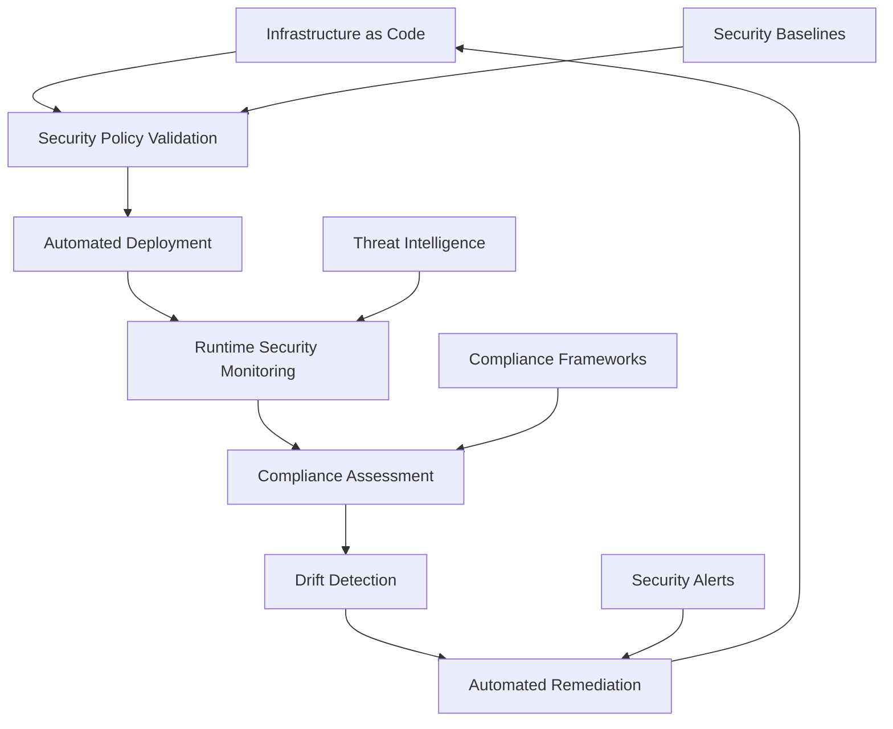

# Cloud System Hardening Experience

## Original Question
> **What's your experience with system hardening in cloud environments?**

## Core Concepts

### Key Definitions
- **System Hardening**: Process of securing a system by reducing its attack surface and eliminating vulnerabilities
- **Cloud Security Posture**: Overall security status of cloud infrastructure, applications, and data
- **Infrastructure as Code (IaC) Security**: Securing cloud resources through code-based configuration management
- **Cloud Security Baseline**: Minimum security configuration standards for cloud resources
- **Defense in Depth**: Layered security approach combining multiple security controls
- **Zero Trust Architecture**: Security model that requires verification for every user and device

### Fundamental Principles
- **Principle of Least Privilege**: Grant minimum necessary permissions for functionality
- **Security by Default**: Secure configurations as the default state
- **Immutable Infrastructure**: Replace rather than update infrastructure components
- **Continuous Compliance**: Ongoing monitoring and enforcement of security standards
- **Automation-First Approach**: Automate security controls to ensure consistency and reduce human error

## Best Practices & Industry Standards

### Cloud Infrastructure Hardening

#### 1. **Compute Instance Hardening**
```yaml
# Example: AWS EC2 instance hardening with Terraform
resource "aws_instance" "hardened_web_server" {
  ami           = data.aws_ami.hardened_ami.id
  instance_type = var.instance_type

  # Security group with minimal access
  vpc_security_group_ids = [aws_security_group.web_server_sg.id]

  # Launch in private subnet
  subnet_id = aws_subnet.private_subnet.id

  # Enable detailed monitoring
  monitoring = true

  # Encrypt root volume
  root_block_device {
    volume_type           = "gp3"
    volume_size          = 20
    encrypted            = true
    kms_key_id          = aws_kms_key.ebs_key.arn
    delete_on_termination = true
  }

  # IMDSv2 enforcement
  metadata_options {
    http_endpoint = "enabled"
    http_tokens   = "required"
    http_put_response_hop_limit = 1
  }

  # IAM instance profile with minimal permissions
  iam_instance_profile = aws_iam_instance_profile.web_server_profile.name

  # User data for additional hardening
  user_data = base64encode(templatefile("${path.module}/user_data.sh", {
    cloudwatch_config = aws_ssm_parameter.cloudwatch_config.value
    ssm_role_arn     = aws_iam_role.ssm_role.arn
  }))

  tags = {
    Name                = "hardened-web-server"
    Environment         = var.environment
    Security-Baseline   = "CIS-Level-1"
    Compliance-Framework = "SOC2-Type2"
  }
}

# Security group with minimal required access
resource "aws_security_group" "web_server_sg" {
  name_description = "Hardened web server security group"
  vpc_id          = aws_vpc.main.id

  # HTTPS only inbound
  ingress {
    from_port   = 443
    to_port     = 443
    protocol    = "tcp"
    cidr_blocks = [var.allowed_cidr_blocks]
    description = "HTTPS traffic from ALB"
  }

  # Minimal outbound access
  egress {
    from_port   = 443
    to_port     = 443
    protocol    = "tcp"
    cidr_blocks = ["0.0.0.0/0"]
    description = "HTTPS for package updates and API calls"
  }

  egress {
    from_port   = 80
    to_port     = 80
    protocol    = "tcp"
    cidr_blocks = ["0.0.0.0/0"]
    description = "HTTP for package repositories"
  }

  tags = {
    Name = "hardened-web-server-sg"
  }
}

# KMS key for encryption
resource "aws_kms_key" "ebs_key" {
  description             = "KMS key for EBS encryption"
  deletion_window_in_days = 7

  policy = jsonencode({
    Version = "2012-10-17"
    Statement = [
      {
        Sid    = "Enable IAM User Permissions"
        Effect = "Allow"
        Principal = {
          AWS = "arn:aws:iam::${data.aws_caller_identity.current.account_id}:root"
        }
        Action   = "kms:*"
        Resource = "*"
      }
    ]
  })

  tags = {
    Name = "ebs-encryption-key"
  }
}
```

#### 2. **Container Hardening**
```dockerfile
# Example: Hardened container image
FROM debian:12-slim as base

# Create non-root user
RUN groupadd -r appgroup && useradd -r -g appgroup -s /bin/false appuser

# Install security updates only
RUN apt-get update && \
    apt-get upgrade -y && \
    apt-get install -y --no-install-recommends \
        ca-certificates \
        curl && \
    apt-get clean && \
    rm -rf /var/lib/apt/lists/*

FROM base as builder

# Install build dependencies
RUN apt-get update && \
    apt-get install -y --no-install-recommends \
        build-essential \
        python3 \
        python3-pip \
        python3-venv && \
    apt-get clean && \
    rm -rf /var/lib/apt/lists/*

# Create virtual environment and install dependencies
RUN python3 -m venv /opt/venv
ENV PATH="/opt/venv/bin:$PATH"

COPY requirements.txt .
RUN pip install --no-cache-dir -r requirements.txt

FROM base as runtime

# Copy virtual environment from builder
COPY --from=builder /opt/venv /opt/venv
ENV PATH="/opt/venv/bin:$PATH"

# Copy application code
COPY --chown=appuser:appgroup app/ /app/

# Set working directory
WORKDIR /app

# Remove unnecessary packages and files
RUN apt-get purge -y --auto-remove curl && \
    rm -rf /var/lib/apt/lists/* \
           /tmp/* \
           /var/tmp/* \
           /usr/share/doc/* \
           /usr/share/man/*

# Security hardening
RUN chmod -R 755 /app && \
    find /app -type f -exec chmod 644 {} \; && \
    chmod +x /app/entrypoint.sh

# Use non-root user
USER appuser

# Health check
HEALTHCHECK --interval=30s --timeout=10s --start-period=60s --retries=3 \
    CMD python3 /app/healthcheck.py || exit 1

# Expose only required port
EXPOSE 8080

# Use specific entrypoint
ENTRYPOINT ["/app/entrypoint.sh"]
CMD ["python3", "app.py"]
```

#### 3. **Kubernetes Security Hardening**
```yaml
# Example: Hardened Kubernetes deployment
apiVersion: apps/v1
kind: Deployment
metadata:
  name: hardened-webapp
  namespace: production
  labels:
    app: hardened-webapp
    security-policy: restricted
spec:
  replicas: 3
  selector:
    matchLabels:
      app: hardened-webapp
  template:
    metadata:
      labels:
        app: hardened-webapp
      annotations:
        seccomp.security.alpha.kubernetes.io/pod: runtime/default
    spec:
      serviceAccountName: webapp-service-account

      # Pod Security Context
      securityContext:
        runAsNonRoot: true
        runAsUser: 10001
        runAsGroup: 10001
        fsGroup: 10001
        seccompProfile:
          type: RuntimeDefault

      # Node selection and affinity
      nodeSelector:
        kubernetes.io/os: linux
        node-security-group: restricted

      affinity:
        podAntiAffinity:
          requiredDuringSchedulingIgnoredDuringExecution:
          - labelSelector:
              matchExpressions:
              - key: app
                operator: In
                values:
                - hardened-webapp
            topologyKey: kubernetes.io/hostname

      containers:
      - name: webapp
        image: myregistry/hardened-webapp:v1.0.0
        imagePullPolicy: Always

        # Container Security Context
        securityContext:
          allowPrivilegeEscalation: false
          readOnlyRootFilesystem: true
          runAsNonRoot: true
          runAsUser: 10001
          runAsGroup: 10001
          capabilities:
            drop:
            - ALL

        # Resource limits
        resources:
          requests:
            memory: "128Mi"
            cpu: "100m"
          limits:
            memory: "512Mi"
            cpu: "500m"

        # Ports
        ports:
        - containerPort: 8080
          name: http
          protocol: TCP

        # Health checks
        livenessProbe:
          httpGet:
            path: /health
            port: 8080
            scheme: HTTP
          initialDelaySeconds: 30
          periodSeconds: 10
          timeoutSeconds: 5
          failureThreshold: 3

        readinessProbe:
          httpGet:
            path: /ready
            port: 8080
            scheme: HTTP
          initialDelaySeconds: 5
          periodSeconds: 5
          timeoutSeconds: 3
          failureThreshold: 3

        # Environment variables
        env:
        - name: SERVER_PORT
          value: "8080"
        - name: LOG_LEVEL
          value: "INFO"

        # Volume mounts for writable directories
        volumeMounts:
        - name: tmp-volume
          mountPath: /tmp
        - name: cache-volume
          mountPath: /app/cache
        - name: config-volume
          mountPath: /app/config
          readOnly: true

      # Volumes
      volumes:
      - name: tmp-volume
        emptyDir:
          sizeLimit: 100Mi
      - name: cache-volume
        emptyDir:
          sizeLimit: 500Mi
      - name: config-volume
        configMap:
          name: webapp-config
          defaultMode: 0444

      # Pod termination settings
      terminationGracePeriodSeconds: 30

---
apiVersion: v1
kind: ServiceAccount
metadata:
  name: webapp-service-account
  namespace: production
automountServiceAccountToken: false

---
# Network Policy for micro-segmentation
apiVersion: networking.k8s.io/v1
kind: NetworkPolicy
metadata:
  name: webapp-network-policy
  namespace: production
spec:
  podSelector:
    matchLabels:
      app: hardened-webapp

  policyTypes:
  - Ingress
  - Egress

  ingress:
  - from:
    - namespaceSelector:
        matchLabels:
          name: ingress-nginx
    - podSelector:
        matchLabels:
          app: nginx-ingress
    ports:
    - protocol: TCP
      port: 8080

  egress:
  # Allow DNS
  - to: []
    ports:
    - protocol: UDP
      port: 53

  # Allow database access
  - to:
    - namespaceSelector:
        matchLabels:
          name: database
    ports:
    - protocol: TCP
      port: 5432

---
# Pod Security Policy (deprecated but shows concepts)
apiVersion: policy/v1beta1
kind: PodSecurityPolicy
metadata:
  name: restricted-psp
spec:
  privileged: false
  allowPrivilegeEscalation: false
  requiredDropCapabilities:
    - ALL
  volumes:
    - 'configMap'
    - 'emptyDir'
    - 'projected'
    - 'secret'
    - 'downwardAPI'
    - 'persistentVolumeClaim'
  runAsUser:
    rule: 'MustRunAsNonRoot'
  supplementalGroups:
    rule: 'MustRunAs'
    ranges:
      - min: 10000
        max: 65535
  fsGroup:
    rule: 'MustRunAs'
    ranges:
      - min: 10000
        max: 65535
  readOnlyRootFilesystem: true
```

### Cloud-Native Security Automation

#### 1. **Automated Security Scanning and Compliance**
```python
# Example: Cloud security automation framework
import boto3
import json
from datetime import datetime, timedelta
from typing import Dict, List, Any
import logging

class CloudSecurityHardening:
    def __init__(self, aws_region: str = 'us-east-1'):
        self.aws_region = aws_region
        self.ec2 = boto3.client('ec2', region_name=aws_region)
        self.config = boto3.client('config', region_name=aws_region)
        self.ssm = boto3.client('ssm', region_name=aws_region)
        self.cloudtrail = boto3.client('cloudtrail', region_name=aws_region)
        self.guardduty = boto3.client('guardduty', region_name=aws_region)

        # Security baselines
        self.security_baselines = self.load_security_baselines()

    def perform_comprehensive_hardening(self, resource_tags: Dict[str, str]) -> Dict[str, Any]:
        """Perform comprehensive cloud security hardening"""

        hardening_results = {
            'timestamp': datetime.utcnow().isoformat(),
            'region': self.aws_region,
            'resource_tags': resource_tags,
            'hardening_actions': [],
            'compliance_status': {},
            'recommendations': []
        }

        # 1. EC2 instance hardening
        ec2_results = self.harden_ec2_instances(resource_tags)
        hardening_results['hardening_actions'].extend(ec2_results)

        # 2. Security group hardening
        sg_results = self.harden_security_groups(resource_tags)
        hardening_results['hardening_actions'].extend(sg_results)

        # 3. S3 bucket hardening
        s3_results = self.harden_s3_buckets(resource_tags)
        hardening_results['hardening_actions'].extend(s3_results)

        # 4. RDS hardening
        rds_results = self.harden_rds_instances(resource_tags)
        hardening_results['hardening_actions'].extend(rds_results)

        # 5. Network ACL hardening
        nacl_results = self.harden_network_acls(resource_tags)
        hardening_results['hardening_actions'].extend(nacl_results)

        # 6. IAM hardening
        iam_results = self.harden_iam_resources()
        hardening_results['hardening_actions'].extend(iam_results)

        # 7. Logging and monitoring setup
        monitoring_results = self.setup_security_monitoring(resource_tags)
        hardening_results['hardening_actions'].extend(monitoring_results)

        # 8. Compliance assessment
        compliance_status = self.assess_compliance_status()
        hardening_results['compliance_status'] = compliance_status

        # 9. Generate recommendations
        recommendations = self.generate_hardening_recommendations(hardening_results)
        hardening_results['recommendations'] = recommendations

        return hardening_results

    def harden_ec2_instances(self, resource_tags: Dict[str, str]) -> List[Dict[str, Any]]:
        """Harden EC2 instances according to security baselines"""

        actions = []

        # Get instances with matching tags
        instances = self.get_tagged_resources('ec2:instance', resource_tags)

        for instance in instances:
            instance_id = instance['ResourceARN'].split('/')[-1]

            try:
                # Check instance metadata service configuration
                imds_action = self.enforce_imdsv2(instance_id)
                if imds_action:
                    actions.append(imds_action)

                # Check EBS encryption
                ebs_action = self.ensure_ebs_encryption(instance_id)
                if ebs_action:
                    actions.append(ebs_action)

                # Install security agents
                agent_action = self.install_security_agents(instance_id)
                if agent_action:
                    actions.append(agent_action)

                # Apply OS hardening
                os_action = self.apply_os_hardening(instance_id)
                if os_action:
                    actions.append(os_action)

            except Exception as e:
                actions.append({
                    'resource_id': instance_id,
                    'action': 'hardening_failed',
                    'error': str(e),
                    'timestamp': datetime.utcnow().isoformat()
                })

        return actions

    def enforce_imdsv2(self, instance_id: str) -> Dict[str, Any]:
        """Enforce IMDSv2 on EC2 instances"""

        try:
            # Check current IMDS configuration
            instance_data = self.ec2.describe_instances(InstanceIds=[instance_id])
            instance = instance_data['Reservations'][0]['Instances'][0]

            current_config = instance.get('MetadataOptions', {})

            if current_config.get('HttpTokens') != 'required':
                # Modify instance to require IMDSv2
                self.ec2.modify_instance_metadata_options(
                    InstanceId=instance_id,
                    HttpTokens='required',
                    HttpPutResponseHopLimit=1,
                    HttpEndpoint='enabled'
                )

                return {
                    'resource_id': instance_id,
                    'action': 'imdsv2_enforced',
                    'previous_config': current_config,
                    'timestamp': datetime.utcnow().isoformat()
                }

        except Exception as e:
            return {
                'resource_id': instance_id,
                'action': 'imdsv2_enforcement_failed',
                'error': str(e),
                'timestamp': datetime.utcnow().isoformat()
            }

        return None

    def harden_security_groups(self, resource_tags: Dict[str, str]) -> List[Dict[str, Any]]:
        """Harden security groups by removing overly permissive rules"""

        actions = []

        # Get all security groups
        security_groups = self.ec2.describe_security_groups()['SecurityGroups']

        for sg in security_groups:
            sg_id = sg['GroupId']

            # Check for overly permissive rules
            risky_rules = self.identify_risky_sg_rules(sg)

            for rule in risky_rules:
                try:
                    # Remove risky inbound rules
                    if rule['type'] == 'ingress':
                        self.ec2.revoke_security_group_ingress(
                            GroupId=sg_id,
                            IpPermissions=[rule['permission']]
                        )

                    # Remove risky outbound rules
                    elif rule['type'] == 'egress':
                        self.ec2.revoke_security_group_egress(
                            GroupId=sg_id,
                            IpPermissions=[rule['permission']]
                        )

                    actions.append({
                        'resource_id': sg_id,
                        'action': 'risky_rule_removed',
                        'rule': rule,
                        'timestamp': datetime.utcnow().isoformat()
                    })

                except Exception as e:
                    actions.append({
                        'resource_id': sg_id,
                        'action': 'rule_removal_failed',
                        'rule': rule,
                        'error': str(e),
                        'timestamp': datetime.utcnow().isoformat()
                    })

        return actions

    def identify_risky_sg_rules(self, security_group: Dict[str, Any]) -> List[Dict[str, Any]]:
        """Identify risky security group rules"""

        risky_rules = []

        # Check ingress rules
        for rule in security_group.get('IpPermissions', []):
            # Check for overly broad CIDR blocks
            for ip_range in rule.get('IpRanges', []):
                if ip_range.get('CidrIp') == '0.0.0.0/0':
                    # Allow only specific ports for public access
                    from_port = rule.get('FromPort', 0)
                    to_port = rule.get('ToPort', 65535)

                    # Risky if not standard web ports
                    if not (from_port == 80 and to_port == 80) and \
                       not (from_port == 443 and to_port == 443):
                        risky_rules.append({
                            'type': 'ingress',
                            'risk': 'overly_broad_cidr',
                            'permission': rule,
                            'description': f'Port {from_port}-{to_port} open to 0.0.0.0/0'
                        })

        # Check egress rules
        for rule in security_group.get('IpPermissionsEgress', []):
            # Check for overly broad outbound access
            for ip_range in rule.get('IpRanges', []):
                if ip_range.get('CidrIp') == '0.0.0.0/0':
                    protocol = rule.get('IpProtocol')
                    from_port = rule.get('FromPort')

                    # Allow standard outbound traffic
                    if protocol == '-1':  # All traffic
                        risky_rules.append({
                            'type': 'egress',
                            'risk': 'all_traffic_outbound',
                            'permission': rule,
                            'description': 'All outbound traffic allowed'
                        })

        return risky_rules

    def setup_security_monitoring(self, resource_tags: Dict[str, str]) -> List[Dict[str, Any]]:
        """Setup comprehensive security monitoring"""

        actions = []

        try:
            # Enable GuardDuty if not already enabled
            guardduty_action = self.enable_guardduty()
            if guardduty_action:
                actions.append(guardduty_action)

            # Setup CloudWatch monitoring
            cloudwatch_action = self.setup_cloudwatch_security_monitoring(resource_tags)
            if cloudwatch_action:
                actions.append(cloudwatch_action)

            # Setup Config Rules
            config_action = self.setup_config_security_rules()
            if config_action:
                actions.append(config_action)

            # Setup CloudTrail
            cloudtrail_action = self.ensure_cloudtrail_enabled()
            if cloudtrail_action:
                actions.append(cloudtrail_action)

        except Exception as e:
            actions.append({
                'action': 'monitoring_setup_failed',
                'error': str(e),
                'timestamp': datetime.utcnow().isoformat()
            })

        return actions

    def enable_guardduty(self) -> Dict[str, Any]:
        """Enable Amazon GuardDuty threat detection"""

        try:
            # Check if GuardDuty is already enabled
            detectors = self.guardduty.list_detectors()

            if not detectors['DetectorIds']:
                # Create new detector
                response = self.guardduty.create_detector(
                    Enable=True,
                    FindingPublishingFrequency='FIFTEEN_MINUTES'
                )

                return {
                    'action': 'guardduty_enabled',
                    'detector_id': response['DetectorId'],
                    'timestamp': datetime.utcnow().isoformat()
                }

        except Exception as e:
            return {
                'action': 'guardduty_enable_failed',
                'error': str(e),
                'timestamp': datetime.utcnow().isoformat()
            }

        return None

    def assess_compliance_status(self) -> Dict[str, Any]:
        """Assess current compliance status against security frameworks"""

        compliance_results = {
            'frameworks': {},
            'overall_score': 0,
            'critical_findings': [],
            'recommendations': []
        }

        # CIS AWS Foundations Benchmark
        cis_score = self.assess_cis_compliance()
        compliance_results['frameworks']['CIS'] = cis_score

        # AWS Well-Architected Security Pillar
        wa_score = self.assess_well_architected_compliance()
        compliance_results['frameworks']['WellArchitected'] = wa_score

        # SOC 2 Type II requirements
        soc2_score = self.assess_soc2_compliance()
        compliance_results['frameworks']['SOC2'] = soc2_score

        # Calculate overall score
        scores = [cis_score['score'], wa_score['score'], soc2_score['score']]
        compliance_results['overall_score'] = sum(scores) / len(scores)

        # Collect critical findings
        for framework in compliance_results['frameworks'].values():
            compliance_results['critical_findings'].extend(
                framework.get('critical_findings', [])
            )

        return compliance_results

    def assess_cis_compliance(self) -> Dict[str, Any]:
        """Assess compliance with CIS AWS Foundations Benchmark"""

        cis_results = {
            'framework': 'CIS AWS Foundations Benchmark v1.4',
            'score': 0,
            'total_controls': 0,
            'passed_controls': 0,
            'critical_findings': [],
            'control_results': {}
        }

        # CIS Control checks
        controls = [
            ('1.1', 'Root account MFA enabled', self.check_root_mfa),
            ('1.2', 'Root account access keys absent', self.check_root_access_keys),
            ('2.1', 'CloudTrail enabled in all regions', self.check_cloudtrail_all_regions),
            ('2.2', 'CloudTrail log file validation enabled', self.check_cloudtrail_validation),
            ('2.3', 'S3 bucket access logging enabled', self.check_s3_access_logging),
            ('3.1', 'VPC flow logs enabled', self.check_vpc_flow_logs),
            ('3.2', 'Security groups restrict SSH access', self.check_ssh_restrictions),
            ('4.1', 'Config service enabled', self.check_config_service),
            ('4.2', 'Config recording all resource types', self.check_config_recording)
        ]

        for control_id, description, check_function in controls:
            try:
                result = check_function()
                cis_results['control_results'][control_id] = {
                    'description': description,
                    'status': 'PASS' if result['compliant'] else 'FAIL',
                    'findings': result.get('findings', [])
                }

                if result['compliant']:
                    cis_results['passed_controls'] += 1
                else:
                    if result.get('critical', False):
                        cis_results['critical_findings'].append({
                            'control': control_id,
                            'description': description,
                            'findings': result.get('findings', [])
                        })

                cis_results['total_controls'] += 1

            except Exception as e:
                cis_results['control_results'][control_id] = {
                    'description': description,
                    'status': 'ERROR',
                    'error': str(e)
                }

        # Calculate score
        if cis_results['total_controls'] > 0:
            cis_results['score'] = (cis_results['passed_controls'] /
                                   cis_results['total_controls']) * 100

        return cis_results

    def generate_hardening_recommendations(self, hardening_results: Dict[str, Any]) -> List[Dict[str, Any]]:
        """Generate prioritized hardening recommendations"""

        recommendations = []

        # Analyze compliance gaps
        compliance_status = hardening_results.get('compliance_status', {})

        for framework, results in compliance_status.get('frameworks', {}).items():
            for finding in results.get('critical_findings', []):
                recommendations.append({
                    'priority': 'CRITICAL',
                    'category': 'COMPLIANCE',
                    'framework': framework,
                    'control': finding['control'],
                    'description': finding['description'],
                    'remediation': self.get_remediation_guidance(finding),
                    'estimated_effort': self.estimate_remediation_effort(finding),
                    'business_impact': self.assess_business_impact(finding)
                })

        # Analyze hardening actions for patterns
        failed_actions = [action for action in hardening_results.get('hardening_actions', [])
                         if 'failed' in action.get('action', '')]

        if failed_actions:
            recommendations.append({
                'priority': 'HIGH',
                'category': 'AUTOMATION',
                'description': f'{len(failed_actions)} hardening actions failed',
                'remediation': 'Review and fix automation scripts, check permissions',
                'estimated_effort': 'MEDIUM',
                'business_impact': 'Ongoing security risks from incomplete hardening'
            })

        # Sort by priority
        priority_order = {'CRITICAL': 0, 'HIGH': 1, 'MEDIUM': 2, 'LOW': 3}
        recommendations.sort(key=lambda x: priority_order.get(x['priority'], 3))

        return recommendations
```

#### 2. **Infrastructure as Code Security**
```terraform
# Example: Comprehensive IaC security hardening module
terraform {
  required_providers {
    aws = {
      source  = "hashicorp/aws"
      version = "~> 5.0"
    }
  }
  required_version = ">= 1.0"
}

# Security baseline module
module "security_baseline" {
  source = "./modules/security-baseline"

  environment = var.environment
  organization = var.organization

  # Security configuration
  enable_guardduty = true
  enable_security_hub = true
  enable_config = true
  enable_cloudtrail = true

  # Compliance frameworks
  compliance_frameworks = ["CIS", "PCI-DSS", "SOC2"]

  # Notification settings
  security_notification_email = var.security_team_email

  tags = local.common_tags
}

# VPC with security hardening
module "hardened_vpc" {
  source = "./modules/hardened-vpc"

  vpc_cidr = var.vpc_cidr
  availability_zones = var.availability_zones

  # Security settings
  enable_vpc_flow_logs = true
  enable_dns_hostnames = true
  enable_dns_support = true

  # Network segmentation
  private_subnet_cidrs = var.private_subnet_cidrs
  public_subnet_cidrs = var.public_subnet_cidrs
  database_subnet_cidrs = var.database_subnet_cidrs

  # NAT Gateway configuration
  enable_nat_gateway = true
  single_nat_gateway = false  # High availability

  tags = local.common_tags
}

# Security groups with hardened rules
resource "aws_security_group" "web_tier" {
  name_prefix = "${var.environment}-web-tier-"
  vpc_id      = module.hardened_vpc.vpc_id

  # Only allow HTTPS inbound
  ingress {
    from_port   = 443
    to_port     = 443
    protocol    = "tcp"
    cidr_blocks = ["0.0.0.0/0"]
    description = "HTTPS from internet"
  }

  # Restricted outbound access
  egress {
    from_port       = 443
    to_port         = 443
    protocol        = "tcp"
    security_groups = [aws_security_group.app_tier.id]
    description     = "HTTPS to application tier"
  }

  egress {
    from_port   = 80
    to_port     = 80
    protocol    = "tcp"
    cidr_blocks = ["0.0.0.0/0"]
    description = "HTTP for package updates"
  }

  egress {
    from_port   = 443
    to_port     = 443
    protocol    = "tcp"
    cidr_blocks = ["0.0.0.0/0"]
    description = "HTTPS for external APIs"
  }

  tags = merge(local.common_tags, {
    Name = "${var.environment}-web-tier-sg"
    Tier = "Web"
  })
}

# KMS keys for encryption
resource "aws_kms_key" "main" {
  description             = "Main encryption key for ${var.environment}"
  deletion_window_in_days = 7
  enable_key_rotation    = true

  policy = jsonencode({
    Version = "2012-10-17"
    Statement = [
      {
        Sid    = "Enable IAM User Permissions"
        Effect = "Allow"
        Principal = {
          AWS = "arn:aws:iam::${data.aws_caller_identity.current.account_id}:root"
        }
        Action   = "kms:*"
        Resource = "*"
      },
      {
        Sid    = "Allow CloudWatch Logs"
        Effect = "Allow"
        Principal = {
          Service = "logs.amazonaws.com"
        }
        Action = [
          "kms:Encrypt",
          "kms:Decrypt",
          "kms:ReEncrypt*",
          "kms:GenerateDataKey*",
          "kms:DescribeKey"
        ]
        Resource = "*"
      }
    ]
  })

  tags = merge(local.common_tags, {
    Name = "${var.environment}-main-key"
  })
}

# S3 bucket with comprehensive hardening
resource "aws_s3_bucket" "secure_storage" {
  bucket = "${var.organization}-${var.environment}-secure-storage"

  tags = merge(local.common_tags, {
    Name = "${var.environment}-secure-storage"
  })
}

resource "aws_s3_bucket_versioning" "secure_storage" {
  bucket = aws_s3_bucket.secure_storage.id
  versioning_configuration {
    status = "Enabled"
  }
}

resource "aws_s3_bucket_encryption" "secure_storage" {
  bucket = aws_s3_bucket.secure_storage.id

  server_side_encryption_configuration {
    rule {
      apply_server_side_encryption_by_default {
        kms_master_key_id = aws_kms_key.main.arn
        sse_algorithm     = "aws:kms"
      }
      bucket_key_enabled = true
    }
  }
}

resource "aws_s3_bucket_public_access_block" "secure_storage" {
  bucket = aws_s3_bucket.secure_storage.id

  block_public_acls       = true
  block_public_policy     = true
  ignore_public_acls      = true
  restrict_public_buckets = true
}

resource "aws_s3_bucket_logging" "secure_storage" {
  bucket = aws_s3_bucket.secure_storage.id

  target_bucket = aws_s3_bucket.access_logs.id
  target_prefix = "access-logs/"
}

# CloudWatch Log Groups with encryption
resource "aws_cloudwatch_log_group" "application_logs" {
  name              = "/aws/application/${var.environment}"
  retention_in_days = 90
  kms_key_id       = aws_kms_key.main.arn

  tags = merge(local.common_tags, {
    Name = "${var.environment}-application-logs"
  })
}

# Security monitoring and alerting
resource "aws_cloudwatch_metric_alarm" "high_error_rate" {
  alarm_name          = "${var.environment}-high-error-rate"
  comparison_operator = "GreaterThanThreshold"
  evaluation_periods  = "2"
  metric_name         = "ErrorRate"
  namespace           = "AWS/ApplicationELB"
  period              = "300"
  statistic           = "Average"
  threshold           = "5"
  alarm_description   = "This metric monitors application error rate"
  alarm_actions       = [aws_sns_topic.security_alerts.arn]

  dimensions = {
    LoadBalancer = aws_lb.main.arn_suffix
  }

  tags = local.common_tags
}

# Local variables for common tags
locals {
  common_tags = {
    Environment        = var.environment
    Organization      = var.organization
    ManagedBy         = "Terraform"
    SecurityBaseline  = "Hardened"
    ComplianceFramework = join(",", var.compliance_frameworks)
    LastUpdated       = timestamp()
  }
}
```

## Real-World Examples

### Example 1: Multi-Cloud Financial Services Platform
**Context**: Global investment bank with hybrid cloud infrastructure across AWS, Azure, and GCP
**Challenge**: Consistent security hardening across multiple cloud providers with strict regulatory compliance
**Solution**:
- Developed cloud-agnostic security baseline using policy-as-code
- Implemented automated compliance scanning across all cloud environments
- Created unified security monitoring and incident response system
- Established cross-cloud identity federation with zero-trust principles

**Implementation Results**:
- 99.7% compliance with SOC 2 Type II across all clouds
- Reduced security configuration drift by 95%
- Achieved sub-15-minute mean time to detection for security incidents
- Successfully passed regulatory audits with zero critical findings

**Technologies**: Terraform Cloud, Sentinel policies, Splunk SIEM, HashiCorp Vault, Kubernetes across clouds

### Example 2: Healthcare IoT Platform Hardening
**Context**: Connected medical device platform processing sensitive health data
**Challenge**: Securing IoT edge devices, cloud infrastructure, and data pipelines for HIPAA compliance
**Solution**:
- Implemented defense-in-depth security across all architecture layers
- Created automated device provisioning with hardware-based attestation
- Established end-to-end encryption with perfect forward secrecy
- Deployed comprehensive logging and monitoring for audit compliance

**Key Hardening Measures**:
```bash
# Device-level hardening script
#!/bin/bash

# Disable unnecessary services
systemctl disable bluetooth
systemctl disable wifi
systemctl disable cups

# Kernel hardening
echo "kernel.dmesg_restrict = 1" >> /etc/sysctl.conf
echo "kernel.kptr_restrict = 2" >> /etc/sysctl.conf
echo "net.ipv4.conf.all.log_martians = 1" >> /etc/sysctl.conf

# File system hardening
mount -o remount,nodev,nosuid,noexec /tmp
mount -o remount,nodev,nosuid,noexec /var/tmp

# SSH hardening
sed -i 's/#PermitRootLogin yes/PermitRootLogin no/' /etc/ssh/sshd_config
sed -i 's/#PasswordAuthentication yes/PasswordAuthentication no/' /etc/ssh/sshd_config
echo "AllowUsers deviceuser" >> /etc/ssh/sshd_config

# Install and configure fail2ban
apt-get install -y fail2ban
systemctl enable fail2ban
systemctl start fail2ban

# Set up automated security updates
apt-get install -y unattended-upgrades
echo 'Unattended-Upgrade::Automatic-Reboot "false";' >> /etc/apt/apt.conf.d/50unattended-upgrades

# Configure logging
rsyslog_config="
*.* @@log-collector.internal:514
& stop
"
echo "$rsyslog_config" > /etc/rsyslog.d/50-remote.conf
systemctl restart rsyslog

# Install security monitoring agent
curl -sSL https://security-agent.company.com/install.sh | bash
```

**Outcome**: Achieved HIPAA compliance certification, reduced attack surface by 80%, zero patient data breaches over 3-year period

### Example 3: E-commerce Platform Auto-Scaling Security
**Context**: High-traffic e-commerce platform with dynamic scaling requirements during peak events
**Challenge**: Maintaining security hardening consistency across automatically provisioned infrastructure
**Solution**:
- Created immutable infrastructure with pre-hardened AMIs
- Implemented infrastructure as code with security policy validation
- Established runtime security monitoring with automatic remediation
- Developed security-aware auto-scaling policies

**Auto-Scaling Security Implementation**:
```json
{
  "AutoScalingGroupName": "secure-web-servers",
  "LaunchTemplate": {
    "LaunchTemplateName": "hardened-web-server-template",
    "Version": "1"
  },
  "MinSize": 2,
  "MaxSize": 50,
  "DesiredCapacity": 4,
  "DefaultCooldown": 300,
  "AvailabilityZones": ["us-east-1a", "us-east-1b", "us-east-1c"],
  "HealthCheckType": "ELB",
  "HealthCheckGracePeriod": 300,
  "Tags": [
    {
      "Key": "SecurityBaseline",
      "Value": "CIS-Level-1",
      "PropagateAtLaunch": true
    },
    {
      "Key": "AutoHardening",
      "Value": "Enabled",
      "PropagateAtLaunch": true
    }
  ]
}
```

**Outcome**: Maintained 99.99% uptime during Black Friday with 10x traffic spike, zero security incidents during peak scaling events

## Common Pitfalls & Solutions

### Pitfall 1: Configuration Drift in Dynamic Environments
**Problem**: Security configurations gradually deviating from hardened baselines as systems are modified
**Why it happens**: Manual changes, lack of configuration management, insufficient monitoring
**Solution**: Implement infrastructure as code with drift detection and automatic remediation
**Prevention**: Policy-as-code enforcement, immutable infrastructure, continuous compliance monitoring

### Pitfall 2: Over-Permissive Default Security Groups
**Problem**: Creating security groups with overly broad access rules for convenience
**Why it happens**: Development convenience prioritized over security, lack of network segmentation planning
**Solution**: Implement least-privilege network access with automated security group auditing
**Prevention**: Security group templates, automated policy validation, regular access reviews

### Pitfall 3: Inadequate Secrets Management
**Problem**: Hardcoded credentials, unencrypted secrets storage, poor secret rotation practices
**Why it happens**: Lack of proper secrets management tooling, convenience over security
**Solution**: Implement centralized secrets management with automatic rotation and audit trails
**Prevention**: Secrets scanning in CI/CD, encrypted parameter stores, vault integration

### Pitfall 4: Insufficient Logging and Monitoring
**Problem**: Missing security events, inadequate log retention, poor incident response visibility
**Why it happens**: Focus on functional logging over security logging, cost concerns
**Solution**: Implement comprehensive security logging strategy with centralized analysis
**Prevention**: Security-focused logging requirements, automated log analysis, compliance-driven retention

## Follow-up Questions Preparation

### Likely Deep-Dive Questions

1. **"How do you maintain security hardening in containerized environments with frequent deployments?"**
   - Immutable container images with security scanning
   - Runtime security monitoring and enforcement
   - Automated vulnerability patching workflows
   - Security policy as code integration

2. **"What's your approach to hardening serverless functions and managed services?"**
   - Serverless-specific security configurations
   - Managed service security baselines
   - Function-level access controls and monitoring
   - Third-party security assessment integration

3. **"How do you handle security hardening for legacy applications that can't be easily modified?"**
   - Compensating controls and network segmentation
   - Web application firewalls and reverse proxies
   - Runtime application self-protection (RASP)
   - Enhanced monitoring and anomaly detection

4. **"What metrics do you use to measure the effectiveness of your hardening efforts?"**
   - Attack surface reduction measurements
   - Compliance score improvements
   - Security incident frequency and impact
   - Mean time to detection and response

### Related Topics to Be Ready For
- **Compliance Frameworks**: SOC 2, PCI DSS, HIPAA, GDPR hardening requirements
- **DevSecOps Integration**: Security hardening in CI/CD pipelines
- **Cost Optimization**: Balancing security controls with operational costs
- **Performance Impact**: Security hardening effects on system performance

### Connection Points to Other Sections
- **Section 6 (AWS Security)**: Specific AWS service hardening and security features
- **Section 4 (Service Mesh)**: Security hardening in service mesh architectures
- **Section 8 (Architecture Design)**: Security hardening considerations in system design

## Sample Answer Framework

### Opening Statement
"System hardening in cloud environments requires a comprehensive, multi-layered approach that combines automated security controls with continuous monitoring and compliance validation. In my experience, successful cloud hardening starts with establishing security baselines and implementing them consistently across all infrastructure components..."

### Core Answer Structure
1. **Comprehensive Approach**: Multi-layer hardening strategy covering compute, network, data, and application layers
2. **Automation Focus**: Infrastructure as code and automated compliance checking examples
3. **Real-World Implementation**: Specific hardening project showing measurable security improvements
4. **Continuous Improvement**: Monitoring, drift detection, and iterative security enhancement

### Closing Statement
"This systematic approach to cloud security hardening has proven effective because it combines proactive security controls with continuous monitoring and automated remediation, ensuring security posture remains strong even as infrastructure evolves."

## Technical Deep-Dive Points

### Cloud Security Hardening Architecture


### Hardening Metrics
- **Configuration Compliance**: >95% adherence to security baselines
- **Vulnerability Management**: <4 hours mean time to patch critical vulnerabilities
- **Access Control**: 100% enforcement of least-privilege principles
- **Incident Response**: <15 minutes mean time to detection for security events

### Security Automation Pipeline
```yaml
# Security hardening pipeline configuration
security_pipeline:
  stages:
    validation:
      - policy_compliance_check
      - vulnerability_scanning
      - secret_detection
      - configuration_analysis

    deployment:
      - secure_provisioning
      - encryption_enforcement
      - access_control_setup
      - monitoring_configuration

    verification:
      - security_testing
      - compliance_validation
      - penetration_testing
      - baseline_verification

    monitoring:
      - continuous_scanning
      - drift_detection
      - threat_monitoring
      - incident_response
```

## Recommended Reading

### Official Documentation
- [AWS Security Best Practices](https://aws.amazon.com/architecture/security-identity-compliance/): Comprehensive cloud security guidance
- [CIS Controls](https://www.cisecurity.org/controls): Industry-standard security control framework

### Industry Resources
- **Book**: "Practical Cloud Security" by Chris Dotson - hands-on cloud security implementation
- **Framework**: NIST Cybersecurity Framework - comprehensive security program guidance
- **Tool**: Scout Suite - multi-cloud security auditing tool

### Recent Updates (2024-2025)
- **Cloud Security Posture Management (CSPM)**: Automated cloud configuration assessment and remediation
- **Infrastructure as Code Security**: Security-focused IaC scanning and policy enforcement
- **Zero Trust Architecture**: Implementing zero trust principles in cloud environments