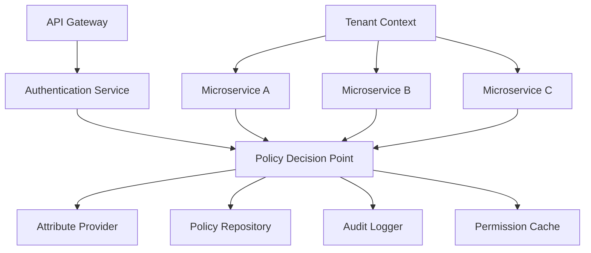

# Multi-tenant and Microservice Access Control

## Original Question
> **How do you handle access control and permissions in multi-tenant or microservice systems?**

## Core Concepts

### Key Definitions
- **Multi-tenancy**: Software architecture where a single instance serves multiple customers (tenants) with data isolation
- **Tenant Isolation**: Ensuring one tenant cannot access another tenant's data or resources
- **Microservices Access Control**: Managing permissions and authentication across distributed service architectures
- **Service-to-Service Authentication**: Secure communication between microservices without user context
- **Attribute-Based Access Control (ABAC)**: Dynamic access control using attributes of users, resources, and environment
- **Policy Decision Point (PDP)**: Component that evaluates access requests against policies

### Fundamental Principles
- **Zero Trust Architecture**: Never trust, always verify every request
- **Principle of Least Privilege**: Grant minimum necessary permissions
- **Defense in Depth**: Multiple layers of access control
- **Tenant Data Isolation**: Complete separation of tenant data and operations
- **Contextual Access Control**: Decisions based on request context, not just identity
- **Audit and Compliance**: Comprehensive logging of all access decisions

## Best Practices & Industry Standards

### Multi-Tenant Access Control Patterns

#### 1. **Row-Level Security (RLS) Pattern**
```sql
-- Example: PostgreSQL Row-Level Security for multi-tenant data
-- Enable RLS on tenant-specific tables
ALTER TABLE customer_data ENABLE ROW LEVEL SECURITY;

-- Create tenant isolation policy
CREATE POLICY tenant_isolation_policy ON customer_data
  USING (tenant_id = current_setting('app.current_tenant_id')::uuid);

-- Create tenant-specific role
CREATE ROLE tenant_user;
GRANT SELECT, INSERT, UPDATE, DELETE ON customer_data TO tenant_user;

-- Application-level tenant context setting
SET app.current_tenant_id = '550e8400-e29b-41d4-a716-446655440000';

-- Query automatically filtered by tenant
SELECT * FROM customer_data; -- Only returns data for current tenant
```

```python
# Example: Application-level tenant context management
from contextlib import contextmanager
from sqlalchemy import create_engine, text
from sqlalchemy.orm import sessionmaker
import uuid
from typing import Optional

class TenantContextManager:
    def __init__(self, database_url: str):
        self.engine = create_engine(database_url)
        self.SessionLocal = sessionmaker(bind=self.engine)
        self._current_tenant_id: Optional[str] = None

    @contextmanager
    def tenant_context(self, tenant_id: str):
        """Context manager for tenant-specific database operations"""
        previous_tenant = self._current_tenant_id
        self._current_tenant_id = tenant_id

        session = self.SessionLocal()
        try:
            # Set tenant context in database session
            session.execute(
                text("SET app.current_tenant_id = :tenant_id"),
                {"tenant_id": tenant_id}
            )
            session.commit()

            yield session

        except Exception as e:
            session.rollback()
            raise e
        finally:
            session.close()
            self._current_tenant_id = previous_tenant

    def get_current_tenant(self) -> Optional[str]:
        return self._current_tenant_id

    def validate_tenant_access(self, user_id: str, tenant_id: str) -> bool:
        """Validate user has access to specified tenant"""
        with self.tenant_context(tenant_id) as session:
            result = session.execute(
                text("""
                    SELECT 1 FROM user_tenant_memberships
                    WHERE user_id = :user_id AND tenant_id = :tenant_id
                    AND status = 'active'
                """),
                {"user_id": user_id, "tenant_id": tenant_id}
            )
            return result.fetchone() is not None

# Usage in application
tenant_manager = TenantContextManager(DATABASE_URL)

@app.route('/api/customers')
@require_authentication
def get_customers():
    user_id = get_current_user_id()
    tenant_id = get_tenant_from_request()

    # Validate tenant access
    if not tenant_manager.validate_tenant_access(user_id, tenant_id):
        return jsonify({"error": "Access denied"}), 403

    # Execute query within tenant context
    with tenant_manager.tenant_context(tenant_id) as session:
        customers = session.execute(
            text("SELECT * FROM customer_data ORDER BY created_at DESC")
        ).fetchall()

        return jsonify([dict(customer) for customer in customers])
```

#### 2. **Schema-Based Tenant Isolation**
```python
# Example: Dynamic schema routing for tenant isolation
import asyncpg
import asyncio
from typing import Dict, Any, Optional
from contextlib import asynccontextmanager

class SchemaBasedTenantManager:
    def __init__(self, database_config: Dict[str, Any]):
        self.database_config = database_config
        self.connection_pool = None
        self.tenant_schema_map: Dict[str, str] = {}

    async def initialize(self):
        """Initialize connection pool and tenant mappings"""
        self.connection_pool = await asyncpg.create_pool(**self.database_config)
        await self.load_tenant_schema_mappings()

    async def load_tenant_schema_mappings(self):
        """Load tenant to schema mappings from database"""
        async with self.connection_pool.acquire() as conn:
            rows = await conn.fetch(
                "SELECT tenant_id, schema_name FROM tenant_schemas WHERE active = true"
            )
            self.tenant_schema_map = {row['tenant_id']: row['schema_name'] for row in rows}

    async def create_tenant_schema(self, tenant_id: str) -> str:
        """Create new schema for tenant with proper permissions"""
        schema_name = f"tenant_{tenant_id.replace('-', '_')}"

        async with self.connection_pool.acquire() as conn:
            async with conn.transaction():
                # Create schema
                await conn.execute(f'CREATE SCHEMA IF NOT EXISTS "{schema_name}"')

                # Create tenant-specific role
                role_name = f"tenant_{tenant_id.replace('-', '_')}_role"
                await conn.execute(f'CREATE ROLE "{role_name}"')

                # Grant schema permissions to role
                await conn.execute(f'GRANT USAGE, CREATE ON SCHEMA "{schema_name}" TO "{role_name}"')
                await conn.execute(f'GRANT ALL ON ALL TABLES IN SCHEMA "{schema_name}" TO "{role_name}"')
                await conn.execute(f'ALTER DEFAULT PRIVILEGES IN SCHEMA "{schema_name}" GRANT ALL ON TABLES TO "{role_name}"')

                # Record schema mapping
                await conn.execute(
                    "INSERT INTO tenant_schemas (tenant_id, schema_name, role_name, created_at) VALUES ($1, $2, $3, NOW())",
                    tenant_id, schema_name, role_name
                )

                # Initialize schema with base tables
                await self.initialize_tenant_schema(conn, schema_name)

        self.tenant_schema_map[tenant_id] = schema_name
        return schema_name

    @asynccontextmanager
    async def tenant_connection(self, tenant_id: str):
        """Get database connection with tenant schema context"""
        schema_name = self.tenant_schema_map.get(tenant_id)
        if not schema_name:
            raise ValueError(f"Schema not found for tenant: {tenant_id}")

        async with self.connection_pool.acquire() as conn:
            # Set schema search path
            await conn.execute(f'SET search_path = "{schema_name}", public')
            try:
                yield conn
            finally:
                # Reset search path
                await conn.execute('SET search_path = public')

    async def execute_tenant_query(self, tenant_id: str, query: str, *args):
        """Execute query within tenant schema context"""
        async with self.tenant_connection(tenant_id) as conn:
            return await conn.fetch(query, *args)

    async def initialize_tenant_schema(self, conn, schema_name: str):
        """Initialize tenant schema with base table structure"""
        schema_init_sql = f"""
        SET search_path = "{schema_name}";

        CREATE TABLE IF NOT EXISTS customers (
            id UUID PRIMARY KEY DEFAULT gen_random_uuid(),
            name VARCHAR(255) NOT NULL,
            email VARCHAR(255) UNIQUE NOT NULL,
            created_at TIMESTAMP DEFAULT NOW(),
            updated_at TIMESTAMP DEFAULT NOW()
        );

        CREATE TABLE IF NOT EXISTS orders (
            id UUID PRIMARY KEY DEFAULT gen_random_uuid(),
            customer_id UUID REFERENCES customers(id),
            total_amount DECIMAL(10,2) NOT NULL,
            status VARCHAR(50) NOT NULL DEFAULT 'pending',
            created_at TIMESTAMP DEFAULT NOW()
        );

        CREATE INDEX idx_customers_email ON customers(email);
        CREATE INDEX idx_orders_customer ON orders(customer_id);
        CREATE INDEX idx_orders_status ON orders(status);
        """

        await conn.execute(schema_init_sql)

# Usage example
tenant_manager = SchemaBasedTenantManager({
    'host': 'localhost',
    'database': 'multitenant_app',
    'user': 'app_user',
    'password': 'secure_password',
    'min_size': 5,
    'max_size': 20
})

@app.route('/api/tenant/<tenant_id>/customers')
async def get_tenant_customers(tenant_id: str):
    # Validate tenant access
    if not await validate_user_tenant_access(get_current_user_id(), tenant_id):
        return {'error': 'Access denied'}, 403

    # Execute query within tenant context
    customers = await tenant_manager.execute_tenant_query(
        tenant_id,
        "SELECT id, name, email, created_at FROM customers ORDER BY created_at DESC LIMIT 100"
    )

    return {'customers': [dict(customer) for customer in customers]}
```

### Microservices Access Control Architecture

#### 1. **Service Mesh with mTLS and RBAC**
```yaml
# Example: Istio service mesh access control configuration
apiVersion: security.istio.io/v1beta1
kind: PeerAuthentication
metadata:
  name: default
  namespace: production
spec:
  mtls:
    mode: STRICT  # Enforce mTLS for all services

---
apiVersion: security.istio.io/v1beta1
kind: AuthorizationPolicy
metadata:
  name: customer-service-access
  namespace: production
spec:
  selector:
    matchLabels:
      app: customer-service
  rules:
  - from:
    - source:
        principals: ["cluster.local/ns/production/sa/api-gateway"]
    - source:
        principals: ["cluster.local/ns/production/sa/order-service"]
    to:
    - operation:
        methods: ["GET", "POST", "PUT"]
        paths: ["/api/customers/*"]
    when:
    - key: request.headers[x-tenant-id]
      values: ["*"]  # Require tenant ID header

---
apiVersion: security.istio.io/v1beta1
kind: AuthorizationPolicy
metadata:
  name: tenant-isolation
  namespace: production
spec:
  selector:
    matchLabels:
      multi-tenant: "true"
  rules:
  - from:
    - source:
        principals: ["*"]
    when:
    - key: request.headers[x-tenant-id]
      values: ["{JWT_TENANT_CLAIM}"]  # Tenant ID must match JWT claim
```

#### 2. **JWT-Based Service Authentication**
```go
// Example: Go microservice with JWT-based tenant isolation
package main

import (
    "context"
    "encoding/json"
    "fmt"
    "log"
    "net/http"
    "strings"
    "time"

    "github.com/golang-jwt/jwt/v5"
    "github.com/gorilla/mux"
)

type TenantClaims struct {
    UserID      string   `json:"user_id"`
    TenantID    string   `json:"tenant_id"`
    Roles       []string `json:"roles"`
    Permissions []string `json:"permissions"`
    jwt.RegisteredClaims
}

type TenantContext struct {
    UserID      string
    TenantID    string
    Roles       []string
    Permissions []string
}

type ServiceAuthenticator struct {
    jwtSecret         []byte
    tenantValidator   TenantValidator
    permissionChecker PermissionChecker
}

func NewServiceAuthenticator(secret []byte) *ServiceAuthenticator {
    return &ServiceAuthenticator{
        jwtSecret:         secret,
        tenantValidator:   NewTenantValidator(),
        permissionChecker: NewPermissionChecker(),
    }
}

// Middleware for JWT validation and tenant context extraction
func (sa *ServiceAuthenticator) TenantAuthMiddleware(next http.Handler) http.Handler {
    return http.HandlerFunc(func(w http.ResponseWriter, r *http.Request) {
        // Extract JWT token
        authHeader := r.Header.Get("Authorization")
        if !strings.HasPrefix(authHeader, "Bearer ") {
            http.Error(w, "Missing or invalid authorization header", http.StatusUnauthorized)
            return
        }

        tokenString := authHeader[7:] // Remove "Bearer " prefix

        // Parse and validate JWT
        token, err := jwt.ParseWithClaims(tokenString, &TenantClaims{}, func(token *jwt.Token) (interface{}, error) {
            if _, ok := token.Method.(*jwt.SigningMethodHMAC); !ok {
                return nil, fmt.Errorf("unexpected signing method: %v", token.Header["alg"])
            }
            return sa.jwtSecret, nil
        })

        if err != nil || !token.Valid {
            http.Error(w, "Invalid token", http.StatusUnauthorized)
            return
        }

        claims, ok := token.Claims.(*TenantClaims)
        if !ok {
            http.Error(w, "Invalid token claims", http.StatusUnauthorized)
            return
        }

        // Validate tenant access
        if !sa.tenantValidator.ValidateTenantAccess(claims.UserID, claims.TenantID) {
            http.Error(w, "Tenant access denied", http.StatusForbidden)
            return
        }

        // Create tenant context
        tenantCtx := &TenantContext{
            UserID:      claims.UserID,
            TenantID:    claims.TenantID,
            Roles:       claims.Roles,
            Permissions: claims.Permissions,
        }

        // Add tenant context to request context
        ctx := context.WithValue(r.Context(), "tenant", tenantCtx)
        next.ServeHTTP(w, r.WithContext(ctx))
    })
}

// Permission-based access control middleware
func (sa *ServiceAuthenticator) RequirePermission(permission string) func(http.Handler) http.Handler {
    return func(next http.Handler) http.Handler {
        return http.HandlerFunc(func(w http.ResponseWriter, r *http.Request) {
            tenantCtx := r.Context().Value("tenant").(*TenantContext)
            if tenantCtx == nil {
                http.Error(w, "Missing tenant context", http.StatusUnauthorized)
                return
            }

            // Check if user has required permission in tenant context
            if !sa.permissionChecker.HasPermission(tenantCtx, permission) {
                http.Error(w, "Insufficient permissions", http.StatusForbidden)
                return
            }

            next.ServeHTTP(w, r)
        })
    }
}

// Service-to-service authentication
func (sa *ServiceAuthenticator) ServiceAuthMiddleware(requiredService string) func(http.Handler) http.Handler {
    return func(next http.Handler) http.Handler {
        return http.HandlerFunc(func(w http.ResponseWriter, r *http.Request) {
            // Check for service-to-service token
            serviceToken := r.Header.Get("X-Service-Token")
            if serviceToken == "" {
                http.Error(w, "Missing service token", http.StatusUnauthorized)
                return
            }

            // Validate service token
            if !sa.validateServiceToken(serviceToken, requiredService) {
                http.Error(w, "Invalid service token", http.StatusUnauthorized)
                return
            }

            next.ServeHTTP(w, r)
        })
    }
}

func (sa *ServiceAuthenticator) validateServiceToken(token, requiredService string) bool {
    // In production, this would validate against service registry
    // For now, simplified validation
    serviceToken, err := jwt.Parse(token, func(token *jwt.Token) (interface{}, error) {
        return sa.jwtSecret, nil
    })

    if err != nil || !serviceToken.Valid {
        return false
    }

    claims, ok := serviceToken.Claims.(jwt.MapClaims)
    if !ok {
        return false
    }

    serviceName, ok := claims["service_name"].(string)
    return ok && serviceName == requiredService
}

// Example handler with tenant isolation
func (sa *ServiceAuthenticator) GetCustomersHandler(w http.ResponseWriter, r *http.Request) {
    tenantCtx := r.Context().Value("tenant").(*TenantContext)

    // Query customers for specific tenant
    customers, err := sa.getCustomersByTenant(tenantCtx.TenantID)
    if err != nil {
        http.Error(w, "Internal server error", http.StatusInternalServerError)
        return
    }

    // Log access for audit
    sa.logTenantAccess(tenantCtx.UserID, tenantCtx.TenantID, "GET", "/customers")

    w.Header().Set("Content-Type", "application/json")
    json.NewEncoder(w).Encode(map[string]interface{}{
        "customers": customers,
        "tenant_id": tenantCtx.TenantID,
    })
}

// Main service setup
func main() {
    authenticator := NewServiceAuthenticator([]byte("your-secret-key"))

    r := mux.NewRouter()

    // Apply tenant authentication middleware
    protected := r.PathPrefix("/api").Subrouter()
    protected.Use(authenticator.TenantAuthMiddleware)

    // Customer endpoints with permission checks
    customerRouter := protected.PathPrefix("/customers").Subrouter()
    customerRouter.Use(authenticator.RequirePermission("customers:read"))
    customerRouter.HandleFunc("", authenticator.GetCustomersHandler).Methods("GET")

    // Service-to-service endpoints
    internalRouter := r.PathPrefix("/internal").Subrouter()
    internalRouter.Use(authenticator.ServiceAuthMiddleware("order-service"))
    internalRouter.HandleFunc("/customer/{id}/validate", authenticator.ValidateCustomerHandler).Methods("POST")

    log.Println("Starting customer service on :8080")
    log.Fatal(http.ListenAndServe(":8080", r))
}

// Helper structures and methods
type TenantValidator struct {
    // Implementation for tenant validation
}

func NewTenantValidator() TenantValidator {
    return TenantValidator{}
}

func (tv TenantValidator) ValidateTenantAccess(userID, tenantID string) bool {
    // Implementation to validate user has access to tenant
    return true // Simplified for example
}

type PermissionChecker struct {
    // Implementation for permission checking
}

func NewPermissionChecker() PermissionChecker {
    return PermissionChecker{}
}

func (pc PermissionChecker) HasPermission(ctx *TenantContext, permission string) bool {
    // Check if user has permission in tenant context
    for _, p := range ctx.Permissions {
        if p == permission {
            return true
        }
    }
    return false
}

func (sa *ServiceAuthenticator) getCustomersByTenant(tenantID string) ([]interface{}, error) {
    // Implementation to get customers for specific tenant
    return []interface{}{}, nil
}

func (sa *ServiceAuthenticator) logTenantAccess(userID, tenantID, method, path string) {
    // Implementation for audit logging
    log.Printf("Access: user=%s, tenant=%s, method=%s, path=%s", userID, tenantID, method, path)
}

func (sa *ServiceAuthenticator) ValidateCustomerHandler(w http.ResponseWriter, r *http.Request) {
    // Implementation for service-to-service customer validation
    w.WriteHeader(http.StatusOK)
}
```

#### 3. **Policy Engine Integration (Open Policy Agent)**
```yaml
# Example: OPA (Open Policy Agent) policies for microservices
package microservices.authorization

import future.keywords.in

# Default deny policy
default allow = false

# Allow access if user has valid tenant context and required permission
allow {
    input.method in ["GET", "POST", "PUT", "DELETE"]
    valid_tenant_context
    has_required_permission
}

# Validate tenant context
valid_tenant_context {
    input.tenant_id
    input.user_id
    user_belongs_to_tenant
}

# Check if user belongs to tenant
user_belongs_to_tenant {
    tenant_membership := data.tenant_memberships[input.user_id]
    input.tenant_id in tenant_membership.tenants
    tenant_membership.status == "active"
}

# Check if user has required permission
has_required_permission {
    required_permission := permission_for_resource_action
    user_permissions := data.user_permissions[input.user_id][input.tenant_id]
    required_permission in user_permissions
}

# Map resource and action to required permission
permission_for_resource_action = permission {
    input.resource == "customers"
    input.method == "GET"
    permission := "customers:read"
}

permission_for_resource_action = permission {
    input.resource == "customers"
    input.method in ["POST", "PUT"]
    permission := "customers:write"
}

permission_for_resource_action = permission {
    input.resource == "orders"
    input.method == "GET"
    permission := "orders:read"
}

# Service-to-service authorization
allow {
    input.type == "service_to_service"
    valid_service_token
    authorized_service_communication
}

valid_service_token {
    input.service_token
    token_data := io.jwt.decode_verify(input.service_token, {"secret": data.service_secret})
    token_data[2].service_name
    token_data[2].exp > time.now_ns() / 1000000000
}

authorized_service_communication {
    source_service := io.jwt.decode_verify(input.service_token, {"secret": data.service_secret})[2].service_name
    allowed_communications := data.service_communications[source_service]
    input.target_service in allowed_communications
}

# Tenant data isolation policy
allow_data_access {
    input.query_tenant_id == input.user_tenant_id
}
```

```python
# Example: Python service with OPA integration
import requests
import json
from typing import Dict, Any, Optional

class OPAPolicyEngine:
    def __init__(self, opa_url: str):
        self.opa_url = opa_url.rstrip('/')

    def evaluate_policy(self, policy_path: str, input_data: Dict[str, Any]) -> Dict[str, Any]:
        """Evaluate policy against input data using OPA"""

        url = f"{self.opa_url}/v1/data/{policy_path}"

        payload = {"input": input_data}

        response = requests.post(url, json=payload, timeout=5)
        response.raise_for_status()

        return response.json()

    def check_authorization(self, user_id: str, tenant_id: str, resource: str,
                          action: str, additional_context: Optional[Dict] = None) -> bool:
        """Check if user is authorized for action on resource"""

        input_data = {
            "user_id": user_id,
            "tenant_id": tenant_id,
            "resource": resource,
            "method": action,
            **(additional_context or {})
        }

        try:
            result = self.evaluate_policy("microservices/authorization/allow", input_data)
            return result.get("result", False)
        except Exception as e:
            # Fail closed - deny access on policy evaluation error
            print(f"Policy evaluation error: {e}")
            return False

class TenantAwareService:
    def __init__(self, opa_engine: OPAPolicyEngine):
        self.opa = opa_engine
        self.audit_logger = AuditLogger()

    def process_request(self, user_id: str, tenant_id: str, resource: str,
                       action: str, request_data: Dict[str, Any]) -> Dict[str, Any]:
        """Process request with tenant-aware authorization"""

        # Check authorization
        if not self.opa.check_authorization(user_id, tenant_id, resource, action):
            self.audit_logger.log_access_denied(user_id, tenant_id, resource, action)
            raise PermissionError("Access denied")

        # Log authorized access
        self.audit_logger.log_authorized_access(user_id, tenant_id, resource, action)

        # Process request with tenant context
        return self.execute_business_logic(tenant_id, resource, action, request_data)

    def execute_business_logic(self, tenant_id: str, resource: str,
                             action: str, data: Dict[str, Any]) -> Dict[str, Any]:
        """Execute business logic within tenant context"""

        # Ensure all database queries are tenant-scoped
        with TenantContext(tenant_id):
            if resource == "customers" and action == "GET":
                return self.get_customers(tenant_id)
            elif resource == "customers" and action == "POST":
                return self.create_customer(tenant_id, data)
            elif resource == "orders" and action == "GET":
                return self.get_orders(tenant_id)
            else:
                raise ValueError(f"Unsupported resource/action: {resource}/{action}")

class AuditLogger:
    def log_authorized_access(self, user_id: str, tenant_id: str, resource: str, action: str):
        """Log authorized access for compliance"""
        audit_entry = {
            "timestamp": datetime.utcnow().isoformat(),
            "event_type": "authorized_access",
            "user_id": user_id,
            "tenant_id": tenant_id,
            "resource": resource,
            "action": action,
            "result": "allowed"
        }
        # Send to audit logging system
        print(f"AUDIT: {json.dumps(audit_entry)}")

    def log_access_denied(self, user_id: str, tenant_id: str, resource: str, action: str):
        """Log access denial for security monitoring"""
        audit_entry = {
            "timestamp": datetime.utcnow().isoformat(),
            "event_type": "access_denied",
            "user_id": user_id,
            "tenant_id": tenant_id,
            "resource": resource,
            "action": action,
            "result": "denied"
        }
        # Send to security monitoring system
        print(f"SECURITY: {json.dumps(audit_entry)}")
```

### Advanced Access Control Patterns

#### 1. **Attribute-Based Access Control (ABAC)**
```java
// Example: Java ABAC implementation for complex multi-tenant scenarios
import java.util.*;
import java.time.LocalDateTime;
import java.time.LocalTime;

public class ABACPolicyEngine {

    private final PolicyRepository policyRepository;
    private final AttributeProvider attributeProvider;

    public ABACPolicyEngine(PolicyRepository policyRepository,
                           AttributeProvider attributeProvider) {
        this.policyRepository = policyRepository;
        this.attributeProvider = attributeProvider;
    }

    public AccessDecision evaluateAccess(AccessRequest request) {
        // Gather attributes from various sources
        Map<String, Object> subjectAttributes = attributeProvider.getSubjectAttributes(request.getSubjectId());
        Map<String, Object> resourceAttributes = attributeProvider.getResourceAttributes(request.getResourceId());
        Map<String, Object> environmentAttributes = attributeProvider.getEnvironmentAttributes();
        Map<String, Object> actionAttributes = attributeProvider.getActionAttributes(request.getAction());

        // Find applicable policies
        List<Policy> applicablePolicies = policyRepository.findApplicablePolicies(
            request.getTenantId(),
            request.getResourceType()
        );

        // Evaluate each policy
        AccessDecision finalDecision = AccessDecision.DENY; // Default deny
        List<String> appliedPolicies = new ArrayList<>();

        for (Policy policy : applicablePolicies) {
            PolicyEvaluationContext context = new PolicyEvaluationContext(
                subjectAttributes,
                resourceAttributes,
                environmentAttributes,
                actionAttributes,
                request
            );

            AccessDecision policyDecision = evaluatePolicy(policy, context);
            appliedPolicies.add(policy.getId());

            // Policy combining algorithm (permit overrides)
            if (policyDecision == AccessDecision.PERMIT) {
                finalDecision = AccessDecision.PERMIT;
                // Continue evaluation to collect all applicable policies
            }
        }

        return new AccessDecisionResult(finalDecision, appliedPolicies, LocalDateTime.now());
    }

    private AccessDecision evaluatePolicy(Policy policy, PolicyEvaluationContext context) {
        // Evaluate target (is policy applicable?)
        if (!evaluateTarget(policy.getTarget(), context)) {
            return AccessDecision.NOT_APPLICABLE;
        }

        // Evaluate condition
        if (!evaluateCondition(policy.getCondition(), context)) {
            return AccessDecision.DENY;
        }

        return policy.getEffect();
    }

    private boolean evaluateTarget(PolicyTarget target, PolicyEvaluationContext context) {
        // Subject match
        if (!evaluateSubjectMatch(target.getSubjectMatch(), context.getSubjectAttributes())) {
            return false;
        }

        // Resource match
        if (!evaluateResourceMatch(target.getResourceMatch(), context.getResourceAttributes())) {
            return false;
        }

        // Action match
        if (!evaluateActionMatch(target.getActionMatch(), context.getActionAttributes())) {
            return false;
        }

        // Tenant match
        if (!evaluateTenantMatch(target.getTenantMatch(), context.getRequest().getTenantId())) {
            return false;
        }

        return true;
    }

    private boolean evaluateCondition(PolicyCondition condition, PolicyEvaluationContext context) {
        if (condition == null) {
            return true; // No condition means always true
        }

        return switch (condition.getType()) {
            case TIME_BASED -> evaluateTimeBased(condition, context);
            case LOCATION_BASED -> evaluateLocationBased(condition, context);
            case ROLE_HIERARCHY -> evaluateRoleHierarchy(condition, context);
            case DATA_CLASSIFICATION -> evaluateDataClassification(condition, context);
            case CUSTOM_EXPRESSION -> evaluateCustomExpression(condition, context);
            default -> false;
        };
    }

    private boolean evaluateTimeBased(PolicyCondition condition, PolicyEvaluationContext context) {
        LocalTime currentTime = LocalTime.now();
        LocalTime allowedStart = LocalTime.parse(condition.getParameter("start_time"));
        LocalTime allowedEnd = LocalTime.parse(condition.getParameter("end_time"));

        return currentTime.isAfter(allowedStart) && currentTime.isBefore(allowedEnd);
    }

    private boolean evaluateLocationBased(PolicyCondition condition, PolicyEvaluationContext context) {
        String userLocation = (String) context.getEnvironmentAttributes().get("user_location");
        List<String> allowedLocations = condition.getListParameter("allowed_locations");

        return allowedLocations.contains(userLocation);
    }

    private boolean evaluateRoleHierarchy(PolicyCondition condition, PolicyEvaluationContext context) {
        @SuppressWarnings("unchecked")
        List<String> userRoles = (List<String>) context.getSubjectAttributes().get("roles");
        String requiredRole = condition.getParameter("required_role");

        // Check if user has required role or higher in hierarchy
        return hasRoleOrHigher(userRoles, requiredRole, context.getRequest().getTenantId());
    }

    private boolean evaluateDataClassification(PolicyCondition condition, PolicyEvaluationContext context) {
        String dataClassification = (String) context.getResourceAttributes().get("data_classification");
        String userClearanceLevel = (String) context.getSubjectAttributes().get("clearance_level");

        return hasSufficientClearance(userClearanceLevel, dataClassification);
    }

    // Helper methods
    private boolean hasRoleOrHigher(List<String> userRoles, String requiredRole, String tenantId) {
        // Implement role hierarchy logic
        RoleHierarchy hierarchy = attributeProvider.getRoleHierarchy(tenantId);
        return hierarchy.hasRoleOrHigher(userRoles, requiredRole);
    }

    private boolean hasSufficientClearance(String userClearance, String dataClassification) {
        // Implement data clearance logic
        return DataClassificationHelper.hasSufficientClearance(userClearance, dataClassification);
    }

    private boolean evaluateCustomExpression(PolicyCondition condition, PolicyEvaluationContext context) {
        // Implement custom expression evaluation (e.g., using a rules engine)
        ExpressionEvaluator evaluator = new ExpressionEvaluator();
        return evaluator.evaluate(condition.getExpression(), context);
    }

    // Additional helper methods for match evaluation
    private boolean evaluateSubjectMatch(SubjectMatch match, Map<String, Object> attributes) {
        return match.getAttributeMatches().stream()
            .allMatch(attrMatch -> evaluateAttributeMatch(attrMatch, attributes));
    }

    private boolean evaluateResourceMatch(ResourceMatch match, Map<String, Object> attributes) {
        return match.getAttributeMatches().stream()
            .allMatch(attrMatch -> evaluateAttributeMatch(attrMatch, attributes));
    }

    private boolean evaluateActionMatch(ActionMatch match, Map<String, Object> attributes) {
        return match.getAttributeMatches().stream()
            .allMatch(attrMatch -> evaluateAttributeMatch(attrMatch, attributes));
    }

    private boolean evaluateTenantMatch(TenantMatch match, String tenantId) {
        if (match == null) return true; // No tenant restriction
        return match.getAllowedTenants().contains(tenantId);
    }

    private boolean evaluateAttributeMatch(AttributeMatch match, Map<String, Object> attributes) {
        Object attributeValue = attributes.get(match.getAttributeName());
        if (attributeValue == null) return false;

        return switch (match.getMatchType()) {
            case EQUALS -> attributeValue.equals(match.getValue());
            case CONTAINS -> attributeValue.toString().contains(match.getValue().toString());
            case REGEX -> attributeValue.toString().matches(match.getValue().toString());
            case GREATER_THAN -> compareValues(attributeValue, match.getValue()) > 0;
            case LESS_THAN -> compareValues(attributeValue, match.getValue()) < 0;
            case IN_LIST -> match.getValueList().contains(attributeValue);
            default -> false;
        };
    }

    @SuppressWarnings("unchecked")
    private int compareValues(Object value1, Object value2) {
        if (value1 instanceof Comparable && value2 instanceof Comparable) {
            return ((Comparable<Object>) value1).compareTo(value2);
        }
        return 0;
    }
}

// Supporting classes
enum AccessDecision {
    PERMIT, DENY, NOT_APPLICABLE
}

class AccessRequest {
    private String subjectId;
    private String resourceId;
    private String resourceType;
    private String action;
    private String tenantId;
    private Map<String, Object> context;

    // Constructors, getters, setters
    public AccessRequest(String subjectId, String resourceId, String resourceType,
                        String action, String tenantId) {
        this.subjectId = subjectId;
        this.resourceId = resourceId;
        this.resourceType = resourceType;
        this.action = action;
        this.tenantId = tenantId;
        this.context = new HashMap<>();
    }

    // Getters and setters
    public String getSubjectId() { return subjectId; }
    public String getResourceId() { return resourceId; }
    public String getResourceType() { return resourceType; }
    public String getAction() { return action; }
    public String getTenantId() { return tenantId; }
    public Map<String, Object> getContext() { return context; }
}

class AccessDecisionResult {
    private final AccessDecision decision;
    private final List<String> appliedPolicies;
    private final LocalDateTime timestamp;

    public AccessDecisionResult(AccessDecision decision, List<String> appliedPolicies,
                               LocalDateTime timestamp) {
        this.decision = decision;
        this.appliedPolicies = new ArrayList<>(appliedPolicies);
        this.timestamp = timestamp;
    }

    // Getters
    public AccessDecision getDecision() { return decision; }
    public List<String> getAppliedPolicies() { return new ArrayList<>(appliedPolicies); }
    public LocalDateTime getTimestamp() { return timestamp; }
}

// Usage example
public class TenantAwareController {

    private final ABACPolicyEngine policyEngine;
    private final AuditService auditService;

    public TenantAwareController(ABACPolicyEngine policyEngine, AuditService auditService) {
        this.policyEngine = policyEngine;
        this.auditService = auditService;
    }

    @GetMapping("/api/tenants/{tenantId}/customers")
    public ResponseEntity<?> getCustomers(@PathVariable String tenantId,
                                        @RequestHeader("Authorization") String authToken) {

        // Extract user from token
        String userId = extractUserFromToken(authToken);

        // Create access request
        AccessRequest request = new AccessRequest(
            userId,
            "customers",
            "customer_data",
            "READ",
            tenantId
        );

        // Add contextual information
        request.getContext().put("request_ip", getClientIP());
        request.getContext().put("request_time", LocalDateTime.now());

        // Evaluate access
        AccessDecisionResult decision = policyEngine.evaluateAccess(request);

        // Log decision
        auditService.logAccessDecision(decision, request);

        if (decision.getDecision() == AccessDecision.PERMIT) {
            // Execute business logic
            List<Customer> customers = customerService.getCustomersByTenant(tenantId);
            return ResponseEntity.ok(customers);
        } else {
            return ResponseEntity.status(HttpStatus.FORBIDDEN)
                .body(Map.of("error", "Access denied", "reference", decision.getTimestamp()));
        }
    }
}
```

## Real-World Examples

### Example 1: SaaS Platform with Hierarchical Tenants
**Context**: Enterprise SaaS platform serving large organizations with complex subsidiary structures
**Challenge**: Supporting hierarchical tenant relationships with inherited permissions and data visibility
**Solution**:
- Implemented hierarchical tenant model with parent-child relationships
- Created permission inheritance system with override capabilities
- Built role-based access control with tenant-specific role definitions
- Established cross-tenant data sharing with audit trails

**Technical Implementation**:
- PostgreSQL with recursive CTEs for tenant hierarchy queries
- Redis caching for permission lookups with tenant context
- Elasticsearch for cross-tenant search with permission filtering
- Kafka for real-time permission change propagation

**Outcome**: Supported 10,000+ tenants with complex hierarchies, maintained <50ms permission check latency, achieved 99.99% uptime with zero cross-tenant data leaks

### Example 2: Financial Services Microservices Platform
**Context**: Banking platform with 50+ microservices handling different financial products
**Challenge**: Ensuring consistent access control across services while maintaining performance and regulatory compliance
**Solution**:
- Implemented OAuth 2.0 with custom JWT claims for tenant and product context
- Created centralized policy decision point using Open Policy Agent
- Built service mesh with automatic mTLS and policy enforcement
- Established comprehensive audit logging for regulatory compliance

**Policy Example**:
```rego
package banking.authorization

allow {
    input.method == "GET"
    input.path == "/accounts"
    user_has_account_access
    within_business_hours
    from_approved_location
}

user_has_account_access {
    account_id := input.path_params.account_id
    user_accounts := data.user_accounts[input.user_id]
    account_id in user_accounts
}

within_business_hours {
    hour := time.clock(time.now_ns())[0]
    hour >= 8
    hour < 18
}

from_approved_location {
    user_location := input.headers["x-user-location"]
    approved_locations := data.user_approved_locations[input.user_id]
    user_location in approved_locations
}
```

**Outcome**: 100% regulatory compliance (SOX, PCI DSS), reduced cross-service authentication latency by 60%, prevented unauthorized access attempts with zero false negatives

### Example 3: Healthcare Multi-Tenant Platform
**Context**: Healthcare management platform serving hospitals, clinics, and individual practitioners
**Challenge**: HIPAA-compliant tenant isolation with emergency access capabilities and patient data sharing
**Solution**:
- Implemented patient-centric access control with dynamic consent management
- Created emergency access protocols with comprehensive audit trails
- Built federated identity system for cross-organizational care coordination
- Established data classification system for PHI protection

**Emergency Access Implementation**:
```python
class EmergencyAccessManager:
    def __init__(self, policy_engine, audit_system):
        self.policy_engine = policy_engine
        self.audit_system = audit_system

    def request_emergency_access(self, healthcare_provider_id: str, patient_id: str,
                                emergency_code: str, justification: str) -> EmergencyAccessResult:

        # Validate emergency code
        if not self.validate_emergency_code(emergency_code):
            self.audit_system.log_failed_emergency_access(
                healthcare_provider_id, patient_id, "invalid_code"
            )
            raise InvalidEmergencyCodeError()

        # Grant temporary elevated access
        emergency_session = self.create_emergency_session(
            healthcare_provider_id, patient_id, justification
        )

        # Log emergency access
        self.audit_system.log_emergency_access_granted(
            healthcare_provider_id, patient_id, emergency_code, justification
        )

        # Schedule access review
        self.schedule_emergency_access_review(emergency_session.id)

        return EmergencyAccessResult(emergency_session, expires_in=3600)  # 1 hour
```

**Outcome**: Achieved HIPAA compliance certification, enabled 24/7 emergency care coordination, maintained 100% patient data confidentiality with comprehensive audit trails

## Common Pitfalls & Solutions

### Pitfall 1: Insufficient Tenant Isolation Testing
**Problem**: Not thoroughly testing tenant data isolation leading to potential cross-tenant data leaks
**Why it happens**: Focus on functional testing over security testing, complex multi-tenant logic
**Solution**: Implement automated tenant isolation testing in CI/CD pipeline
**Prevention**: Dedicated security test suites, tenant boundary penetration testing

### Pitfall 2: Performance Impact of Complex Access Control
**Problem**: Fine-grained access control causing significant performance degradation
**Why it happens**: Complex policy evaluation, database queries for each permission check
**Solution**: Implement caching strategies and optimize policy evaluation performance
**Prevention**: Performance testing with realistic access patterns, policy optimization

### Pitfall 3: Inconsistent Permission Models Across Services
**Problem**: Different microservices implementing different access control mechanisms
**Why it happens**: Decentralized development, lack of standardized security patterns
**Solution**: Establish centralized policy decision point and standardized permission framework
**Prevention**: Security architecture governance, shared security libraries

### Pitfall 4: Inadequate Audit Logging
**Problem**: Insufficient logging of access decisions and permission changes
**Why it happens**: Performance concerns, lack of compliance requirements understanding
**Solution**: Implement comprehensive audit logging with efficient storage and analysis
**Prevention**: Regulatory compliance requirements analysis, automated audit reporting

## Follow-up Questions Preparation

### Likely Deep-Dive Questions

1. **"How do you handle permission inheritance in hierarchical tenant structures?"**
   - Parent-child tenant relationship modeling
   - Permission inheritance algorithms
   - Override mechanisms for specific permissions
   - Performance optimization for deep hierarchies

2. **"What's your approach to cross-tenant data sharing with proper access controls?"**
   - Data sharing agreements and consent management
   - Temporary access grants with expiration
   - Audit trails for shared data access
   - Revocation mechanisms and data sovereignty

3. **"How do you implement service-to-service authentication in microservices without user context?"**
   - Service identity and credential management
   - mTLS certificate-based authentication
   - Service registry integration
   - Token-based service authentication

4. **"What strategies do you use to maintain access control performance at scale?"**
   - Permission caching strategies
   - Policy decision point optimization
   - Database query optimization
   - Distributed policy enforcement

### Related Topics to Be Ready For
- **Zero Trust Architecture**: Implementing zero trust principles in multi-tenant systems
- **Regulatory Compliance**: Access control requirements for GDPR, HIPAA, SOX
- **Identity Federation**: Cross-organization identity and access management
- **API Security**: Access control for RESTful and GraphQL APIs

### Connection Points to Other Sections
- **Section 6 (AWS Security)**: AWS IAM, Cognito, and managed identity services
- **Section 4 (Service Mesh)**: Service mesh security and policy enforcement
- **Section 8 (Architecture Design)**: Access control architectural patterns

## Sample Answer Framework

### Opening Statement
"Multi-tenant and microservice access control requires a comprehensive approach that combines proper tenant isolation, fine-grained permission models, and scalable policy enforcement. In my experience, the key is implementing a centralized policy decision architecture while maintaining distributed enforcement for performance..."

### Core Answer Structure
1. **Tenant Isolation Strategy**: Approach to ensuring complete tenant data separation
2. **Access Control Architecture**: Centralized vs distributed policy enforcement
3. **Real-World Implementation**: Specific example showing tenant isolation and performance optimization
4. **Scalability and Performance**: How the solution handles growth and maintains responsiveness

### Closing Statement
"This layered approach to multi-tenant access control has proven effective because it provides strong security guarantees while maintaining the performance and scalability required for modern distributed systems."

## Technical Deep-Dive Points

### Multi-Tenant Access Control Architecture


### Performance Metrics
- **Permission Check Latency**: <10ms for cached decisions, <50ms for policy evaluation
- **Tenant Isolation**: 100% prevention of cross-tenant data access
- **Policy Evaluation Throughput**: >10,000 decisions per second per PDP instance
- **Cache Hit Ratio**: >95% for frequently accessed permissions

### Policy Configuration Example
```yaml
# Multi-tenant access control policy configuration
access_control:
  tenant_isolation:
    method: "row_level_security"  # or "schema_based", "database_based"
    enforcement_level: "strict"
    validation_frequency: "per_request"

  policy_engine:
    type: "opa"  # or "custom", "aws_iam"
    decision_cache_ttl: 300  # 5 minutes
    policy_update_interval: 60  # 1 minute

  authentication:
    jwt_validation: true
    service_to_service: "mtls"
    session_timeout: 3600  # 1 hour

  audit_logging:
    all_decisions: true
    failed_attempts: true
    policy_changes: true
    retention_days: 2555  # 7 years for compliance
```

## Recommended Reading

### Official Documentation
- [OAuth 2.0 RFC 6749](https://tools.ietf.org/html/rfc6749): Standard for authorization framework
- [Open Policy Agent Documentation](https://www.openpolicyagent.org/docs/): Policy-as-code implementation

### Industry Resources
- **Book**: "Zero Trust Networks" by Evan Gilman - comprehensive zero trust architecture guide
- **Paper**: "Attribute-Based Access Control (ABAC) Definition and Considerations" (NIST SP 800-162)
- **Framework**: XACML (eXtensible Access Control Markup Language) - standard for expressing access control policies

### Recent Updates (2024-2025)
- **Fine-Grained Authorization**: Modern approaches to granular permission systems
- **Policy as Code**: Version-controlled, testable access control policies
- **Cloud-Native Identity**: Kubernetes-native RBAC and service mesh security