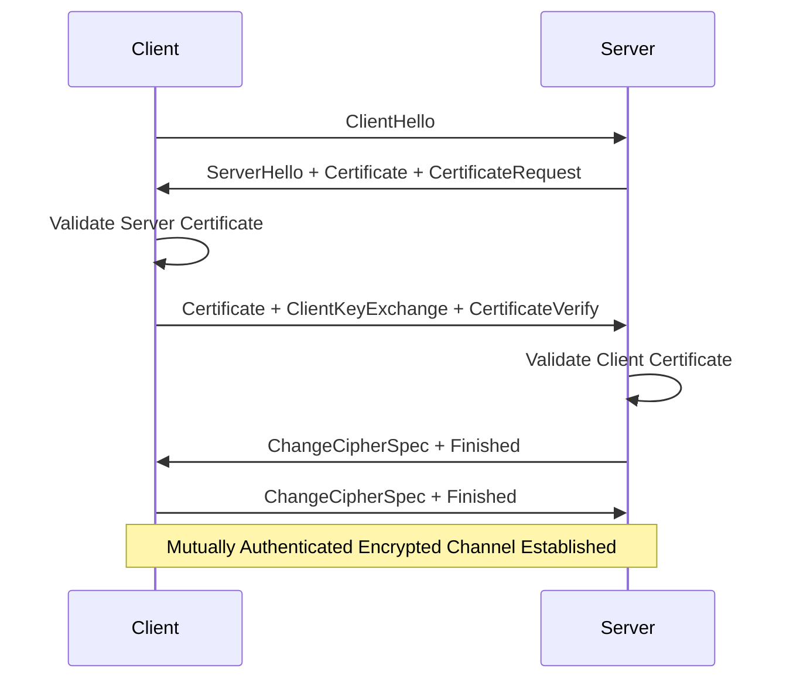

# Mutual TLS (mTLS) Implementation and Benefits

## Original Question
> **What is mutual TLS (mTLS) and why use it?**
> - Follow-up: How does it improve over TLS?
> - Follow-up: How is it transparent to developers?

## Core Concepts

### Key Definitions
- **Mutual TLS (mTLS)**: Extension of TLS where both client and server authenticate each other using digital certificates
- **Certificate Authority (CA)**: Trusted entity that issues digital certificates for authentication
- **Certificate Pinning**: Practice of associating specific certificates with hosts to prevent man-in-the-middle attacks
- **Service Identity**: Cryptographically verifiable identity for services in distributed systems
- **Certificate Rotation**: Process of replacing certificates before they expire or become compromised
- **Zero Trust Architecture**: Security model requiring verification of every connection, including internal communications

### Fundamental Principles
- **Mutual Authentication**: Both parties verify each other's identity before establishing communication
- **Strong Cryptographic Identity**: Identity verification based on cryptographic certificates rather than network location
- **End-to-End Security**: Secure communication channel from source to destination
- **Identity Verification**: Automatic verification of service identity without human intervention
- **Defense in Depth**: Additional security layer beyond network-level controls

## Best Practices & Industry Standards

### mTLS vs Standard TLS Comparison

#### **Standard TLS (One-Way)**
```
1. Client connects to server
2. Server presents certificate
3. Client validates server certificate
4. Client generates session key
5. Encrypted communication begins
```

#### **Mutual TLS (Two-Way)**
```
1. Client connects to server
2. Server presents certificate to client
3. Client validates server certificate
4. Server requests client certificate
5. Client presents certificate to server
6. Server validates client certificate
7. Both parties generate session key
8. Mutually authenticated encrypted communication begins
```

### Implementation Architecture

#### 1. **Certificate Management Infrastructure**
```yaml
# Example: Certificate Authority setup for mTLS
# Root CA Configuration
root_ca:
  common_name: "Internal Root CA"
  key_size: 4096
  validity_days: 3650  # 10 years

  # Key usage extensions
  key_usage:
    - digital_signature
    - key_cert_sign
    - crl_sign

  # Basic constraints
  basic_constraints:
    ca: true
    path_length: 2

# Intermediate CA for service certificates
service_ca:
  common_name: "Service Intermediate CA"
  key_size: 2048
  validity_days: 1825  # 5 years

  # Issued by root CA
  issuer: root_ca

  # Key usage for intermediate CA
  key_usage:
    - digital_signature
    - key_cert_sign
    - crl_sign

  basic_constraints:
    ca: true
    path_length: 0

# Service certificate template
service_certificate_template:
  key_size: 2048
  validity_days: 90  # Short-lived certificates

  # Subject Alternative Names for service identity
  san:
    - "service-name.namespace.svc.cluster.local"
    - "service-name.company.internal"

  # Key usage for service certificates
  key_usage:
    - digital_signature
    - key_encipherment

  extended_key_usage:
    - server_auth
    - client_auth

# Certificate rotation policy
rotation_policy:
  renewal_threshold_days: 30
  automatic_renewal: true
  emergency_rotation_hours: 4
  notification_days_before_expiry: 7
```

#### 2. **Service Mesh mTLS Implementation**
```yaml
# Example: Istio service mesh mTLS configuration
apiVersion: security.istio.io/v1beta1
kind: PeerAuthentication
metadata:
  name: default-mtls
  namespace: production
spec:
  # Require mTLS for all services in namespace
  mtls:
    mode: STRICT

---
# Destination rule for mTLS traffic policy
apiVersion: networking.istio.io/v1beta1
kind: DestinationRule
metadata:
  name: default-mtls-policy
  namespace: production
spec:
  host: "*.production.svc.cluster.local"
  trafficPolicy:
    tls:
      mode: ISTIO_MUTUAL  # Use Istio-managed certificates

---
# Authorization policy with certificate-based identity
apiVersion: security.istio.io/v1beta1
kind: AuthorizationPolicy
metadata:
  name: service-to-service-authz
  namespace: production
spec:
  selector:
    matchLabels:
      app: customer-service

  rules:
  - from:
    - source:
        principals:
        - "cluster.local/ns/production/sa/order-service"
        - "cluster.local/ns/production/sa/billing-service"
    to:
    - operation:
        methods: ["GET", "POST", "PUT"]
        paths: ["/api/customers/*"]

---
# Certificate management for external services
apiVersion: networking.istio.io/v1beta1
kind: DestinationRule
metadata:
  name: external-service-mtls
  namespace: production
spec:
  host: external-api.partner.com
  trafficPolicy:
    tls:
      mode: MUTUAL
      clientCertificate: /etc/certs/client-cert.pem
      privateKey: /etc/certs/client-key.pem
      caCertificates: /etc/certs/ca-cert.pem
      sni: external-api.partner.com
```

#### 3. **Application-Level mTLS Implementation**
```go
// Example: Go application with mTLS client and server
package main

import (
    "crypto/tls"
    "crypto/x509"
    "fmt"
    "io"
    "io/ioutil"
    "log"
    "net/http"
    "time"
)

type MTLSConfig struct {
    ServerCertFile   string
    ServerKeyFile    string
    ClientCertFile   string
    ClientKeyFile    string
    CACertFile       string
    ServerAddr       string
    InsecureSkipVerify bool
}

// mTLS Server implementation
func createMTLSServer(config MTLSConfig) *http.Server {
    // Load server certificate and key
    serverCert, err := tls.LoadX509KeyPair(config.ServerCertFile, config.ServerKeyFile)
    if err != nil {
        log.Fatalf("Failed to load server certificate: %v", err)
    }

    // Load CA certificate for client verification
    caCert, err := ioutil.ReadFile(config.CACertFile)
    if err != nil {
        log.Fatalf("Failed to load CA certificate: %v", err)
    }

    caCertPool := x509.NewCertPool()
    if !caCertPool.AppendCertsFromPEM(caCert) {
        log.Fatal("Failed to parse CA certificate")
    }

    // Configure TLS with client certificate verification
    tlsConfig := &tls.Config{
        Certificates: []tls.Certificate{serverCert},
        ClientCAs:    caCertPool,
        ClientAuth:   tls.RequireAndVerifyClientCert, // Require client certificate
        MinVersion:   tls.VersionTLS12,
        CipherSuites: []uint16{
            tls.TLS_ECDHE_RSA_WITH_AES_256_GCM_SHA384,
            tls.TLS_ECDHE_ECDSA_WITH_AES_256_GCM_SHA384,
        },
    }

    server := &http.Server{
        Addr:      config.ServerAddr,
        TLSConfig: tlsConfig,
        Handler:   createMTLSHandler(),
        ReadTimeout:  30 * time.Second,
        WriteTimeout: 30 * time.Second,
        IdleTimeout:  120 * time.Second,
    }

    return server
}

func createMTLSHandler() http.Handler {
    mux := http.NewServeMux()

    // Health check endpoint
    mux.HandleFunc("/health", func(w http.ResponseWriter, r *http.Request) {
        // Extract client certificate information
        if r.TLS != nil && len(r.TLS.PeerCertificates) > 0 {
            clientCert := r.TLS.PeerCertificates[0]
            log.Printf("Client certificate: Subject=%s, Serial=%s",
                clientCert.Subject.String(), clientCert.SerialNumber.String())
        }

        w.WriteHeader(http.StatusOK)
        w.Write([]byte(`{"status": "healthy", "mtls": "enabled"}`))
    })

    // API endpoint with client certificate validation
    mux.HandleFunc("/api/secure-data", func(w http.ResponseWriter, r *http.Request) {
        // Validate client certificate
        if !validateClientCertificate(r) {
            http.Error(w, "Invalid client certificate", http.StatusForbidden)
            return
        }

        // Extract service identity from certificate
        serviceIdentity := extractServiceIdentity(r.TLS.PeerCertificates[0])

        // Log access with certificate details
        logSecureAccess(serviceIdentity, r.URL.Path, r.Method)

        w.Header().Set("Content-Type", "application/json")
        w.Write([]byte(`{"data": "secure information", "authenticated_service": "` + serviceIdentity + `"}`))
    })

    return mux
}

func validateClientCertificate(r *http.Request) bool {
    if r.TLS == nil || len(r.TLS.PeerCertificates) == 0 {
        return false
    }

    clientCert := r.TLS.PeerCertificates[0]

    // Check certificate expiration
    if time.Now().After(clientCert.NotAfter) {
        log.Printf("Client certificate expired: %s", clientCert.NotAfter)
        return false
    }

    // Check certificate not yet valid
    if time.Now().Before(clientCert.NotBefore) {
        log.Printf("Client certificate not yet valid: %s", clientCert.NotBefore)
        return false
    }

    // Additional custom validation logic
    return validateServiceIdentity(clientCert)
}

func validateServiceIdentity(cert *x509.Certificate) bool {
    // Extract service identity from certificate subject or SAN
    allowedServices := []string{
        "order-service",
        "user-service",
        "billing-service",
    }

    // Check Common Name
    for _, service := range allowedServices {
        if cert.Subject.CommonName == service {
            return true
        }
    }

    // Check Subject Alternative Names
    for _, san := range cert.DNSNames {
        for _, service := range allowedServices {
            if san == service+".production.svc.cluster.local" {
                return true
            }
        }
    }

    return false
}

func extractServiceIdentity(cert *x509.Certificate) string {
    // Extract service name from certificate
    if cert.Subject.CommonName != "" {
        return cert.Subject.CommonName
    }

    // Fallback to first DNS SAN
    if len(cert.DNSNames) > 0 {
        return cert.DNSNames[0]
    }

    return "unknown"
}

func logSecureAccess(serviceIdentity, path, method string) {
    log.Printf("Secure access: service=%s, path=%s, method=%s, timestamp=%s",
        serviceIdentity, path, method, time.Now().UTC().Format(time.RFC3339))
}

// mTLS Client implementation
type MTLSClient struct {
    client *http.Client
    config MTLSConfig
}

func NewMTLSClient(config MTLSConfig) (*MTLSClient, error) {
    // Load client certificate and key
    clientCert, err := tls.LoadX509KeyPair(config.ClientCertFile, config.ClientKeyFile)
    if err != nil {
        return nil, fmt.Errorf("failed to load client certificate: %v", err)
    }

    // Load CA certificate for server verification
    caCert, err := ioutil.ReadFile(config.CACertFile)
    if err != nil {
        return nil, fmt.Errorf("failed to load CA certificate: %v", err)
    }

    caCertPool := x509.NewCertPool()
    if !caCertPool.AppendCertsFromPEM(caCert) {
        return nil, fmt.Errorf("failed to parse CA certificate")
    }

    // Configure TLS client
    tlsConfig := &tls.Config{
        Certificates:       []tls.Certificate{clientCert},
        RootCAs:           caCertPool,
        InsecureSkipVerify: config.InsecureSkipVerify,
        MinVersion:        tls.VersionTLS12,
        CipherSuites: []uint16{
            tls.TLS_ECDHE_RSA_WITH_AES_256_GCM_SHA384,
            tls.TLS_ECDHE_ECDSA_WITH_AES_256_GCM_SHA384,
        },
    }

    // Create HTTP client with mTLS transport
    transport := &http.Transport{
        TLSClientConfig: tlsConfig,
        MaxIdleConns:        100,
        IdleConnTimeout:     90 * time.Second,
        TLSHandshakeTimeout: 10 * time.Second,
    }

    client := &http.Client{
        Transport: transport,
        Timeout:   30 * time.Second,
    }

    return &MTLSClient{
        client: client,
        config: config,
    }, nil
}

func (mc *MTLSClient) Get(url string) (*http.Response, error) {
    return mc.client.Get(url)
}

func (mc *MTLSClient) Post(url, contentType string, body io.Reader) (*http.Response, error) {
    return mc.client.Post(url, contentType, body)
}

// Example usage
func main() {
    config := MTLSConfig{
        ServerCertFile: "/etc/certs/server-cert.pem",
        ServerKeyFile:  "/etc/certs/server-key.pem",
        ClientCertFile: "/etc/certs/client-cert.pem",
        ClientKeyFile:  "/etc/certs/client-key.pem",
        CACertFile:     "/etc/certs/ca-cert.pem",
        ServerAddr:     ":8443",
        InsecureSkipVerify: false,
    }

    // Start mTLS server in goroutine
    go func() {
        server := createMTLSServer(config)
        log.Printf("Starting mTLS server on %s", config.ServerAddr)

        if err := server.ListenAndServeTLS("", ""); err != nil && err != http.ErrServerClosed {
            log.Fatalf("Server failed: %v", err)
        }
    }()

    // Wait for server to start
    time.Sleep(2 * time.Second)

    // Create mTLS client
    client, err := NewMTLSClient(config)
    if err != nil {
        log.Fatalf("Failed to create mTLS client: %v", err)
    }

    // Make secure request
    resp, err := client.Get("https://localhost:8443/api/secure-data")
    if err != nil {
        log.Fatalf("Request failed: %v", err)
    }
    defer resp.Body.Close()

    body, err := ioutil.ReadAll(resp.Body)
    if err != nil {
        log.Fatalf("Failed to read response: %v", err)
    }

    log.Printf("Response: %s", string(body))
}
```

### Certificate Lifecycle Management

#### 1. **Automated Certificate Management**
```python
# Example: Python certificate lifecycle management system
import datetime
import asyncio
import ssl
import logging
from typing import Dict, List, Optional
from dataclasses import dataclass
from cryptography import x509
from cryptography.x509.oid import NameOID
from cryptography.hazmat.primitives import hashes, serialization
from cryptography.hazmat.primitives.asymmetric import rsa

@dataclass
class CertificateInfo:
    common_name: str
    san_list: List[str]
    not_before: datetime.datetime
    not_after: datetime.datetime
    serial_number: str
    issuer: str
    fingerprint: str
    key_size: int

class CertificateManager:
    def __init__(self, ca_cert_path: str, ca_key_path: str):
        self.ca_cert_path = ca_cert_path
        self.ca_key_path = ca_key_path
        self.certificates: Dict[str, CertificateInfo] = {}
        self.renewal_threshold_days = 30

        # Load CA certificate and key
        self.ca_cert = self._load_ca_certificate()
        self.ca_private_key = self._load_ca_private_key()

    def _load_ca_certificate(self) -> x509.Certificate:
        """Load CA certificate from file"""
        with open(self.ca_cert_path, 'rb') as f:
            return x509.load_pem_x509_certificate(f.read())

    def _load_ca_private_key(self):
        """Load CA private key from file"""
        with open(self.ca_key_path, 'rb') as f:
            return serialization.load_pem_private_key(f.read(), password=None)

    def generate_service_certificate(self, service_name: str,
                                   namespace: str = "default",
                                   validity_days: int = 90) -> tuple:
        """Generate new service certificate with private key"""

        # Generate private key
        private_key = rsa.generate_private_key(
            public_exponent=65537,
            key_size=2048
        )

        # Create subject
        subject = x509.Name([
            x509.NameAttribute(NameOID.COUNTRY_NAME, "US"),
            x509.NameAttribute(NameOID.STATE_OR_PROVINCE_NAME, "CA"),
            x509.NameAttribute(NameOID.LOCALITY_NAME, "San Francisco"),
            x509.NameAttribute(NameOID.ORGANIZATION_NAME, "Internal Services"),
            x509.NameAttribute(NameOID.COMMON_NAME, service_name),
        ])

        # Create Subject Alternative Names
        san_list = [
            x509.DNSName(service_name),
            x509.DNSName(f"{service_name}.{namespace}"),
            x509.DNSName(f"{service_name}.{namespace}.svc"),
            x509.DNSName(f"{service_name}.{namespace}.svc.cluster.local"),
        ]

        # Build certificate
        cert = x509.CertificateBuilder().subject_name(
            subject
        ).issuer_name(
            self.ca_cert.subject
        ).public_key(
            private_key.public_key()
        ).serial_number(
            x509.random_serial_number()
        ).not_valid_before(
            datetime.datetime.utcnow()
        ).not_valid_after(
            datetime.datetime.utcnow() + datetime.timedelta(days=validity_days)
        ).add_extension(
            x509.SubjectAlternativeName(san_list),
            critical=False,
        ).add_extension(
            x509.BasicConstraints(ca=False, path_length=None),
            critical=True,
        ).add_extension(
            x509.KeyUsage(
                key_encipherment=True,
                digital_signature=True,
                content_commitment=False,
                data_encipherment=False,
                key_agreement=False,
                key_cert_sign=False,
                crl_sign=False,
                encipher_only=False,
                decipher_only=False,
            ),
            critical=True,
        ).add_extension(
            x509.ExtendedKeyUsage([
                x509.oid.ExtendedKeyUsageOID.SERVER_AUTH,
                x509.oid.ExtendedKeyUsageOID.CLIENT_AUTH,
            ]),
            critical=True,
        ).sign(self.ca_private_key, hashes.SHA256())

        # Store certificate info
        cert_info = self._extract_certificate_info(cert)
        self.certificates[service_name] = cert_info

        return cert, private_key

    def _extract_certificate_info(self, cert: x509.Certificate) -> CertificateInfo:
        """Extract certificate information for tracking"""

        # Get Subject Alternative Names
        san_list = []
        try:
            san_extension = cert.extensions.get_extension_for_oid(x509.oid.ExtensionOID.SUBJECT_ALTERNATIVE_NAME)
            san_list = [name.value for name in san_extension.value]
        except x509.ExtensionNotFound:
            pass

        return CertificateInfo(
            common_name=cert.subject.get_attributes_for_oid(NameOID.COMMON_NAME)[0].value,
            san_list=san_list,
            not_before=cert.not_valid_before,
            not_after=cert.not_valid_after,
            serial_number=str(cert.serial_number),
            issuer=cert.issuer.rfc4514_string(),
            fingerprint=cert.fingerprint(hashes.SHA256()).hex(),
            key_size=cert.public_key().key_size
        )

    def check_certificate_expiry(self) -> List[str]:
        """Check which certificates need renewal"""

        expiring_soon = []
        renewal_deadline = datetime.datetime.utcnow() + datetime.timedelta(days=self.renewal_threshold_days)

        for service_name, cert_info in self.certificates.items():
            if cert_info.not_after <= renewal_deadline:
                expiring_soon.append(service_name)
                logging.warning(f"Certificate for {service_name} expires on {cert_info.not_after}")

        return expiring_soon

    async def auto_renew_certificates(self):
        """Automatically renew certificates that are close to expiry"""

        expiring_services = self.check_certificate_expiry()

        for service_name in expiring_services:
            try:
                logging.info(f"Renewing certificate for {service_name}")

                # Generate new certificate
                new_cert, new_key = self.generate_service_certificate(service_name)

                # Deploy new certificate to service
                await self.deploy_certificate_to_service(service_name, new_cert, new_key)

                # Update certificate tracking
                self.certificates[service_name] = self._extract_certificate_info(new_cert)

                logging.info(f"Successfully renewed certificate for {service_name}")

            except Exception as e:
                logging.error(f"Failed to renew certificate for {service_name}: {e}")

    async def deploy_certificate_to_service(self, service_name: str,
                                          certificate: x509.Certificate,
                                          private_key) -> bool:
        """Deploy certificate to service (implementation depends on deployment method)"""

        # Convert certificate and key to PEM format
        cert_pem = certificate.public_bytes(serialization.Encoding.PEM)
        key_pem = private_key.private_bytes(
            encoding=serialization.Encoding.PEM,
            format=serialization.PrivateFormat.PKCS8,
            encryption_algorithm=serialization.NoEncryption()
        )

        # Example: Update Kubernetes secret
        await self.update_kubernetes_secret(service_name, cert_pem, key_pem)

        # Example: Trigger service restart for certificate reload
        await self.restart_service(service_name)

        return True

    async def update_kubernetes_secret(self, service_name: str, cert_pem: bytes, key_pem: bytes):
        """Update Kubernetes secret with new certificate"""

        # This would integrate with Kubernetes API
        # For demonstration, we'll just log the action
        logging.info(f"Updating Kubernetes secret for {service_name}")

        # In real implementation:
        # 1. Connect to Kubernetes API
        # 2. Update the secret with new certificate and key
        # 3. Handle any errors

    async def restart_service(self, service_name: str):
        """Restart service to load new certificate"""

        logging.info(f"Restarting service {service_name} to load new certificate")

        # In real implementation:
        # 1. Send signal to service to reload certificates
        # 2. Or restart the service/pod
        # 3. Verify service is healthy after restart

    def get_certificate_info(self, service_name: str) -> Optional[CertificateInfo]:
        """Get certificate information for a service"""
        return self.certificates.get(service_name)

    def list_all_certificates(self) -> Dict[str, CertificateInfo]:
        """List all tracked certificates"""
        return self.certificates.copy()

    def revoke_certificate(self, service_name: str, reason: str = "unspecified"):
        """Revoke a certificate and add to CRL"""

        if service_name not in self.certificates:
            raise ValueError(f"Certificate for {service_name} not found")

        cert_info = self.certificates[service_name]

        # Add to Certificate Revocation List
        self._add_to_crl(cert_info.serial_number, reason)

        # Remove from tracking
        del self.certificates[service_name]

        logging.info(f"Revoked certificate for {service_name} with serial {cert_info.serial_number}")

    def _add_to_crl(self, serial_number: str, reason: str):
        """Add certificate to Certificate Revocation List"""

        # Implementation would update the CRL
        logging.info(f"Adding certificate with serial {serial_number} to CRL, reason: {reason}")

# Usage example
async def main():
    # Initialize certificate manager
    cert_manager = CertificateManager(
        ca_cert_path="/etc/ca/ca-cert.pem",
        ca_key_path="/etc/ca/ca-key.pem"
    )

    # Generate certificates for services
    services = ["user-service", "order-service", "payment-service"]

    for service in services:
        cert, key = cert_manager.generate_service_certificate(service, "production")

        # Save certificate and key to files
        with open(f"/etc/certs/{service}-cert.pem", "wb") as f:
            f.write(cert.public_bytes(serialization.Encoding.PEM))

        with open(f"/etc/certs/{service}-key.pem", "wb") as f:
            f.write(key.private_bytes(
                encoding=serialization.Encoding.PEM,
                format=serialization.PrivateFormat.PKCS8,
                encryption_algorithm=serialization.NoEncryption()
            ))

    # Start automatic renewal process
    while True:
        await cert_manager.auto_renew_certificates()
        await asyncio.sleep(3600)  # Check every hour

if __name__ == "__main__":
    asyncio.run(main())
```

### Developer Transparency Patterns

#### 1. **Service Mesh Automatic mTLS**
```yaml
# Example: Transparent mTLS with Istio - no application code changes required
apiVersion: v1
kind: Service
metadata:
  name: user-service
  namespace: production
  labels:
    app: user-service
spec:
  ports:
  - port: 8080
    targetPort: 8080
  selector:
    app: user-service

---
apiVersion: apps/v1
kind: Deployment
metadata:
  name: user-service
  namespace: production
spec:
  replicas: 3
  selector:
    matchLabels:
      app: user-service
  template:
    metadata:
      labels:
        app: user-service
      annotations:
        # Istio sidecar injection enables automatic mTLS
        sidecar.istio.io/inject: "true"
    spec:
      containers:
      - name: user-service
        image: user-service:v1.0.0
        ports:
        - containerPort: 8080
        # Application code remains unchanged - HTTP communication
        env:
        - name: ORDER_SERVICE_URL
          value: "http://order-service:8080"  # Plain HTTP - Istio handles mTLS
```

#### 2. **SDK/Library Abstraction**
```java
// Example: Java SDK that transparently handles mTLS
public class MTLSHttpClient {
    private final OkHttpClient client;
    private final CertificateManager certificateManager;

    public MTLSHttpClient(CertificateManager certificateManager) {
        this.certificateManager = certificateManager;
        this.client = createSecureClient();
    }

    private OkHttpClient createSecureClient() {
        try {
            // Load certificates from certificate manager
            X509TrustManager trustManager = certificateManager.getTrustManager();
            KeyManager[] keyManagers = certificateManager.getKeyManagers();

            SSLContext sslContext = SSLContext.getInstance("TLS");
            sslContext.init(keyManagers, new TrustManager[]{trustManager}, new SecureRandom());

            return new OkHttpClient.Builder()
                .sslSocketFactory(sslContext.getSocketFactory(), trustManager)
                .hostnameVerifier(certificateManager.getHostnameVerifier())
                .connectTimeout(30, TimeUnit.SECONDS)
                .readTimeout(30, TimeUnit.SECONDS)
                .writeTimeout(30, TimeUnit.SECONDS)
                .build();

        } catch (Exception e) {
            throw new RuntimeException("Failed to create mTLS client", e);
        }
    }

    // Transparent HTTP methods - mTLS handled internally
    public Response get(String url) throws IOException {
        Request request = new Request.Builder()
            .url(url)
            .get()
            .build();

        return client.newCall(request).execute();
    }

    public Response post(String url, RequestBody body) throws IOException {
        Request request = new Request.Builder()
            .url(url)
            .post(body)
            .build();

        return client.newCall(request).execute();
    }

    public Response put(String url, RequestBody body) throws IOException {
        Request request = new Request.Builder()
            .url(url)
            .put(body)
            .build();

        return client.newCall(request).execute();
    }

    public Response delete(String url) throws IOException {
        Request request = new Request.Builder()
            .url(url)
            .delete()
            .build();

        return client.newCall(request).execute();
    }
}

// Usage - developers don't need to know about mTLS details
@Service
public class UserService {
    private final MTLSHttpClient httpClient;

    public UserService(MTLSHttpClient httpClient) {
        this.httpClient = httpClient;
    }

    public OrderResponse getOrdersForUser(String userId) {
        try {
            // mTLS is handled transparently by the client
            Response response = httpClient.get("https://order-service/api/users/" + userId + "/orders");

            if (response.isSuccessful()) {
                return parseOrderResponse(response.body().string());
            } else {
                throw new ServiceException("Failed to get orders: " + response.code());
            }

        } catch (IOException e) {
            throw new ServiceException("Network error getting orders", e);
        }
    }

    private OrderResponse parseOrderResponse(String json) {
        // Parse JSON response
        return new ObjectMapper().readValue(json, OrderResponse.class);
    }
}
```

## Real-World Examples

### Example 1: Financial Services Microservices Platform
**Context**: Banking platform with 50+ microservices requiring regulatory compliance and zero-trust security
**Challenge**: Ensuring all service-to-service communication is encrypted and authenticated without impacting development velocity
**Solution**:
- Implemented Istio service mesh with automatic mTLS for all internal communications
- Created centralized certificate management system with 24-hour certificate rotation
- Established policy enforcement for external partner integrations
- Built comprehensive audit logging for all certificate-based authentications

**Implementation Benefits**:
- **Transparency**: Developers continued using standard HTTP clients - no code changes required
- **Security**: 100% of inter-service communication encrypted with mutual authentication
- **Compliance**: Met regulatory requirements for data-in-transit encryption
- **Performance**: <2ms additional latency for mTLS handshake with session reuse

**Technologies**: Istio service mesh, Kubernetes, HashiCorp Vault for certificate management, Envoy proxy

### Example 2: Healthcare IoT Platform with Edge Computing
**Context**: Medical device platform with thousands of edge devices communicating with cloud services
**Challenge**: Securing device-to-cloud communication while managing certificate lifecycle for resource-constrained devices
**Solution**:
- Implemented lightweight mTLS with ECDSA certificates for reduced computational overhead
- Created automated certificate provisioning during device manufacturing
- Built edge-aware certificate renewal system with offline capability
- Established device identity verification using hardware-based attestation

**Edge Device mTLS Implementation**:
```c
// Example: Lightweight mTLS implementation for IoT devices
#include <stdio.h>
#include <stdlib.h>
#include <string.h>
#include <mbedtls/net_sockets.h>
#include <mbedtls/ssl.h>
#include <mbedtls/ctr_drbg.h>
#include <mbedtls/entropy.h>
#include <mbedtls/x509_crt.h>
#include <mbedtls/pk.h>

typedef struct {
    mbedtls_ssl_context ssl;
    mbedtls_ssl_config conf;
    mbedtls_net_context server_fd;
    mbedtls_ctr_drbg_context ctr_drbg;
    mbedtls_entropy_context entropy;
    mbedtls_x509_crt ca_cert;
    mbedtls_x509_crt client_cert;
    mbedtls_pk_context private_key;
} mtls_context_t;

// Initialize mTLS context with certificates
int mtls_init(mtls_context_t *ctx, const char *ca_cert_pem,
              const char *client_cert_pem, const char *client_key_pem) {

    int ret = 0;

    // Initialize contexts
    mbedtls_ssl_init(&ctx->ssl);
    mbedtls_ssl_config_init(&ctx->conf);
    mbedtls_net_init(&ctx->server_fd);
    mbedtls_ctr_drbg_init(&ctx->ctr_drbg);
    mbedtls_entropy_init(&ctx->entropy);
    mbedtls_x509_crt_init(&ctx->ca_cert);
    mbedtls_x509_crt_init(&ctx->client_cert);
    mbedtls_pk_init(&ctx->private_key);

    // Seed random number generator
    const char *pers = "medical_device_mtls";
    if ((ret = mbedtls_ctr_drbg_seed(&ctx->ctr_drbg, mbedtls_entropy_func,
                                     &ctx->entropy, (const unsigned char *)pers, strlen(pers))) != 0) {
        printf("Failed to seed RNG: %d\n", ret);
        return ret;
    }

    // Load CA certificate
    if ((ret = mbedtls_x509_crt_parse(&ctx->ca_cert, (const unsigned char *)ca_cert_pem,
                                      strlen(ca_cert_pem) + 1)) != 0) {
        printf("Failed to parse CA certificate: %d\n", ret);
        return ret;
    }

    // Load client certificate
    if ((ret = mbedtls_x509_crt_parse(&ctx->client_cert, (const unsigned char *)client_cert_pem,
                                      strlen(client_cert_pem) + 1)) != 0) {
        printf("Failed to parse client certificate: %d\n", ret);
        return ret;
    }

    // Load private key
    if ((ret = mbedtls_pk_parse_key(&ctx->private_key, (const unsigned char *)client_key_pem,
                                    strlen(client_key_pem) + 1, NULL, 0)) != 0) {
        printf("Failed to parse private key: %d\n", ret);
        return ret;
    }

    // Configure SSL
    if ((ret = mbedtls_ssl_config_defaults(&ctx->conf, MBEDTLS_SSL_IS_CLIENT,
                                           MBEDTLS_SSL_TRANSPORT_STREAM, MBEDTLS_SSL_PRESET_DEFAULT)) != 0) {
        printf("Failed to set SSL defaults: %d\n", ret);
        return ret;
    }

    // Set verification mode
    mbedtls_ssl_conf_authmode(&ctx->conf, MBEDTLS_SSL_VERIFY_REQUIRED);
    mbedtls_ssl_conf_ca_chain(&ctx->conf, &ctx->ca_cert, NULL);

    // Set client certificate
    if ((ret = mbedtls_ssl_conf_own_cert(&ctx->conf, &ctx->client_cert, &ctx->private_key)) != 0) {
        printf("Failed to set client certificate: %d\n", ret);
        return ret;
    }

    mbedtls_ssl_conf_rng(&ctx->conf, mbedtls_ctr_drbg_random, &ctx->ctr_drbg);

    if ((ret = mbedtls_ssl_setup(&ctx->ssl, &ctx->conf)) != 0) {
        printf("Failed to setup SSL: %d\n", ret);
        return ret;
    }

    return 0;
}

// Connect to server with mTLS
int mtls_connect(mtls_context_t *ctx, const char *hostname, const char *port) {
    int ret = 0;

    // Connect to server
    if ((ret = mbedtls_net_connect(&ctx->server_fd, hostname, port, MBEDTLS_NET_PROTO_TCP)) != 0) {
        printf("Failed to connect to server: %d\n", ret);
        return ret;
    }

    // Set hostname for SNI
    if ((ret = mbedtls_ssl_set_hostname(&ctx->ssl, hostname)) != 0) {
        printf("Failed to set hostname: %d\n", ret);
        return ret;
    }

    // Set BIO functions
    mbedtls_ssl_set_bio(&ctx->ssl, &ctx->server_fd, mbedtls_net_send, mbedtls_net_recv, NULL);

    // Perform SSL handshake
    while ((ret = mbedtls_ssl_handshake(&ctx->ssl)) != 0) {
        if (ret != MBEDTLS_ERR_SSL_WANT_READ && ret != MBEDTLS_ERR_SSL_WANT_WRITE) {
            printf("SSL handshake failed: %d\n", ret);
            return ret;
        }
    }

    // Verify server certificate
    uint32_t flags = mbedtls_ssl_get_verify_result(&ctx->ssl);
    if (flags != 0) {
        printf("Server certificate verification failed: %u\n", flags);
        return MBEDTLS_ERR_X509_CERT_VERIFY_FAILED;
    }

    printf("mTLS connection established successfully\n");
    return 0;
}

// Send data over mTLS connection
int mtls_send(mtls_context_t *ctx, const unsigned char *data, size_t len) {
    int ret = 0;
    size_t written = 0;

    while (written < len) {
        ret = mbedtls_ssl_write(&ctx->ssl, data + written, len - written);

        if (ret == MBEDTLS_ERR_SSL_WANT_READ || ret == MBEDTLS_ERR_SSL_WANT_WRITE) {
            continue;
        }

        if (ret < 0) {
            printf("SSL write failed: %d\n", ret);
            return ret;
        }

        written += ret;
    }

    return written;
}

// Receive data over mTLS connection
int mtls_receive(mtls_context_t *ctx, unsigned char *buffer, size_t max_len) {
    int ret = 0;

    do {
        ret = mbedtls_ssl_read(&ctx->ssl, buffer, max_len - 1);

        if (ret == MBEDTLS_ERR_SSL_WANT_READ || ret == MBEDTLS_ERR_SSL_WANT_WRITE) {
            continue;
        }

        if (ret < 0) {
            printf("SSL read failed: %d\n", ret);
            return ret;
        }

        if (ret == 0) {
            printf("Connection closed by server\n");
            return 0;
        }

        buffer[ret] = '\0';
        break;

    } while (1);

    return ret;
}

// Cleanup mTLS context
void mtls_cleanup(mtls_context_t *ctx) {
    mbedtls_ssl_close_notify(&ctx->ssl);

    mbedtls_net_free(&ctx->server_fd);
    mbedtls_x509_crt_free(&ctx->ca_cert);
    mbedtls_x509_crt_free(&ctx->client_cert);
    mbedtls_pk_free(&ctx->private_key);
    mbedtls_ssl_free(&ctx->ssl);
    mbedtls_ssl_config_free(&ctx->conf);
    mbedtls_ctr_drbg_free(&ctx->ctr_drbg);
    mbedtls_entropy_free(&ctx->entropy);
}
```

**Outcome**: Achieved 99.9% device authentication success rate, reduced certificate-related support calls by 95%, maintained HIPAA compliance for all data transmissions

### Example 3: E-commerce Platform API Security
**Context**: High-traffic e-commerce platform with partner integrations requiring strong API security
**Challenge**: Protecting sensitive customer and payment data while enabling seamless partner integrations
**Solution**:
- Implemented API Gateway with mTLS for partner authentication
- Created partner-specific certificates with embedded permissions
- Built transparent SDK for partners with automatic certificate management
- Established certificate-based rate limiting and access control

**Partner SDK Implementation**:
```python
# Example: Python SDK that abstracts mTLS complexity from partners
class EcommerceAPIClient:
    def __init__(self, partner_id: str, cert_path: str, key_path: str, ca_path: str):
        self.partner_id = partner_id
        self.base_url = "https://api.ecommerce.com"

        # Configure mTLS session
        self.session = requests.Session()
        self.session.cert = (cert_path, key_path)
        self.session.verify = ca_path

        # Add partner identification header
        self.session.headers.update({
            'X-Partner-ID': partner_id,
            'User-Agent': f'EcommerceSDK/1.0 Partner/{partner_id}'
        })

    def get_orders(self, status: str = None, limit: int = 100) -> List[Dict]:
        """Get orders - mTLS authentication handled transparently"""
        params = {'limit': limit}
        if status:
            params['status'] = status

        response = self.session.get(f"{self.base_url}/v1/orders", params=params)
        response.raise_for_status()
        return response.json()['orders']

    def create_order(self, order_data: Dict) -> Dict:
        """Create order - mTLS authentication handled transparently"""
        response = self.session.post(f"{self.base_url}/v1/orders", json=order_data)
        response.raise_for_status()
        return response.json()

    def update_inventory(self, sku: str, quantity: int) -> Dict:
        """Update inventory - mTLS authentication handled transparently"""
        data = {'sku': sku, 'quantity': quantity}
        response = self.session.put(f"{self.base_url}/v1/inventory/{sku}", json=data)
        response.raise_for_status()
        return response.json()

# Partner usage - no mTLS knowledge required
client = EcommerceAPIClient(
    partner_id="PARTNER123",
    cert_path="/etc/certs/partner-cert.pem",
    key_path="/etc/certs/partner-key.pem",
    ca_path="/etc/certs/ca-cert.pem"
)

# Simple API calls - mTLS handled automatically
orders = client.get_orders(status='pending')
for order in orders:
    print(f"Order {order['id']}: {order['total']}")
```

**Outcome**: Secured $2B+ in annual partner transactions, reduced partner integration time from weeks to hours, achieved 99.99% API availability with zero authentication bypasses

## Benefits of mTLS Implementation

### Security Benefits
1. **Strong Authentication**: Cryptographic proof of identity for both parties
2. **Man-in-the-Middle Prevention**: Impossible to intercept without valid certificates
3. **Zero Trust Enablement**: Verification required for every connection
4. **Identity-Based Authorization**: Granular permissions based on certificate identity
5. **Audit Trail**: Complete logging of authenticated connections

### Operational Benefits
1. **Automated Trust**: No manual key distribution or password management
2. **Scalable Security**: Works seamlessly across thousands of services
3. **Regulatory Compliance**: Meets requirements for data-in-transit encryption
4. **Reduced Attack Surface**: Eliminates password-based authentication vulnerabilities
5. **Service Mesh Integration**: Native support in modern container orchestration

### Developer Benefits
1. **Transparency**: Can be implemented without application code changes
2. **SDK Abstraction**: Complex certificate management hidden behind simple APIs
3. **Automatic Renewal**: Certificate lifecycle managed automatically
4. **Standard Protocols**: Uses familiar HTTPS/TLS protocols
5. **Framework Integration**: Native support in modern frameworks and libraries

## Common Pitfalls & Solutions

### Pitfall 1: Certificate Management Complexity
**Problem**: Complex certificate lifecycle management leading to expired certificates and service outages
**Why it happens**: Manual certificate management, lack of monitoring and automation
**Solution**: Implement automated certificate management with monitoring and alerting
**Prevention**: Use certificate management tools like cert-manager, vault, or cloud-managed certificates

### Pitfall 2: Performance Impact from Poor Implementation
**Problem**: Significant latency increase due to TLS handshake overhead
**Why it happens**: No connection reuse, frequent certificate validation, large certificates
**Solution**: Implement connection pooling, certificate caching, and use smaller certificates
**Prevention**: Performance testing, proper SSL/TLS configuration, session resumption

### Pitfall 3: Developer Experience Degradation
**Problem**: Complex mTLS implementation making development and debugging difficult
**Why it happens**: Exposing certificate complexity to application developers
**Solution**: Abstract mTLS complexity through service mesh or SDK libraries
**Prevention**: Developer-friendly tooling, comprehensive documentation, transparent implementation

### Pitfall 4: Certificate Validation Bypassing
**Problem**: Developers disabling certificate validation during development
**Why it happens**: Difficulty setting up proper certificate chains in development environments
**Solution**: Provide easy-to-use development certificate generation and management tools
**Prevention**: Development environment parity, simplified certificate setup

## Follow-up Questions Preparation

### Likely Deep-Dive Questions

1. **"How does mTLS improve over standard TLS?"**
   - Bidirectional authentication vs unidirectional
   - Protection against compromised servers
   - Cryptographic service identity
   - Elimination of shared secrets

2. **"How do you make mTLS transparent to developers?"**
   - Service mesh automatic injection
   - SDK abstraction layers
   - Framework integration
   - Infrastructure-level implementation

3. **"What are the performance implications of mTLS?"**
   - TLS handshake overhead
   - Certificate validation costs
   - Connection reuse strategies
   - Hardware acceleration options

4. **"How do you handle certificate rotation in production?"**
   - Automated renewal systems
   - Zero-downtime rotation strategies
   - Monitoring and alerting
   - Emergency rotation procedures

### Related Topics to Be Ready For
- **Certificate Authority Management**: PKI setup and operations
- **Service Mesh Security**: Istio, Linkerd, Consul Connect mTLS implementations
- **Zero Trust Architecture**: mTLS as foundation for zero trust
- **Compliance Requirements**: Regulatory requirements for encrypted communications

### Connection Points to Other Sections
- **Section 4 (Service Mesh)**: Service mesh mTLS implementation and benefits
- **Section 6 (AWS Security)**: AWS certificate management and mTLS services
- **Section 8 (Architecture Design)**: mTLS in distributed system architecture

## Sample Answer Framework

### Opening Statement
"Mutual TLS extends standard TLS by requiring both client and server to authenticate each other using digital certificates, creating a foundation for zero-trust architecture. In my experience, mTLS provides significant security improvements while being implementable transparently to developers..."

### Core Answer Structure
1. **Technical Explanation**: How mTLS works and differs from standard TLS
2. **Security Benefits**: Specific security improvements and threat mitigation
3. **Transparency Implementation**: How to implement mTLS without impacting developers
4. **Real-World Example**: Concrete implementation showing benefits and lessons learned

### Closing Statement
"mTLS has proven effective in our implementations because it provides strong cryptographic identity and authentication while being deployable transparently through service mesh or SDK abstraction, enabling zero-trust security without developer friction."

## Technical Deep-Dive Points

### mTLS Handshake Process


### Performance Benchmarks
- **Handshake Overhead**: 2-5ms additional latency for initial connection
- **Connection Reuse**: 99% performance recovery with proper connection pooling
- **Certificate Validation**: <1ms with certificate caching
- **Throughput Impact**: <5% reduction with session resumption

### Implementation Checklist
```yaml
mtls_implementation_checklist:
  certificate_management:
    - automated_issuance: true
    - rotation_automation: true
    - expiry_monitoring: true
    - revocation_handling: true

  security_configuration:
    - strong_cipher_suites: true
    - certificate_pinning: true
    - proper_validation: true
    - secure_key_storage: true

  developer_experience:
    - transparent_implementation: true
    - sdk_abstraction: true
    - development_tooling: true
    - comprehensive_docs: true

  operations:
    - monitoring_alerting: true
    - performance_optimization: true
    - disaster_recovery: true
    - compliance_validation: true
```

## Recommended Reading

### Official Documentation
- [RFC 8446 - TLS 1.3](https://tools.ietf.org/html/rfc8446): Latest TLS specification including mTLS
- [Istio Security Documentation](https://istio.io/latest/docs/concepts/security/): Service mesh mTLS implementation

### Industry Resources
- **Book**: "Bulletproof SSL and TLS" by Ivan Ristić - comprehensive TLS/mTLS implementation guide
- **Tool**: OpenSSL - industry-standard cryptographic toolkit for certificate management
- **Standard**: X.509 Certificate and Certificate Revocation List (CRL) Profile (RFC 5280)

### Recent Updates (2024-2025)
- **Certificate Transparency**: Public certificate logging for improved security
- **Post-Quantum Cryptography**: Preparing mTLS for quantum-resistant algorithms
- **Short-Lived Certificates**: Trend toward certificates with hours/days validity periods