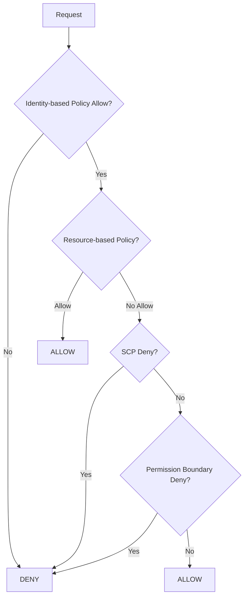

# IAM Core Components and Web App Setup

## Original Question
> **Explain the core components of AWS IAM. How would you set up users, groups, and roles for a web app?**

## Core Concepts

### Key Definitions
- **AWS Identity and Access Management (IAM)**: Service for managing access to AWS services and resources
- **IAM User**: Identity representing a person or service that interacts with AWS
- **IAM Group**: Collection of IAM users with shared permissions
- **IAM Role**: Set of permissions that define what actions are allowed and denied
- **IAM Policy**: Document defining permissions in JSON format
- **Principal**: Entity that can make requests to AWS (user, role, federated identity)
- **Resource-Based Policy**: Policy attached directly to AWS resources

### Fundamental Principles
- **Principle of Least Privilege**: Grant minimum necessary permissions
- **Defense in Depth**: Multiple layers of access controls
- **Separation of Duties**: Distribute sensitive operations across multiple users
- **Regular Access Reviews**: Periodic audit and cleanup of permissions
- **Strong Authentication**: Multi-factor authentication for sensitive operations

## Best Practices & Industry Standards

### Core IAM Components

#### 1. **IAM Users**
```json
{
  "Version": "2012-10-17",
  "Statement": [
    {
      "Effect": "Allow",
      "Action": [
        "s3:GetObject",
        "s3:PutObject"
      ],
      "Resource": "arn:aws:s3:::my-app-bucket/*"
    }
  ]
}
```

**Use Cases for IAM Users**:
- Individual developers who need AWS console access
- Service accounts for applications (though roles are preferred)
- Third-party services requiring long-term credentials
- CI/CD systems (though roles with OIDC are preferred)

**Best Practices**:
- Enable MFA for all users
- Rotate access keys regularly
- Use temporary credentials when possible
- Follow naming conventions (e.g., `firstname.lastname`, `service-name`)

#### 2. **IAM Groups**
```bash
# AWS CLI commands for group management
aws iam create-group --group-name WebAppDevelopers

aws iam attach-group-policy \
  --group-name WebAppDevelopers \
  --policy-arn arn:aws:iam::aws:policy/PowerUserAccess

aws iam add-user-to-group \
  --group-name WebAppDevelopers \
  --user-name john.doe
```

**Common Group Patterns**:
- **Developers**: Development environment access
- **QATesters**: Testing environment permissions
- **DevOpsEngineers**: Infrastructure management rights
- **ReadOnlyUsers**: Monitoring and reporting access
- **Administrators**: Full administrative access

#### 3. **IAM Roles**
```json
{
  "Version": "2012-10-17",
  "Statement": [
    {
      "Effect": "Allow",
      "Principal": {
        "Service": "ec2.amazonaws.com"
      },
      "Action": "sts:AssumeRole"
    }
  ]
}
```

**Role Types**:
- **Service Roles**: For AWS services (EC2, Lambda, ECS)
- **Cross-Account Roles**: For access between AWS accounts
- **Identity Provider Roles**: For federated access (SAML, OIDC)
- **Switch Roles**: For users to temporarily assume elevated permissions

#### 4. **IAM Policies**
```json
{
  "Version": "2012-10-17",
  "Statement": [
    {
      "Sid": "WebAppS3Access",
      "Effect": "Allow",
      "Action": [
        "s3:GetObject",
        "s3:PutObject",
        "s3:DeleteObject"
      ],
      "Resource": [
        "arn:aws:s3:::webapp-assets/*",
        "arn:aws:s3:::webapp-user-uploads/*"
      ],
      "Condition": {
        "StringEquals": {
          "s3:ExistingObjectTag/Environment": "${aws:PrincipalTag/Environment}"
        }
      }
    }
  ]
}
```

**Policy Types**:
- **AWS Managed Policies**: Pre-built policies maintained by AWS
- **Customer Managed Policies**: Custom policies you create and maintain
- **Inline Policies**: Policies directly attached to users, groups, or roles

### Web Application IAM Architecture

#### 1. **Complete Web App IAM Setup**
```python
# Example: Terraform configuration for web application IAM setup
import boto3
import json
from typing import Dict, List

class WebAppIAMSetup:
    def __init__(self, app_name: str, environment: str):
        self.app_name = app_name
        self.environment = environment
        self.iam = boto3.client('iam')
        self.account_id = boto3.client('sts').get_caller_identity()['Account']

    def create_web_app_infrastructure(self):
        """Create complete IAM infrastructure for web application"""

        # 1. Create IAM groups for different user types
        self.create_user_groups()

        # 2. Create service roles for application components
        self.create_service_roles()

        # 3. Create custom policies for application-specific permissions
        self.create_application_policies()

        # 4. Set up cross-account access if needed
        self.create_cross_account_roles()

        # 5. Create monitoring and compliance policies
        self.create_monitoring_policies()

    def create_user_groups(self):
        """Create IAM groups for different types of users"""

        groups_config = {
            f"{self.app_name}-developers": {
                "description": "Developers working on the web application",
                "policies": [
                    "arn:aws:iam::aws:policy/PowerUserAccess",
                    f"arn:aws:iam::{self.account_id}:policy/{self.app_name}-developer-policy"
                ]
            },
            f"{self.app_name}-testers": {
                "description": "QA testers for the web application",
                "policies": [
                    "arn:aws:iam::aws:policy/ReadOnlyAccess",
                    f"arn:aws:iam::{self.account_id}:policy/{self.app_name}-tester-policy"
                ]
            },
            f"{self.app_name}-operators": {
                "description": "Operations team for production support",
                "policies": [
                    f"arn:aws:iam::{self.account_id}:policy/{self.app_name}-operator-policy"
                ]
            }
        }

        for group_name, config in groups_config.items():
            # Create group
            try:
                self.iam.create_group(
                    GroupName=group_name,
                    Path=f"/{self.app_name}/"
                )
                print(f"Created group: {group_name}")
            except self.iam.exceptions.EntityAlreadyExistsException:
                print(f"Group already exists: {group_name}")

            # Attach policies to group
            for policy_arn in config["policies"]:
                try:
                    self.iam.attach_group_policy(
                        GroupName=group_name,
                        PolicyArn=policy_arn
                    )
                    print(f"Attached policy {policy_arn} to {group_name}")
                except Exception as e:
                    print(f"Error attaching policy: {e}")

    def create_service_roles(self):
        """Create IAM roles for application services"""

        # Web server role (EC2/ECS)
        web_server_trust_policy = {
            "Version": "2012-10-17",
            "Statement": [
                {
                    "Effect": "Allow",
                    "Principal": {
                        "Service": ["ec2.amazonaws.com", "ecs-tasks.amazonaws.com"]
                    },
                    "Action": "sts:AssumeRole"
                }
            ]
        }

        web_server_permissions = {
            "Version": "2012-10-17",
            "Statement": [
                {
                    "Sid": "S3AccessForWebAssets",
                    "Effect": "Allow",
                    "Action": [
                        "s3:GetObject"
                    ],
                    "Resource": f"arn:aws:s3:::{self.app_name}-{self.environment}-assets/*"
                },
                {
                    "Sid": "DynamoDBAccess",
                    "Effect": "Allow",
                    "Action": [
                        "dynamodb:GetItem",
                        "dynamodb:PutItem",
                        "dynamodb:UpdateItem",
                        "dynamodb:DeleteItem",
                        "dynamodb:Query",
                        "dynamodb:Scan"
                    ],
                    "Resource": f"arn:aws:dynamodb:*:{self.account_id}:table/{self.app_name}-*"
                },
                {
                    "Sid": "CloudWatchLogging",
                    "Effect": "Allow",
                    "Action": [
                        "logs:CreateLogGroup",
                        "logs:CreateLogStream",
                        "logs:PutLogEvents",
                        "logs:DescribeLogStreams"
                    ],
                    "Resource": f"arn:aws:logs:*:{self.account_id}:log-group:/aws/{self.app_name}/*"
                },
                {
                    "Sid": "ParameterStoreAccess",
                    "Effect": "Allow",
                    "Action": [
                        "ssm:GetParameter",
                        "ssm:GetParameters",
                        "ssm:GetParametersByPath"
                    ],
                    "Resource": f"arn:aws:ssm:*:{self.account_id}:parameter/{self.app_name}/{self.environment}/*"
                }
            ]
        }

        # Create web server role
        role_name = f"{self.app_name}-{self.environment}-web-server-role"
        self.create_role(role_name, web_server_trust_policy, web_server_permissions)

        # Lambda execution role
        lambda_trust_policy = {
            "Version": "2012-10-17",
            "Statement": [
                {
                    "Effect": "Allow",
                    "Principal": {
                        "Service": "lambda.amazonaws.com"
                    },
                    "Action": "sts:AssumeRole"
                }
            ]
        }

        lambda_permissions = {
            "Version": "2012-10-17",
            "Statement": [
                {
                    "Sid": "BasicLambdaExecution",
                    "Effect": "Allow",
                    "Action": [
                        "logs:CreateLogGroup",
                        "logs:CreateLogStream",
                        "logs:PutLogEvents"
                    ],
                    "Resource": f"arn:aws:logs:*:{self.account_id}:log-group:/aws/lambda/{self.app_name}-*"
                },
                {
                    "Sid": "VPCAccess",
                    "Effect": "Allow",
                    "Action": [
                        "ec2:CreateNetworkInterface",
                        "ec2:DescribeNetworkInterfaces",
                        "ec2:DeleteNetworkInterface"
                    ],
                    "Resource": "*"
                },
                {
                    "Sid": "SecretsManagerAccess",
                    "Effect": "Allow",
                    "Action": [
                        "secretsmanager:GetSecretValue"
                    ],
                    "Resource": f"arn:aws:secretsmanager:*:{self.account_id}:secret:{self.app_name}/{self.environment}/*"
                }
            ]
        }

        # Create Lambda role
        lambda_role_name = f"{self.app_name}-{self.environment}-lambda-role"
        self.create_role(lambda_role_name, lambda_trust_policy, lambda_permissions)

    def create_role(self, role_name: str, trust_policy: Dict, permissions_policy: Dict):
        """Helper method to create IAM role with policies"""

        try:
            # Create role
            self.iam.create_role(
                RoleName=role_name,
                AssumeRolePolicyDocument=json.dumps(trust_policy),
                Description=f"Service role for {self.app_name} application",
                MaxSessionDuration=3600,
                Tags=[
                    {
                        'Key': 'Application',
                        'Value': self.app_name
                    },
                    {
                        'Key': 'Environment',
                        'Value': self.environment
                    }
                ]
            )
            print(f"Created role: {role_name}")

            # Create and attach inline policy
            policy_name = f"{role_name}-permissions"
            self.iam.put_role_policy(
                RoleName=role_name,
                PolicyName=policy_name,
                PolicyDocument=json.dumps(permissions_policy)
            )
            print(f"Attached policy to role: {role_name}")

        except self.iam.exceptions.EntityAlreadyExistsException:
            print(f"Role already exists: {role_name}")

    def create_application_policies(self):
        """Create custom policies for application-specific needs"""

        # Developer policy
        developer_policy = {
            "Version": "2012-10-17",
            "Statement": [
                {
                    "Sid": "DevelopmentResourceAccess",
                    "Effect": "Allow",
                    "Action": [
                        "s3:*"
                    ],
                    "Resource": [
                        f"arn:aws:s3:::{self.app_name}-dev-*",
                        f"arn:aws:s3:::{self.app_name}-dev-*/*"
                    ]
                },
                {
                    "Sid": "DevelopmentDatabaseAccess",
                    "Effect": "Allow",
                    "Action": [
                        "dynamodb:*"
                    ],
                    "Resource": f"arn:aws:dynamodb:*:{self.account_id}:table/{self.app_name}-dev-*"
                },
                {
                    "Sid": "LambdaDeployment",
                    "Effect": "Allow",
                    "Action": [
                        "lambda:CreateFunction",
                        "lambda:UpdateFunctionCode",
                        "lambda:UpdateFunctionConfiguration",
                        "lambda:DeleteFunction",
                        "lambda:InvokeFunction"
                    ],
                    "Resource": f"arn:aws:lambda:*:{self.account_id}:function:{self.app_name}-dev-*"
                },
                {
                    "Sid": "DenyProductionAccess",
                    "Effect": "Deny",
                    "Action": "*",
                    "Resource": [
                        f"arn:aws:s3:::{self.app_name}-prod-*",
                        f"arn:aws:s3:::{self.app_name}-prod-*/*",
                        f"arn:aws:dynamodb:*:{self.account_id}:table/{self.app_name}-prod-*",
                        f"arn:aws:lambda:*:{self.account_id}:function:{self.app_name}-prod-*"
                    ]
                }
            ]
        }

        # Create developer policy
        policy_name = f"{self.app_name}-developer-policy"
        try:
            self.iam.create_policy(
                PolicyName=policy_name,
                PolicyDocument=json.dumps(developer_policy),
                Description="Custom policy for web application developers"
            )
            print(f"Created policy: {policy_name}")
        except self.iam.exceptions.EntityAlreadyExistsException:
            print(f"Policy already exists: {policy_name}")

    def create_cross_account_roles(self):
        """Create roles for cross-account access"""

        # Monitoring account access role
        monitoring_trust_policy = {
            "Version": "2012-10-17",
            "Statement": [
                {
                    "Effect": "Allow",
                    "Principal": {
                        "AWS": f"arn:aws:iam::MONITORING-ACCOUNT-ID:root"
                    },
                    "Action": "sts:AssumeRole",
                    "Condition": {
                        "StringEquals": {
                            "sts:ExternalId": f"{self.app_name}-monitoring-key"
                        }
                    }
                }
            ]
        }

        monitoring_permissions = {
            "Version": "2012-10-17",
            "Statement": [
                {
                    "Sid": "CloudWatchAccess",
                    "Effect": "Allow",
                    "Action": [
                        "cloudwatch:GetMetricData",
                        "cloudwatch:GetMetricStatistics",
                        "cloudwatch:ListMetrics",
                        "logs:DescribeLogGroups",
                        "logs:DescribeLogStreams",
                        "logs:GetLogEvents"
                    ],
                    "Resource": "*"
                }
            ]
        }

        monitoring_role_name = f"{self.app_name}-monitoring-access-role"
        self.create_role(monitoring_role_name, monitoring_trust_policy, monitoring_permissions)

    def setup_user_access(self, users_config: List[Dict]):
        """Set up individual users and assign them to appropriate groups"""

        for user_config in users_config:
            username = user_config['username']
            groups = user_config['groups']

            # Create user
            try:
                self.iam.create_user(
                    UserName=username,
                    Path=f"/{self.app_name}/",
                    Tags=[
                        {
                            'Key': 'Application',
                            'Value': self.app_name
                        },
                        {
                            'Key': 'Environment',
                            'Value': self.environment
                        }
                    ]
                )
                print(f"Created user: {username}")

                # Create login profile if console access is needed
                if user_config.get('console_access', False):
                    self.iam.create_login_profile(
                        UserName=username,
                        Password=user_config.get('temporary_password', 'TempPass123!'),
                        PasswordResetRequired=True
                    )

                # Add user to groups
                for group_name in groups:
                    self.iam.add_user_to_group(
                        GroupName=group_name,
                        UserName=username
                    )
                    print(f"Added {username} to group {group_name}")

                # Enable MFA virtual device
                if user_config.get('require_mfa', True):
                    self.setup_mfa_for_user(username)

            except self.iam.exceptions.EntityAlreadyExistsException:
                print(f"User already exists: {username}")

    def setup_mfa_for_user(self, username: str):
        """Set up MFA virtual device for user"""

        mfa_device_name = f"{username}-mfa-device"

        try:
            # Create virtual MFA device
            response = self.iam.create_virtual_mfa_device(
                Path=f"/{self.app_name}/",
                VirtualMFADeviceName=mfa_device_name
            )

            print(f"Created MFA device for {username}")
            print(f"QR Code PNG: {response['VirtualMFADevice']['QRCodePNG']}")
            print(f"Secret Key: {response['VirtualMFADevice']['Base32StringSeed']}")

            # Note: In practice, you'd need to complete MFA setup with authentication codes

        except Exception as e:
            print(f"Error creating MFA device for {username}: {e}")

# Usage example
def setup_webapp_iam():
    """Example usage of WebAppIAMSetup"""

    iam_setup = WebAppIAMSetup("ecommerce-web", "production")

    # Create the infrastructure
    iam_setup.create_web_app_infrastructure()

    # Set up users
    users = [
        {
            "username": "john.developer",
            "groups": ["ecommerce-web-developers"],
            "console_access": True,
            "require_mfa": True
        },
        {
            "username": "jane.tester",
            "groups": ["ecommerce-web-testers"],
            "console_access": True,
            "require_mfa": True
        },
        {
            "username": "ops.engineer",
            "groups": ["ecommerce-web-operators"],
            "console_access": True,
            "require_mfa": True
        }
    ]

    iam_setup.setup_user_access(users)

if __name__ == "__main__":
    setup_webapp_iam()
```

#### 2. **Infrastructure as Code (Terraform) Example**
```hcl
# terraform/iam.tf - Complete IAM setup for web application
terraform {
  required_providers {
    aws = {
      source  = "hashicorp/aws"
      version = "~> 5.0"
    }
  }
}

# Data sources
data "aws_caller_identity" "current" {}
data "aws_region" "current" {}

# Local values
locals {
  app_name    = var.app_name
  environment = var.environment
  account_id  = data.aws_caller_identity.current.account_id
  region      = data.aws_region.current.name

  common_tags = {
    Application = local.app_name
    Environment = local.environment
    ManagedBy   = "Terraform"
  }
}

# IAM Groups
resource "aws_iam_group" "developers" {
  name = "${local.app_name}-developers"
  path = "/${local.app_name}/"
}

resource "aws_iam_group" "testers" {
  name = "${local.app_name}-testers"
  path = "/${local.app_name}/"
}

resource "aws_iam_group" "operators" {
  name = "${local.app_name}-operators"
  path = "/${local.app_name}/"
}

# Custom Policies
resource "aws_iam_policy" "developer_policy" {
  name        = "${local.app_name}-developer-policy"
  description = "Policy for ${local.app_name} developers"

  policy = jsonencode({
    Version = "2012-10-17"
    Statement = [
      {
        Sid    = "S3DevelopmentAccess"
        Effect = "Allow"
        Action = [
          "s3:*"
        ]
        Resource = [
          "arn:aws:s3:::${local.app_name}-dev-*",
          "arn:aws:s3:::${local.app_name}-dev-*/*"
        ]
      },
      {
        Sid    = "DynamoDBDevelopmentAccess"
        Effect = "Allow"
        Action = [
          "dynamodb:*"
        ]
        Resource = "arn:aws:dynamodb:*:${local.account_id}:table/${local.app_name}-dev-*"
      },
      {
        Sid    = "LambdaDevelopmentAccess"
        Effect = "Allow"
        Action = [
          "lambda:CreateFunction",
          "lambda:UpdateFunctionCode",
          "lambda:UpdateFunctionConfiguration",
          "lambda:DeleteFunction",
          "lambda:InvokeFunction",
          "lambda:GetFunction"
        ]
        Resource = "arn:aws:lambda:*:${local.account_id}:function:${local.app_name}-dev-*"
      },
      {
        Sid    = "CloudWatchDevelopmentAccess"
        Effect = "Allow"
        Action = [
          "cloudwatch:GetMetricData",
          "cloudwatch:GetMetricStatistics",
          "logs:DescribeLogGroups",
          "logs:DescribeLogStreams",
          "logs:GetLogEvents",
          "logs:FilterLogEvents"
        ]
        Resource = "*"
      },
      {
        Sid    = "DenyProductionResources"
        Effect = "Deny"
        Action = "*"
        Resource = [
          "arn:aws:s3:::${local.app_name}-prod-*",
          "arn:aws:s3:::${local.app_name}-prod-*/*",
          "arn:aws:dynamodb:*:${local.account_id}:table/${local.app_name}-prod-*",
          "arn:aws:lambda:*:${local.account_id}:function:${local.app_name}-prod-*"
        ]
      }
    ]
  })

  tags = local.common_tags
}

# Attach policies to groups
resource "aws_iam_group_policy_attachment" "developers_custom" {
  group      = aws_iam_group.developers.name
  policy_arn = aws_iam_policy.developer_policy.arn
}

resource "aws_iam_group_policy_attachment" "developers_power_user" {
  group      = aws_iam_group.developers.name
  policy_arn = "arn:aws:iam::aws:policy/PowerUserAccess"
}

# Service Roles
resource "aws_iam_role" "web_server_role" {
  name = "${local.app_name}-${local.environment}-web-server-role"

  assume_role_policy = jsonencode({
    Version = "2012-10-17"
    Statement = [
      {
        Action = "sts:AssumeRole"
        Effect = "Allow"
        Principal = {
          Service = [
            "ec2.amazonaws.com",
            "ecs-tasks.amazonaws.com"
          ]
        }
      }
    ]
  })

  tags = local.common_tags
}

resource "aws_iam_role_policy" "web_server_policy" {
  name = "${local.app_name}-${local.environment}-web-server-policy"
  role = aws_iam_role.web_server_role.id

  policy = jsonencode({
    Version = "2012-10-17"
    Statement = [
      {
        Sid    = "S3AssetAccess"
        Effect = "Allow"
        Action = [
          "s3:GetObject"
        ]
        Resource = "arn:aws:s3:::${local.app_name}-${local.environment}-assets/*"
      },
      {
        Sid    = "DynamoDBAccess"
        Effect = "Allow"
        Action = [
          "dynamodb:GetItem",
          "dynamodb:PutItem",
          "dynamodb:UpdateItem",
          "dynamodb:DeleteItem",
          "dynamodb:Query",
          "dynamodb:Scan"
        ]
        Resource = "arn:aws:dynamodb:${local.region}:${local.account_id}:table/${local.app_name}-${local.environment}-*"
      },
      {
        Sid    = "ParameterStoreAccess"
        Effect = "Allow"
        Action = [
          "ssm:GetParameter",
          "ssm:GetParameters",
          "ssm:GetParametersByPath"
        ]
        Resource = "arn:aws:ssm:${local.region}:${local.account_id}:parameter/${local.app_name}/${local.environment}/*"
      },
      {
        Sid    = "CloudWatchLogging"
        Effect = "Allow"
        Action = [
          "logs:CreateLogGroup",
          "logs:CreateLogStream",
          "logs:PutLogEvents"
        ]
        Resource = "arn:aws:logs:${local.region}:${local.account_id}:log-group:/aws/${local.app_name}/*"
      }
    ]
  })
}

# Instance Profile for EC2
resource "aws_iam_instance_profile" "web_server_profile" {
  name = "${local.app_name}-${local.environment}-web-server-profile"
  role = aws_iam_role.web_server_role.name

  tags = local.common_tags
}

# Lambda Execution Role
resource "aws_iam_role" "lambda_role" {
  name = "${local.app_name}-${local.environment}-lambda-role"

  assume_role_policy = jsonencode({
    Version = "2012-10-17"
    Statement = [
      {
        Action = "sts:AssumeRole"
        Effect = "Allow"
        Principal = {
          Service = "lambda.amazonaws.com"
        }
      }
    ]
  })

  tags = local.common_tags
}

resource "aws_iam_role_policy_attachment" "lambda_basic_execution" {
  role       = aws_iam_role.lambda_role.name
  policy_arn = "arn:aws:iam::aws:policy/service-role/AWSLambdaBasicExecutionRole"
}

resource "aws_iam_role_policy_attachment" "lambda_vpc_execution" {
  role       = aws_iam_role.lambda_role.name
  policy_arn = "arn:aws:iam::aws:policy/service-role/AWSLambdaVPCAccessExecutionRole"
}

# Outputs
output "web_server_role_arn" {
  description = "ARN of the web server IAM role"
  value       = aws_iam_role.web_server_role.arn
}

output "lambda_role_arn" {
  description = "ARN of the Lambda execution role"
  value       = aws_iam_role.lambda_role.arn
}

output "developer_group_name" {
  description = "Name of the developers group"
  value       = aws_iam_group.developers.name
}

# Variables
variable "app_name" {
  description = "Name of the application"
  type        = string
}

variable "environment" {
  description = "Environment (dev, staging, prod)"
  type        = string
}
```

## Real-World Examples

### Example 1: Multi-Environment SaaS Platform
**Context**: SaaS platform with development, staging, and production environments
**Challenge**: Ensuring developers can't accidentally access production while maintaining operational efficiency
**Solution**: Environment-based IAM structure with cross-account roles for production access

**Implementation Results**:
- 50+ developers with environment-specific access
- Zero production incidents from development activities
- 90% reduction in access requests through self-service groups
- Comprehensive audit trail for compliance requirements

**Technologies**: AWS Organizations, IAM, CloudTrail, AWS Config

### Example 2: Financial Services Web Application
**Context**: Banking web application requiring SOX compliance and strict access controls
**Challenge**: Implementing separation of duties while enabling DevOps practices
**Solution**: Role-based access with just-in-time elevation and comprehensive logging

**Key Features**:
```bash
# Break-glass access for production emergencies
aws sts assume-role \
  --role-arn arn:aws:iam::PROD-ACCOUNT:role/emergency-access-role \
  --role-session-name emergency-$(date +%s) \
  --external-id EMERGENCY-TOKEN-123
```

**Outcome**: Passed SOX compliance audit, reduced mean time to resolution by 40%, maintained complete audit trail

### Example 3: E-commerce Platform with Partner Integration
**Context**: E-commerce platform requiring secure API access for multiple partners
**Challenge**: Providing granular access to specific resources while maintaining security
**Solution**: Cross-account roles with resource-specific permissions and API Gateway integration

**Partner Access Pattern**:
```json
{
  "Version": "2012-10-17",
  "Statement": [
    {
      "Effect": "Allow",
      "Action": [
        "execute-api:Invoke"
      ],
      "Resource": "arn:aws:execute-api:*:*:*/partner/*",
      "Condition": {
        "StringEquals": {
          "aws:PrincipalTag/PartnerID": "${aws:RequestTag/PartnerID}"
        }
      }
    }
  ]
}
```

**Outcome**: Onboarded 200+ partners with automated access provisioning, zero unauthorized access incidents

## Common Pitfalls & Solutions

### Pitfall 1: Over-Privileged Service Roles
**Problem**: Creating service roles with broad permissions for convenience
**Why it happens**: Lack of understanding of minimum required permissions
**Solution**: Start with minimal permissions and add as needed, use IAM Access Analyzer
**Prevention**: Regular permission audits and automated policy analysis

### Pitfall 2: Long-Lived Access Keys
**Problem**: IAM users with access keys that never rotate
**Why it happens**: Convenience and fear of breaking applications
**Solution**: Implement automatic key rotation and use roles where possible
**Prevention**: IAM credential reports and automated alerts for old keys

### Pitfall 3: Inline Policies Everywhere
**Problem**: Using inline policies instead of managed policies
**Why it happens**: Seems easier for specific use cases
**Solution**: Use managed policies for reusability and consistency
**Prevention**: IAM policy templates and standardization guidelines

### Pitfall 4: Missing Resource-Level Permissions
**Problem**: Granting broad permissions when resource-level restrictions are possible
**Why it happens**: Lack of knowledge about resource-level IAM support
**Solution**: Use resource ARNs and conditions to restrict access to specific resources
**Prevention**: IAM policy validation tools and security reviews

## Follow-up Questions Preparation

### Likely Deep-Dive Questions

1. **"How do you handle IAM at scale across multiple AWS accounts?"**
   - AWS Organizations and SCPs
   - Cross-account role strategies
   - Centralized identity providers
   - Automated account provisioning

2. **"What's your approach to IAM policy testing and validation?"**
   - IAM Policy Simulator
   - Access Analyzer findings
   - CloudTrail analysis for unused permissions
   - Automated policy testing in CI/CD

3. **"How do you implement just-in-time access for production environments?"**
   - Time-based STS tokens
   - Approval workflows
   - Elevated access monitoring
   - Automatic access revocation

4. **"What strategies do you use for IAM disaster recovery?"**
   - Cross-region IAM replication strategies
   - Emergency access procedures
   - IAM backup and restore processes
   - Alternative authentication methods

### Related Topics to Be Ready For
- **AWS Organizations**: Account management and service control policies
- **Identity Federation**: SAML, OIDC integration with enterprise identity providers
- **Compliance**: SOC, PCI DSS, HIPAA requirements for access management
- **Automation**: Infrastructure as code for IAM resource management

### Connection Points to Other Sections
- **Section 5 (Security & Encryption)**: IAM integration with encryption and access control
- **API Gateway Security**: How IAM roles and policies secure API endpoints
- **CloudWatch Monitoring**: IAM permissions for monitoring and logging

## Sample Answer Framework

### Opening Statement
"AWS IAM consists of four core components: users, groups, roles, and policies. For a web application, I'd design an IAM structure that follows the principle of least privilege while enabling efficient development and operations workflows..."

### Core Answer Structure
1. **Core Components Overview**: Brief explanation of users, groups, roles, and policies
2. **Web App Architecture**: Specific setup showing groups for different user types and service roles
3. **Security Best Practices**: MFA, policy validation, least privilege implementation
4. **Real-World Example**: Concrete implementation with measurable security improvements

### Closing Statement
"This IAM structure provides strong security boundaries while enabling developer productivity through appropriate group-based permissions and service roles that follow AWS security best practices."

## Technical Deep-Dive Points

### IAM Permission Evaluation Logic


### IAM Best Practices Checklist
```yaml
iam_best_practices:
  authentication:
    - enable_mfa_for_all_users: true
    - use_strong_password_policy: true
    - rotate_access_keys_regularly: true
    - prefer_roles_over_users: true

  authorization:
    - apply_least_privilege: true
    - use_managed_policies: true
    - avoid_wildcard_permissions: true
    - implement_resource_level_permissions: true

  monitoring:
    - enable_cloudtrail_logging: true
    - monitor_unused_permissions: true
    - regular_access_reviews: true
    - automated_policy_analysis: true

  operations:
    - use_infrastructure_as_code: true
    - implement_approval_workflows: true
    - document_emergency_procedures: true
    - regular_security_assessments: true
```

## Recommended Reading

### Official Documentation
- [AWS IAM User Guide](https://docs.aws.amazon.com/IAM/latest/UserGuide/): Comprehensive IAM documentation
- [IAM Best Practices](https://docs.aws.amazon.com/IAM/latest/UserGuide/best-practices.html): AWS-recommended security practices

### Industry Resources
- **Tool**: IAM Policy Simulator - test and validate IAM policies
- **Service**: AWS Access Analyzer - identify unintended access to resources
- **Framework**: AWS Well-Architected Security Pillar - comprehensive security guidance

### Recent Updates (2024-2025)
- **IAM Anywhere**: Extend IAM to workloads outside AWS
- **IAM Access Analyzer**: Enhanced policy validation and unused access findings
- **IAM Identity Center**: Successor to AWS SSO for centralized access management